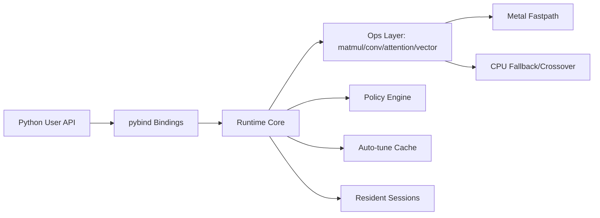
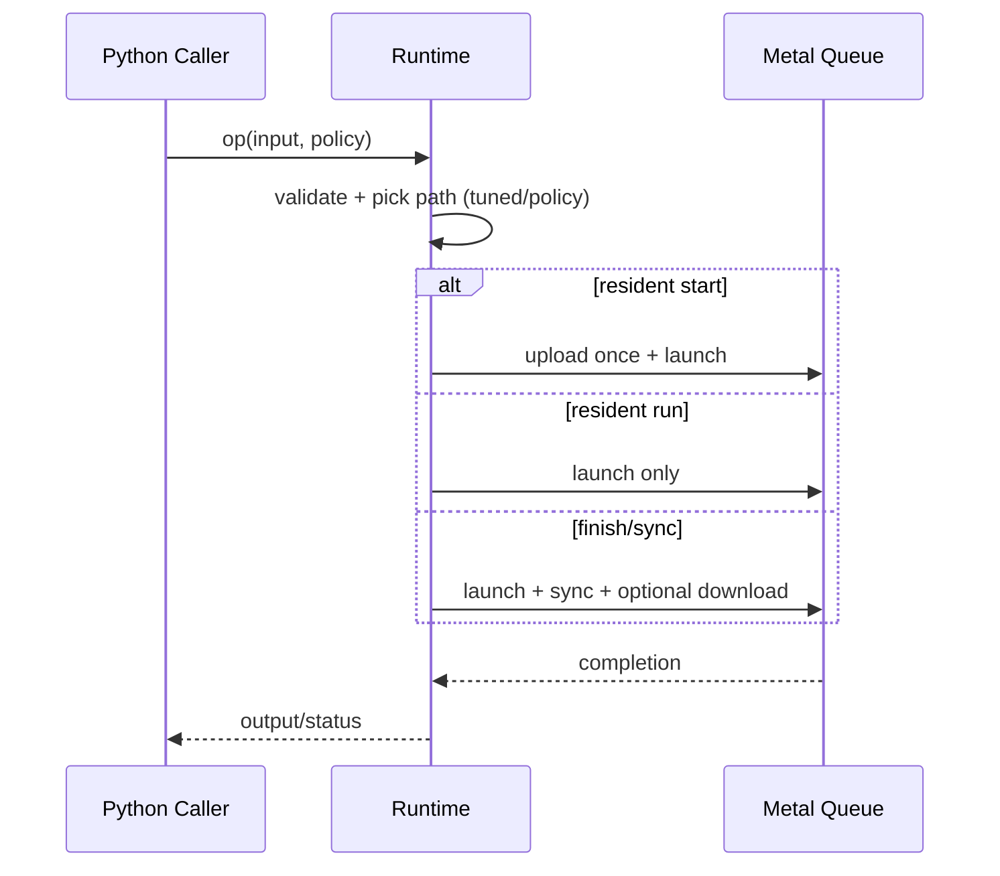
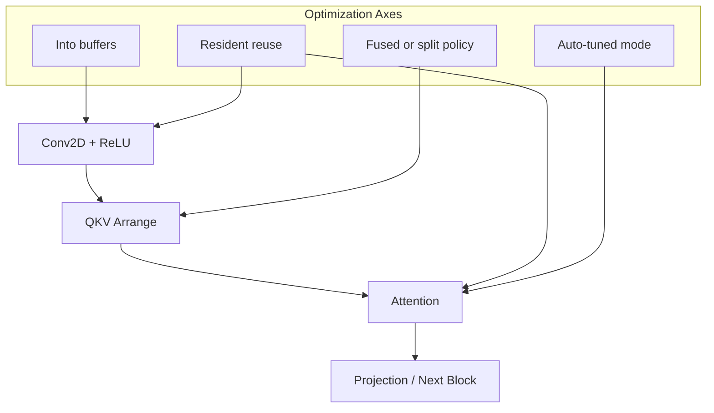

# 1. Title
# Lightning Core: Metal-First Runtime for Attention, MatMul, and Fused Inference Pipelines

# 2. Badges
[](https://pypi.org/project/lightning-core/)
[](https://pypi.org/project/lightning-core/)
[](https://pypi.org/project/lightning-core/)
[](LICENSE)
[](https://github.com/wnsgus00114-droid/lightning-core)
[](https://github.com/wnsgus00114-droid/lightning-core/actions/workflows/python-wheel-publish.yml)
[](https://github.com/wnsgus00114-droid/lightning-core/actions/workflows/ci-contract-tests.yml)
[](https://github.com/wnsgus00114-droid/lightning-core/actions/workflows/docs-pages.yml)

# 3. One-line Summary
Lightning Core is a macOS-first, Metal-backed runtime that provides low-level control (resident IO, policy routing, fused paths) with easy Python APIs.
Current public release: **v0.1.12** (2026-04-01).

# 4. Abstract
Lightning Core targets high-iteration experimentation on Apple Silicon by combining:
- custom C++ kernels and runtime scheduling,
- Metal fastpaths with CPU fallback/crossover,
- pybind-based Python APIs for rapid operator and pipeline testing.

The project is positioned between a research runtime and a production-oriented operator engine. It emphasizes repeatable benchmarking, explicit execution policy control, and practical end-to-end pipeline composition (conv -> attention, FFN, LN -> projection).

# 5. Motivation / Problem Statement
Most deep-learning tooling assumes CUDA-first execution, while many practical local environments are macOS + Apple Silicon. This creates a gap:
- kernel-level optimization ideas are hard to test quickly on macOS,
- launch/memory overhead dominates small and repeated workloads,
- framework-level abstractions can hide runtime policy decisions.

Lightning Core addresses this by exposing runtime scheduling primitives and fastpaths directly.

# 6. Key Idea
Treat execution policy as a first-class runtime object:
- choose upload/download/sync behavior per call,
- persist resident sessions for repeated loops,
- auto-tune per-shape kernel/mode choices,
- fuse where useful, and fallback/crossover when launch overhead dominates.

# 7. Contributions
- Metal-first runtime for selected tensor/ops and attention workloads.
- Resident execution model for amortizing transfer/sync overhead.
- Auto-tuned matmul and attention mode selection with persisted cache.
- High-level integrated APIs for conv/attention pipeline composition.
- Python-friendly convenience APIs (`matmul2d`, `attention2d`, tensor constructors) without changing fast-path kernels.
- Benchmark harnesses and reproducibility artifacts.

# 8. System Architecture


# 9. Execution Model


# 10. Fused Pipeline Design


# 11. Benchmark Setup
Latest README snapshot setup (local run, 2026-03-30):
- Device: Apple Silicon macOS (Metal enabled)
- Runtime: `lightning_core` editable build
- Torch: 2.11.0 (MPS available)
- Bench suites:
  - `ai_model_all_bench.py`
  - `ml_all_bench.py`
  - `dl_all_bench.py`

Capability and environment disclosure in this section is auto-generated from:
- `docs/runtime_capabilities.json`
- `docs/tested_environments.json`

<!-- AUTO-CAPABILITY-MATRIX:BEGIN -->

### Runtime Capability Matrix (Auto-generated)

- Snapshot generated at (UTC): `2026-03-31T15:54:26+00:00`
- Active backend at snapshot time: `cpu`
- Active memory model: `host-managed-compat`
- Note: `Available` is host-dependent. Regenerate the snapshot on your target machine for exact values.
- Generated by: `python scripts/generate_capability_docs.py --refresh-runtime-snapshot`

| Device | Built | Available | Compute | Memory | Sync | Profiling | Trace | Sync Policy | Memory Model | Query |
| --- | --- | --- | --- | --- | --- | --- | --- | --- | --- | --- |
| metal | Yes | No | Yes | Yes | Yes | No | Yes | Yes | host-managed-compat | ok |
| cpu | Yes | Yes | Yes | No | No | No | Yes | Yes | host-managed-compat | ok |
| cuda | No | No | No | No | No | No | Yes | Yes | native-device | ok |

### Runtime Trace / Capability API Surface (Auto-generated)

| Runtime API Surface | Available | Notes |
| --- | --- | --- |
| runtime_trace_enable | Yes | Enable/disable trace capture |
| runtime_trace_events | Yes | Raw runtime event list |
| runtime_trace_timeline | Yes | Sorted/grouped timeline report |
| runtime_trace_clear | Yes | Clear ring buffer events |
| runtime_backend_capabilities | Yes | Per-backend contract query (metal/cpu/cuda) |
| runtime_active_backend_capabilities | Yes | Capability contract of current active backend |

### Tested Environment Matrix (Auto-generated)

| Date | Scope | Hardware / OS | Python | Torch | Status | Notes |
| --- | --- | --- | --- | --- | --- | --- |
| 2026-03-30 | Local benchmark snapshot | Apple Silicon macOS (Metal enabled) | 3.14 | 2.11.0 | validated | README benchmark snapshot run (ai_model_all_bench.py / ml_all_bench.py / dl_all_bench.py). |
| 2026-04-01 | CI contract tests | GitHub Actions macos-14 | 3.12 | n/a | validated | CMake + CTest quality gate workflow. |
| 2026-04-01 | CI wheel build and publish | GitHub Actions macos-14 | 3.12 | n/a | validated | Wheel build + distribution validation in publish workflow. |

<!-- AUTO-CAPABILITY-MATRIX:END -->

# 12. Benchmark Results
Full snapshot with readability-first structure: summary first, then all raw cases in collapsible tables.

Result key: `ours_best_vs_mps > 1.0` means Lightning Core or Integrated API is faster than Torch MPS for that case.

Data scope in this section: `kernel_bench.csv` (10), `pipeline_bench.csv` (8), `ml_all_bench.csv` (10), `large_gemm_auto_sweep.csv` (15), `api_overhead_bench.csv` (6).

**A. Suite Summary (All Rows)**
| Suite | Rows | Win Rate (>1.0) | Median | Avg | Min | Max |
| --- | ---: | ---: | ---: | ---: | ---: | ---: |
| Kernel | 10 | 100.0% | 4.73x | 76.52x | 1.03x | 324.33x |
| Pipeline | 8 | 100.0% | 2.34x | 2.42x | 1.02x | 3.91x |
| ML | 10 | 100.0% | 8.85x | 12.91x | 1.40x | 43.99x |
| DL Large GEMM Sweep | 15 | 100.0% | 2.73x | 3.30x | 2.32x | 4.70x |

**B. Family Summary (to avoid average distortion)**

Kernel families:
| Family | Rows | Median | Avg | Min | Max |
| --- | ---: | ---: | ---: | ---: | ---: |
| attention micro | 3 | 226.43x | 247.31x | 191.17x | 324.33x |
| conv | 4 | 1.08x | 1.14x | 1.03x | 1.39x |
| gemm | 3 | 4.80x | 6.23x | 4.65x | 9.24x |

Pipeline families:
| Family | Rows | Median | Avg | Min | Max |
| --- | ---: | ---: | ---: | ---: | ---: |
| ffn | 2 | 3.85x | 3.85x | 3.79x | 3.90x |
| ln->proj | 2 | 3.75x | 3.75x | 3.60x | 3.91x |
| conv->attn | 4 | 1.04x | 1.05x | 1.02x | 1.09x |

**C. Full Case Tables (All Results, Non-Sampled)**

<details>
<summary>Kernel Bench (10 rows)</summary>

| Case | LC ms | Torch MPS ms | Integrated API ms | Best-vs-MPS | Winner |
| --- | ---: | ---: | ---: | ---: | --- |
| attention micro / seq=8,head_dim=16 | 0.000830 | 0.269087 | 0.001226 | 324.33x | LC |
| attention micro / seq=8,head_dim=32 | 0.000944 | 0.213847 | 0.001882 | 226.43x | LC |
| attention micro / seq=12,head_dim=12 | 0.001070 | 0.204469 | 0.001555 | 191.17x | LC |
| conv / batch=1,in_ch=3,h=16,w=16,out_ch=16,k=3 | 0.185349 | 0.257828 | 0.194724 | 1.39x | LC |
| conv / batch=1,in_ch=3,h=24,w=24,out_ch=16,k=3 | 0.183891 | 0.189333 | 0.210661 | 1.03x | LC |
| conv / batch=2,in_ch=3,h=16,w=16,out_ch=16,k=3 | 0.185802 | 0.199536 | 0.199568 | 1.07x | LC |
| conv / batch=1,in_ch=3,h=28,w=28,out_ch=16,k=3 | 0.189276 | 0.199620 | 0.185099 | 1.08x | Integrated |
| gemm / m=256,k=256,n=256 | 0.025391 | 0.234509 | 0.194258 | 9.24x | LC |
| gemm / m=896,k=896,n=896 | 0.136708 | 0.636312 | 0.722937 | 4.65x | LC |
| gemm / m=1024,k=1024,n=1024 | 0.168671 | 0.810279 | 0.981496 | 4.80x | LC |
</details>

<details>
<summary>Pipeline Bench (8 rows)</summary>

| Case | LC ms | Torch MPS ms | Integrated API ms | Best-vs-MPS | Winner |
| --- | ---: | ---: | ---: | ---: | --- |
| ffn / batch=512,d_model=768,d_ff=3072 | 0.198201 | 0.752038 | n/a | 3.79x | n/a |
| ffn / batch=1024,d_model=768,d_ff=3072 | 0.372339 | 1.452003 | n/a | 3.90x | n/a |
| ln->proj / batch=1024,d_model=1024,out=1024 | 0.172553 | 0.620380 | n/a | 3.60x | n/a |
| ln->proj / batch=2048,d_model=1024,out=1024 | 0.310551 | 1.215415 | n/a | 3.91x | n/a |
| conv->attn / conv(n=1,c=3->16,h=8,w=8,k=3)+attn(seq=48,d=48) | 0.395543 | 0.408251 | 0.404033 | 1.03x | LC |
| conv->attn / conv(n=1,c=3->16,h=8,w=8,k=3)+attn(seq=192,d=48) | 0.431083 | 0.425477 | 0.415871 | 1.02x | Integrated |
| conv->attn / conv(n=1,c=3->16,h=8,w=8,k=3)+attn(seq=192,d=8) | 0.396123 | 0.432692 | 0.407752 | 1.09x | LC |
| conv->attn / conv(n=1,c=3->16,h=8,w=8,k=3)+attn(seq=96,d=48) | 0.394251 | 0.411843 | 0.398017 | 1.04x | LC |
</details>

<details>
<summary>ML Bench (10 rows)</summary>

| Case | LC ms | Torch MPS ms | Integrated API ms | Best-vs-MPS | Winner |
| --- | ---: | ---: | ---: | ---: | --- |
| linear_classifier_inference / batch=1024,in=1024,out=512 | 0.096433 | 0.758746 | 1.214318 | 7.87x | LC |
| linear_classifier_inference / batch=2048,in=1024,out=512 | 0.186845 | 1.847536 | 2.952137 | 9.89x | LC |
| linear_classifier_inference / batch=4096,in=1024,out=1024 | 0.632555 | 3.894910 | 5.193821 | 6.16x | LC |
| matrix_preprocessing_sub / rows=512,cols=512 | 0.015134 | 0.208502 | 0.027561 | 13.78x | LC |
| matrix_preprocessing_sub / rows=1024,cols=1024 | 0.025363 | 0.249293 | 0.108649 | 9.83x | LC |
| matrix_preprocessing_sub / rows=2048,cols=1024 | 0.009389 | 0.413009 | 0.220267 | 43.99x | LC |
| feature_scaling_vector_add / n=65536 | 0.008237 | 0.191661 | 0.007252 | 26.43x | Integrated |
| feature_scaling_vector_add / n=262144 | 0.028608 | 0.205842 | 0.028113 | 7.32x | Integrated |
| feature_scaling_vector_add / n=1048576 | 0.109309 | 0.264072 | 0.109139 | 2.42x | Integrated |
| feature_scaling_vector_add / n=4194304 | 0.469037 | 0.653430 | 0.466921 | 1.40x | Integrated |
</details>

<details>
<summary>DL Large GEMM Sweep (15 rows)</summary>

| Shape + Mode | LC best ms | Torch MPS ms | Integrated API ms | Best-vs-MPS | Winner |
| --- | ---: | ---: | ---: | ---: | --- |
| m=1024,k=1024,n=1024 / runtime_default_promoted | 0.179328 | 0.818152 | 1.011852 | 4.56x | LC |
| m=1024,k=1024,n=1024 / aggressive_mps_no_bucket | 0.176217 | 0.818152 | 1.011852 | 4.64x | LC |
| m=1024,k=1024,n=1024 / kernel_favor_no_bucket | 0.174091 | 0.818152 | 1.011852 | 4.70x | LC |
| m=1536,k=1536,n=1536 / runtime_default_promoted | 0.738707 | 2.801908 | 3.591471 | 3.79x | LC |
| m=1536,k=1536,n=1536 / aggressive_mps_no_bucket | 0.783325 | 2.801908 | 3.591471 | 3.58x | LC |
| m=1536,k=1536,n=1536 / kernel_favor_no_bucket | 0.690338 | 2.801908 | 3.591471 | 4.06x | LC |
| m=2048,k=2048,n=2048 / runtime_default_promoted | 1.808589 | 4.930492 | 5.989359 | 2.73x | LC |
| m=2048,k=2048,n=2048 / aggressive_mps_no_bucket | 1.830923 | 4.930492 | 5.989359 | 2.69x | LC |
| m=2048,k=2048,n=2048 / kernel_favor_no_bucket | 2.034688 | 4.930492 | 5.989359 | 2.42x | LC |
| m=3072,k=3072,n=3072 / runtime_default_promoted | 7.413207 | 17.205290 | 21.317615 | 2.32x | LC |
| m=3072,k=3072,n=3072 / aggressive_mps_no_bucket | 7.110929 | 17.205290 | 21.317615 | 2.42x | LC |
| m=3072,k=3072,n=3072 / kernel_favor_no_bucket | 7.113339 | 17.205290 | 21.317615 | 2.42x | LC |
| m=4096,k=1024,n=4096 / runtime_default_promoted | 2.469568 | 9.743840 | 12.071318 | 3.95x | LC |
| m=4096,k=1024,n=4096 / aggressive_mps_no_bucket | 3.794696 | 9.743840 | 12.071318 | 2.57x | LC |
| m=4096,k=1024,n=4096 / kernel_favor_no_bucket | 3.638081 | 9.743840 | 12.071318 | 2.68x | LC |
</details>

<details>
<summary>API Overhead (LC direct vs Python API, 6 rows)</summary>

| Case | LC direct ms | Python API ms | API/LC |
| --- | ---: | ---: | ---: |
| engine_direct_vs_python_api_attention / seq=256,head_dim=64 | 0.262145 | 0.266253 | 1.02x |
| engine_direct_vs_python_api_attention / seq=512,head_dim=64 | 0.425523 | 0.437983 | 1.03x |
| engine_direct_vs_python_api_conv / batch=1,in_ch=3,h=32,w=32,out_ch=16,k=3 | 0.196769 | 0.195138 | 0.99x |
| engine_direct_vs_python_api_conv / batch=2,in_ch=3,h=32,w=32,out_ch=16,k=3 | 0.211811 | 0.200831 | 0.95x |
| engine_direct_vs_python_api_conv_attn / conv(n=1,c=3->16,h=8,w=8,k=3)+attn(seq=48,d=48) | 0.416029 | 0.396602 | 0.95x |
| engine_direct_vs_python_api_conv_attn / conv(n=1,c=3->16,h=8,w=8,k=3)+attn(seq=96,d=48) | 0.424866 | 0.399091 | 0.94x |
</details>

# 13. Key Findings / Insights
- Why Torch MPS can look slower on some shapes: generic graph/operator dispatch and synchronization overhead become dominant for very small kernels.
- Why Lightning Core can win: tuned mode routing + resident sessions reduce upload/download/sync cost across repeated calls.
- Why integrated path sometimes wins over direct path: fewer intermediate host round-trips and better cache reuse in connected blocks.
- Why Torch can still win in other projects/shapes: some large dense operators benefit from highly optimized generic kernels when fusion/session reuse is not active.
- Fair interpretation rule: compare both one-shot latency and steady-state (resident) throughput, because they measure different bottlenecks.

# 14. Limitations
- Scope is selective operators/pipelines, not a full DL framework.
- Performance can vary by thermals, OS/driver version, and benchmark ordering.
- Release-tag CI now enforces a fixed-seed repeated-run variance gate (`suite-total LC CV <= 2%`) for quick-bench latency evidence, with per-case CV report artifacts.
- Some APIs are still low-level by design.
- Multi-head/full-transformer framework parity is not the goal yet.

# 15. Future Work
- Expanded fused kernels (attention and projection blocks).
- Better mixed-precision controls and calibration tooling.
- Broader operator coverage and shape-specialized kernels.
- More stable cross-device benchmark CI baselines.

# 16. Installation
From PyPI:

```bash
python -m pip install -U lightning-core
```

From source:

```bash
git clone https://github.com/wnsgus00114-droid/lightning-core.git
cd lightning-core
python -m pip install .
```

# 17. Quick Start
```python
import numpy as np
import lightning_core as lc

print("backend:", lc.backend_name())

a = np.random.rand(128, 256).astype(np.float32)
b = np.random.rand(256, 64).astype(np.float32)
y = lc.matmul2d(a, b, "metal")
print(y.shape)
```

# 18. Core API Overview
Core categories:
- Runtime: `backend_name`, `metal_available`, `cuda_available`, `runtime_trace_*`, `runtime_trace_timeline`, `runtime_*_backend_interfaces`
- Tensor: `Tensor`, `Tensor64`, `TensorView`
- Ops: matmul/conv/vector/matrix (+ resident sessions)
- Attention: forward/train + policy + session
- Integrated: high-level conv/attention pipeline APIs
- Python helper module (shipped in wheel): `lightning_core_integrated_api` (`set_backend("lightning"|"torch"|"auto")`)

# 19. Input Rules
- Use `float32` NumPy arrays for fast paths.
- Prefer contiguous arrays (`np.ascontiguousarray`).
- For `*_into` APIs, output buffer shape must exactly match expected shape.
- Device string must be one of: `"metal"`, `"cpu"`, `"cuda"` (if available).

# 20. MatMul Usage
```python
import numpy as np
import lightning_core as lc

a = np.random.rand(512, 1024).astype(np.float32)
b = np.random.rand(1024, 512).astype(np.float32)

# easy API (shape inferred)
out = lc.matmul2d(a, b, "metal")

# into API (avoid re-allocation)
out2 = np.empty((512, 512), dtype=np.float32)
lc.matmul2d_into(a, b, out2, "metal")
```

# 21. Attention Usage
```python
import numpy as np
import lightning_core as lc

q = np.random.rand(8, 16).astype(np.float32)
k = np.random.rand(8, 16).astype(np.float32)
v = np.random.rand(8, 16).astype(np.float32)

out = lc.attention2d(q, k, v, False, "metal")
out_into = np.empty_like(q)
lc.attention2d_into(q, k, v, out_into, False, "metal")
```

# 22. Convolution Usage
```python
import numpy as np
import lightning_core as lc

x = np.random.rand(1, 3, 16, 16).astype(np.float32)
w = np.random.rand(16, 3, 3, 3).astype(np.float32)
b = np.random.rand(16).astype(np.float32)

y = lc.conv2d_nchw(x, w, b, 1, 1, 1, 1, "metal")
```

# 23. Resident Blocks
Resident sessions reduce repeated IO/sync overhead:

```python
import numpy as np
import lightning_core as lc

a = np.random.rand(1024, 1024).astype(np.float32)
b = np.random.rand(1024, 1024).astype(np.float32)
out = np.empty((1024, 1024), dtype=np.float32)

sess = lc.matmul2d_resident_session(a, b)
sess.start_into(a, b, out)
sess.run_batch_sync_no_download_into(a, b, out, 8)
```

# 24. Pipeline Usage
Integrated APIs are exposed in both `lightning_core` (legacy-prefixed names) and `lightning_core.api` (clean names).
The compatibility helper module `lightning_core_integrated_api` is also shipped inside the package for users who prefer block-style wrappers (`Linear`, resident blocks, integrated pipeline helpers).

```python
import numpy as np
import lightning_core as lc
import lightning_core_integrated_api as lc_api

# Engine selector for integrated helper: lightning / torch / auto
lc_api.set_backend("auto")
print("integrated engine:", lc_api.get_backend())

x = np.random.rand(1, 3, 8, 8).astype(np.float32)
w = np.random.rand(16, 3, 3, 3).astype(np.float32)
b = np.random.rand(16).astype(np.float32)

# High-level conv+relu
y = lc.api.conv_relu_nchw(x, w, b, stride_h=1, stride_w=1, pad_h=1, pad_w=1, device="metal")

# Integrated conv->attention path
seq_len, head_dim = 96, 48
z = lc.api.conv_attention_torchstrong_nchw(
    x, w, b, seq_len=seq_len, head_dim=head_dim, stride_h=1, stride_w=1, pad_h=1, pad_w=1, device="metal"
)

# Graph vs eager A/B toggle for verification
# (current graph mode coverage for this path: conv 3x3, stride=1, pad=1 + attention)
z_graph = lc.api.conv_attention_torchstrong_nchw(
    x,
    w,
    b,
    seq_len=seq_len,
    head_dim=head_dim,
    stride_h=1,
    stride_w=1,
    pad_h=1,
    pad_w=1,
    device="metal",
    execution_mode="graph",
)

# Quick parity + speed report (eager vs graph) for the same shape
report = lc.api.conv_attention_torchstrong_nchw_ab_report(
    x, w, b, seq_len=seq_len, head_dim=head_dim, stride_h=1, stride_w=1, pad_h=1, pad_w=1, device="metal"
)
print(report["winner"], report["graph_over_eager"], report["max_abs_diff"])
print(y.shape, z.shape)
```

Typical optimization pattern:
- use `*_into` to reuse preallocated output buffers,
- keep data contiguous in `float32`,
- avoid host/device round-trips between connected blocks.

# 25. Performance Tips
- Reuse output buffers with `*_into` APIs.
- Use resident sessions for repeated loops.
- Keep inputs contiguous `float32`.
- Separate one-shot latency benchmarks and steady-state throughput benchmarks.
- Warm up before measurement.
- Tiny one-shot conv Metal crossover default is tuned to `260000` MACs; override with `CJ_CONV2D_CPU_CROSSOVER_MACS` (`CJ_CONV2D_CPU_CROSSOVER_DYNAMIC=1` for dynamic refresh).
- Use `runtime_trace_timeline(group_by="op_path")` to identify op-dispatch bottlenecks (`op|selected_device|direct/fallback`) directly in Python.

# 26. API Examples
More examples:
- [docs/quickstart.md](docs/quickstart.md)
- [docs/advanced.md](docs/advanced.md)
- Docs site (GitHub Pages, after repository Pages enablement): <https://wnsgus00114-droid.github.io/lightning-core/>
- `examples/` and benchmark source files under `benchmarks/`

Runtime timeline bottleneck readout (`op_dispatch` path):

```python
import numpy as np
import lightning_core as lc

lc.runtime_trace_clear()
lc.runtime_trace_enable(True)

a = np.random.rand(256, 256).astype(np.float32)
b = np.random.rand(256, 256).astype(np.float32)
for _ in range(40):
    lc.matmul2d(a, b, "metal")

lc.runtime_trace_enable(False)
report = lc.runtime_trace_timeline(
    group_by="op_path",                  # op|selected_device|direct_or_fallback
    group_sort_by="total_delta_next_ns", # bottleneck-first
    group_descending=True,
    hotspot_top_k=8,
)

print(report["groups"][:3])    # aggregated bottleneck paths
print(report["hotspots"][:5])  # top single-event hotspots
```

# 27. Benchmark Overview
Lightning Core benchmark docs are now **Python-first** for reproducibility and copy-paste usage.

Primary public benchmark path:
- `benchmarks/python/quick_bench.py` (quick public comparison)
- `benchmarks/large_gemm_auto_sweep.py` (large GEMM policy sweep)
- `benchmarks/generate_cross_suite_summary.py` (cross-suite summary report)

All three Python scripts are included below as **full code blocks** so users can copy-paste directly from README without opening separate files.

Optional:
- native C++ binaries in `benchmarks/` are still available for low-level kernel validation.

# 28. Benchmark Directory Structure
```text
benchmarks/
  python/
    quick_bench.py
  large_gemm_auto_sweep.py
  generate_cross_suite_summary.py
  # optional native benchmarks (low-level):
  bench_attention.cpp
  bench_vector_add.cpp
  bench_matmul.cpp
  bench_matrix_ops.cpp
  bench_transformer.cpp
  bench_lstm_rnn.cpp
  bench_cnn_dnn.cpp
  bench_vlm.cpp
  sweep_matrix_ops.sh
```

Workspace-level scripts used for the README snapshot (outside repo root in this environment):
- `ai_model_all_bench.py`
- `ml_all_bench.py`
- `dl_all_bench.py`

# 29. How to Run Benchmarks
Python benchmarks (recommended):

```bash
python benchmarks/python/quick_bench.py --warmup 40 --iters 200 --out benchmark_results/quick_bench.csv
python benchmarks/large_gemm_auto_sweep.py
python benchmarks/generate_cross_suite_summary.py
```

Workspace Python benchmark harness (same environment used for README snapshot):

```bash
python ../ai_model_all_bench.py
python ../ml_all_bench.py
python ../dl_all_bench.py
```

Minimal one-liner micro benchmark template:

```bash
python - <<'PY'
import time
import numpy as np
import lightning_core as lc

a = np.random.rand(1024, 1024).astype(np.float32)
b = np.random.rand(1024, 1024).astype(np.float32)

for _ in range(20):  # warmup
    lc.matmul2d(a, b, "metal")

t0 = time.perf_counter()
for _ in range(100):
    lc.matmul2d(a, b, "metal")
t1 = time.perf_counter()

print("median-like avg ms:", ((t1 - t0) * 1000.0) / 100.0)
PY
```

Full copy-paste Python benchmark code (README embedded):

<details>
<summary><code>benchmarks/python/quick_bench.py</code> (full)</summary>

```python
#!/usr/bin/env python3
"""Quick public benchmark for Lightning Core vs Torch MPS.

Usage:
  python benchmarks/python/quick_bench.py
  python benchmarks/python/quick_bench.py --iters 200 --warmup 40 --out benchmark_results/quick_bench.csv
  python benchmarks/python/quick_bench.py --device cpu --iters 100 --warmup 20
"""

from __future__ import annotations

import argparse
import csv
import time
from pathlib import Path
from statistics import median

import numpy as np

import lightning_core as lc

try:
    import torch
    import torch.nn.functional as F
except Exception:  # pragma: no cover
    torch = None
    F = None


def _time_ms(fn, warmup: int, iters: int) -> float:
    for _ in range(warmup):
        fn()
    samples = []
    for _ in range(iters):
        t0 = time.perf_counter_ns()
        fn()
        t1 = time.perf_counter_ns()
        samples.append((t1 - t0) / 1e6)
    return float(median(samples))


def _torch_mps_available() -> bool:
    return torch is not None and torch.backends.mps.is_available()  # type: ignore[union-attr]


def bench_matmul(warmup: int, iters: int, device: str):
    cases = [(256, 256, 256), (1024, 1024, 1024), (2048, 2048, 2048)]
    out = []
    for m, k, n in cases:
        a = np.random.rand(m, k).astype(np.float32)
        b = np.random.rand(k, n).astype(np.float32)

        lc_ms = _time_ms(lambda: lc.matmul2d(a, b, device), warmup, iters)

        torch_mps_ms = float("nan")
        if _torch_mps_available():
            ta = torch.from_numpy(a).to("mps")
            tb = torch.from_numpy(b).to("mps")

            def _torch_fn():
                torch.mps.synchronize()  # type: ignore[attr-defined]
                _ = ta @ tb
                torch.mps.synchronize()  # type: ignore[attr-defined]

            torch_mps_ms = _time_ms(_torch_fn, warmup, iters)

        out.append(
            {
                "suite": "quick_bench",
                "bench": "matmul2d",
                "shape": f"m={m},k={k},n={n}",
                "lightning_core_ms": lc_ms,
                "torch_mps_ms": torch_mps_ms,
                "speedup_torch_over_lc": (torch_mps_ms / lc_ms) if np.isfinite(torch_mps_ms) and lc_ms > 0 else float("nan"),
            }
        )
    return out


def bench_attention(warmup: int, iters: int, device: str):
    cases = [(8, 16), (96, 48), (256, 64)]
    out = []
    for seq, dim in cases:
        q = np.random.rand(seq, dim).astype(np.float32)
        k = np.random.rand(seq, dim).astype(np.float32)
        v = np.random.rand(seq, dim).astype(np.float32)

        lc_ms = _time_ms(lambda: lc.attention2d(q, k, v, False, device), warmup, iters)

        torch_mps_ms = float("nan")
        if _torch_mps_available():
            tq = torch.from_numpy(q).to("mps").unsqueeze(0).unsqueeze(0)
            tk = torch.from_numpy(k).to("mps").unsqueeze(0).unsqueeze(0)
            tv = torch.from_numpy(v).to("mps").unsqueeze(0).unsqueeze(0)

            def _torch_fn():
                torch.mps.synchronize()  # type: ignore[attr-defined]
                _ = F.scaled_dot_product_attention(tq, tk, tv, is_causal=False)
                torch.mps.synchronize()  # type: ignore[attr-defined]

            torch_mps_ms = _time_ms(_torch_fn, warmup, iters)

        out.append(
            {
                "suite": "quick_bench",
                "bench": "attention2d",
                "shape": f"seq={seq},head_dim={dim}",
                "lightning_core_ms": lc_ms,
                "torch_mps_ms": torch_mps_ms,
                "speedup_torch_over_lc": (torch_mps_ms / lc_ms) if np.isfinite(torch_mps_ms) and lc_ms > 0 else float("nan"),
            }
        )
    return out


def bench_conv(warmup: int, iters: int, device: str):
    cases = [(1, 3, 16, 16, 16, 3), (1, 3, 32, 32, 16, 3), (2, 3, 32, 32, 16, 3)]
    out = []
    for n, c, h, w, oc, ksz in cases:
        x = np.random.rand(n, c, h, w).astype(np.float32)
        wgt = np.random.rand(oc, c, ksz, ksz).astype(np.float32)
        b = np.random.rand(oc).astype(np.float32)

        lc_ms = _time_ms(lambda: lc.conv2d_nchw(x, wgt, b, 1, 1, 1, 1, device), warmup, iters)

        torch_mps_ms = float("nan")
        if _torch_mps_available():
            tx = torch.from_numpy(x).to("mps")
            tw = torch.from_numpy(wgt).to("mps")
            tb = torch.from_numpy(b).to("mps")

            def _torch_fn():
                torch.mps.synchronize()  # type: ignore[attr-defined]
                _ = F.relu(F.conv2d(tx, tw, tb, stride=1, padding=1))
                torch.mps.synchronize()  # type: ignore[attr-defined]

            torch_mps_ms = _time_ms(_torch_fn, warmup, iters)

        out.append(
            {
                "suite": "quick_bench",
                "bench": "conv2d_relu",
                "shape": f"batch={n},in_ch={c},h={h},w={w},out_ch={oc},k={ksz}",
                "lightning_core_ms": lc_ms,
                "torch_mps_ms": torch_mps_ms,
                "speedup_torch_over_lc": (torch_mps_ms / lc_ms) if np.isfinite(torch_mps_ms) and lc_ms > 0 else float("nan"),
            }
        )
    return out


def save_csv(path: Path, rows):
    path.parent.mkdir(parents=True, exist_ok=True)
    fields = ["suite", "bench", "shape", "lightning_core_ms", "torch_mps_ms", "speedup_torch_over_lc"]
    with path.open("w", newline="", encoding="utf-8") as f:
        w = csv.DictWriter(f, fieldnames=fields)
        w.writeheader()
        w.writerows(rows)


def main() -> None:
    p = argparse.ArgumentParser(description="Lightning Core quick benchmark")
    p.add_argument("--warmup", type=int, default=40)
    p.add_argument("--iters", type=int, default=200)
    p.add_argument("--out", type=Path, default=Path("benchmark_results/quick_bench.csv"))
    p.add_argument(
        "--device",
        type=str,
        default="auto",
        choices=["auto", "metal", "cpu"],
        help="LC execution device. 'auto' picks metal when backend reports metal, otherwise cpu.",
    )
    args = p.parse_args()

    if args.device == "auto":
        lc_device = "metal" if lc.backend_name().lower() == "metal" else "cpu"
    else:
        lc_device = args.device

    rows = []
    rows.extend(bench_attention(args.warmup, args.iters, lc_device))
    rows.extend(bench_conv(args.warmup, args.iters, lc_device))
    rows.extend(bench_matmul(args.warmup, args.iters, lc_device))

    save_csv(args.out, rows)

    print(f"backend={lc.backend_name()} device={lc_device} torch_mps_available={_torch_mps_available()}")
    print("saved:", args.out)
    print("\n=== Quick Bench (median ms) ===")
    for r in rows:
        sp = r["speedup_torch_over_lc"]
        sp_txt = f"{sp:.2f}x" if np.isfinite(sp) else "n/a"
        torch_txt = f"{r['torch_mps_ms']:.6f}ms" if np.isfinite(r["torch_mps_ms"]) else "n/a"
        print(
            f"[{r['bench']}] {r['shape']} | LC={r['lightning_core_ms']:.6f}ms "
            f"TorchMPS={torch_txt} torch/lc={sp_txt}"
        )


if __name__ == "__main__":
    main()
```
</details>

<details>
<summary><code>benchmarks/large_gemm_auto_sweep.py</code> (full)</summary>

```python
from __future__ import annotations

import csv
import json
import os
import statistics
import time
from contextlib import contextmanager
from pathlib import Path

import numpy as np
import torch

import lightning_core as lc


ROOT = Path(__file__).resolve().parents[1]
OUT_DIR = ROOT / "benchmarks" / "reports" / "2026-03-29"


def _sync_mps() -> None:
    if torch.backends.mps.is_available():
        torch.mps.synchronize()


def _time_ms(fn, warmup: int, iters: int) -> float:
    samples = []
    for i in range(warmup + iters):
        t0 = time.perf_counter()
        fn()
        dt = (time.perf_counter() - t0) * 1000.0
        if i >= warmup:
            samples.append(dt)
    return statistics.mean(samples)


@contextmanager
def _env(**kwargs: str):
    old = {}
    for k, v in kwargs.items():
        old[k] = os.environ.get(k)
        if v is None:
            os.environ.pop(k, None)
        else:
            os.environ[k] = v
    try:
        yield
    finally:
        for k, v in old.items():
            if v is None:
                os.environ.pop(k, None)
            else:
                os.environ[k] = v


def _torch_mps_mm_ms(ta_mps: torch.Tensor, tb_mps: torch.Tensor, warmup: int = 4, iters: int = 20) -> float:
    def _run() -> None:
        _ = torch.matmul(ta_mps, tb_mps)
        _sync_mps()

    return _time_ms(_run, warmup=warmup, iters=iters)


def _lc_one_shot_ms(a: np.ndarray, b: np.ndarray, out: np.ndarray, m: int, k: int, n: int, warmup: int = 3, iters: int = 16) -> float:
    return _time_ms(
        lambda: lc.matmul_np_into(a, b, out, m, k, n, "metal"),
        warmup=warmup,
        iters=iters,
    )


def _lc_resident_steady_ms(
    a: np.ndarray,
    b: np.ndarray,
    out: np.ndarray,
    m: int,
    k: int,
    n: int,
    loops_per_sample: int = 10,
    warmup: int = 2,
    iters: int = 12,
) -> float:
    session = lc.MatMulMetalResidentSession(m, k, n)
    session.start_into(a, b, out)

    def _run_batch() -> None:
        session.run_batch_sync_into(a, b, out, loops_per_sample)

    batch_ms = _time_ms(_run_batch, warmup=warmup, iters=iters)
    return batch_ms / float(loops_per_sample)


def bench_large_gemm_sweep() -> dict:
    OUT_DIR.mkdir(parents=True, exist_ok=True)

    shapes = [
        (1024, 1024, 1024),
        (1536, 1536, 1536),
        (2048, 2048, 2048),
        (3072, 3072, 3072),
        (4096, 1024, 4096),
    ]

    tune_root = OUT_DIR / "matmul_tune_profiles"
    tune_root.mkdir(parents=True, exist_ok=True)

    modes = [
        {
            "name": "runtime_default_promoted",
            "env": {
                "CJ_MATMUL_DISABLE_PROMOTED_BUCKETS": "0",
            },
        },
        {
            "name": "aggressive_mps_no_bucket",
            "env": {
                "CJ_MATMUL_DISABLE_PROMOTED_BUCKETS": "1",
                "CJ_MATMUL_PREFER_MPS_ON_LARGE": "1",
                "CJ_MATMUL_TRY_KERNEL_ON_LARGE": "0",
                "CJ_MATMUL_MPS_HYST_PCT": "5.0",
            },
        },
        {
            "name": "kernel_favor_no_bucket",
            "env": {
                "CJ_MATMUL_DISABLE_PROMOTED_BUCKETS": "1",
                "CJ_MATMUL_PREFER_MPS_ON_LARGE": "0",
                "CJ_MATMUL_TRY_KERNEL_ON_LARGE": "1",
                "CJ_MATMUL_MPS_HYST_PCT": "0.0",
            },
        },
    ]

    all_rows: list[dict] = []
    best_rows: list[dict] = []

    for m, k, n in shapes:
        a = np.random.rand(m, k).astype(np.float32)
        b = np.random.rand(k, n).astype(np.float32)
        out = np.empty((m * n,), dtype=np.float32)

        ta_cpu = torch.from_numpy(a)
        tb_cpu = torch.from_numpy(b)

        if torch.backends.mps.is_available():
            ta_mps = ta_cpu.to("mps")
            tb_mps = tb_cpu.to("mps")
            torch_mps_ms = _torch_mps_mm_ms(ta_mps, tb_mps)
        else:
            torch_mps_ms = float("nan")

        for mode in modes:
            mode_name = mode["name"]
            tune_file = str(tune_root / f"{mode_name}_{m}x{k}x{n}.csv")
            with _env(CJ_MATMUL_TUNE_CACHE_FILE=tune_file, **mode["env"]):
                lc.matmul_reset_tuning()
                lc_one_shot_ms = _lc_one_shot_ms(a, b, out, m, k, n)
                lc_resident_ms = _lc_resident_steady_ms(a, b, out, m, k, n)

            row = {
                "shape": f"m={m},k={k},n={n}",
                "mode": mode_name,
                "lc_one_shot_ms": lc_one_shot_ms,
                "lc_resident_steady_ms": lc_resident_ms,
                "lc_best_ms": min(lc_one_shot_ms, lc_resident_ms),
                "torch_mps_ms": torch_mps_ms,
                "speedup_torch_over_lc_best": (
                    torch_mps_ms / min(lc_one_shot_ms, lc_resident_ms)
                    if torch_mps_ms == torch_mps_ms and min(lc_one_shot_ms, lc_resident_ms) > 0
                    else float("nan")
                ),
            }
            all_rows.append(row)

        rows_for_shape = [r for r in all_rows if r["shape"] == f"m={m},k={k},n={n}"]
        best = min(rows_for_shape, key=lambda r: r["lc_best_ms"])
        best_rows.append(best)

    csv_path = OUT_DIR / "large_gemm_auto_sweep.csv"
    json_path = OUT_DIR / "large_gemm_auto_sweep.json"

    with csv_path.open("w", newline="", encoding="utf-8") as f:
        writer = csv.DictWriter(
            f,
            fieldnames=[
                "shape",
                "mode",
                "lc_one_shot_ms",
                "lc_resident_steady_ms",
                "lc_best_ms",
                "torch_mps_ms",
                "speedup_torch_over_lc_best",
            ],
        )
        writer.writeheader()
        writer.writerows(all_rows)

    payload = {
        "backend": lc.backend_name(),
        "torch": torch.__version__,
        "mps_available": torch.backends.mps.is_available(),
        "all_rows": all_rows,
        "best_rows_per_shape": best_rows,
    }
    with json_path.open("w", encoding="utf-8") as f:
        json.dump(payload, f, indent=2)

    print(f"saved: {csv_path}")
    print(f"saved: {json_path}")
    return payload


def main() -> None:
    payload = bench_large_gemm_sweep()
    print("\n=== Best policy per shape ===")
    for row in payload["best_rows_per_shape"]:
        print(
            f"{row['shape']}: mode={row['mode']} "
            f"lc_best={row['lc_best_ms']:.4f}ms torch_mps={row['torch_mps_ms']:.4f}ms "
            f"speedup={row['speedup_torch_over_lc_best']:.2f}x"
        )


if __name__ == "__main__":
    main()
```
</details>

<details>
<summary><code>benchmarks/generate_cross_suite_summary.py</code> (full)</summary>

```python
from __future__ import annotations

import json
import math
import statistics
from datetime import date
from pathlib import Path


THIS_DIR = Path(__file__).resolve().parent
WORKSPACE_ROOT = THIS_DIR.parent.parent
BENCH_DIR = WORKSPACE_ROOT / "benchmark_results"
REPORT_DIR = THIS_DIR / "reports" / str(date.today())


def _load_json(path: Path) -> dict:
    with path.open("r", encoding="utf-8") as f:
        return json.load(f)


def _is_finite(x: float) -> bool:
    return isinstance(x, (int, float)) and math.isfinite(float(x))


def _series_stats(values: list[float]) -> dict:
    if not values:
        return {
            "count": 0,
            "avg": float("nan"),
            "median": float("nan"),
            "max": float("nan"),
            "min": float("nan"),
        }
    return {
        "count": len(values),
        "avg": statistics.mean(values),
        "median": statistics.median(values),
        "max": max(values),
        "min": min(values),
    }


def _normalize_rows() -> list[dict]:
    ml = _load_json(BENCH_DIR / "ml_all_bench.json")
    dl = _load_json(BENCH_DIR / "large_gemm_auto_sweep.json")
    ai = _load_json(BENCH_DIR / "ai_model_all_bench.json")

    rows: list[dict] = []

    for src in ml.get("rows", []):
        rows.append(
            {
                "suite": "ml",
                "bench": src["bench"],
                "shape": src["shape"],
                "lc_ms": float(src["lightning_core_ms"]),
                "torch_mps_ms": float(src["torch_mps_ms"]),
                "exia_ms": float(src["exia_standalone_ms"]),
            }
        )

    for src in dl.get("best_rows_per_shape", []):
        rows.append(
            {
                "suite": "dl",
                "bench": "large_gemm_best_policy",
                "shape": src["shape"],
                "lc_ms": float(src["lc_best_ms"]),
                "torch_mps_ms": float(src["torch_mps_ms"]),
                "exia_ms": float(src["exia_standalone_ms"]),
            }
        )

    for src in ai.get("rows", []):
        rows.append(
            {
                "suite": "ai",
                "bench": src["bench"],
                "shape": src["shape"],
                "lc_ms": float(src["lightning_core_ms"]),
                "torch_mps_ms": float(src["torch_mps_ms"]),
                "exia_ms": float(src["exia_standalone_ms"]),
            }
        )

    return rows


def _build_pair_stats(rows: list[dict], key: str) -> dict:
    valid = [r for r in rows if _is_finite(r["lc_ms"]) and _is_finite(r[key]) and r["lc_ms"] > 0.0]

    speedup = [r[key] / r["lc_ms"] for r in valid]
    gap_ms = [r[key] - r["lc_ms"] for r in valid]
    abs_gap_ms = [abs(v) for v in gap_ms]

    max_abs_row = None
    if valid:
        max_abs_row = max(valid, key=lambda r: abs(r[key] - r["lc_ms"]))

    return {
        "speedup_ratio": _series_stats(speedup),
        "gap_ms": _series_stats(gap_ms),
        "abs_gap_ms": _series_stats(abs_gap_ms),
        "max_abs_gap_case": (
            {
                "suite": max_abs_row["suite"],
                "bench": max_abs_row["bench"],
                "shape": max_abs_row["shape"],
                "lc_ms": max_abs_row["lc_ms"],
                "other_ms": max_abs_row[key],
                "abs_gap_ms": abs(max_abs_row[key] - max_abs_row["lc_ms"]),
                "ratio": max_abs_row[key] / max_abs_row["lc_ms"],
            }
            if max_abs_row is not None
            else None
        ),
    }


def _build_summary(rows: list[dict]) -> dict:
    by_suite: dict[str, dict] = {}
    for suite in ["ml", "dl", "ai"]:
        srows = [r for r in rows if r["suite"] == suite]
        by_suite[suite] = {
            "count": len(srows),
            "torch_mps_vs_lc": _build_pair_stats(srows, "torch_mps_ms"),
            "exia_vs_lc": _build_pair_stats(srows, "exia_ms"),
        }

    overall = {
        "count": len(rows),
        "torch_mps_vs_lc": _build_pair_stats(rows, "torch_mps_ms"),
        "exia_vs_lc": _build_pair_stats(rows, "exia_ms"),
    }

    return {
        "generated_at": date.today().isoformat(),
        "source_dir": str(BENCH_DIR),
        "overall": overall,
        "by_suite": by_suite,
    }


def _fmt(v: float) -> str:
    if not _is_finite(v):
        return "nan"
    return f"{v:.4f}"


def _to_markdown(summary: dict) -> str:
    lines: list[str] = []
    lines.append("# Cross-Suite Benchmark Summary")
    lines.append("")
    lines.append(f"Generated: {summary['generated_at']}")
    lines.append("")

    def add_block(title: str, block: dict) -> None:
        lines.append(f"## {title}")
        lines.append("")
        t = block["torch_mps_vs_lc"]
        e = block["exia_vs_lc"]

        lines.append("- Torch MPS vs LC")
        lines.append(
            f"  - speedup ratio avg/median/max: {_fmt(t['speedup_ratio']['avg'])} / {_fmt(t['speedup_ratio']['median'])} / {_fmt(t['speedup_ratio']['max'])}"
        )
        lines.append(
            f"  - gap(ms) avg/median/max_abs: {_fmt(t['gap_ms']['avg'])} / {_fmt(t['gap_ms']['median'])} / {_fmt(t['abs_gap_ms']['max'])}"
        )

        lines.append("- Exia standalone vs LC")
        lines.append(
            f"  - speedup ratio avg/median/max: {_fmt(e['speedup_ratio']['avg'])} / {_fmt(e['speedup_ratio']['median'])} / {_fmt(e['speedup_ratio']['max'])}"
        )
        lines.append(
            f"  - gap(ms) avg/median/max_abs: {_fmt(e['gap_ms']['avg'])} / {_fmt(e['gap_ms']['median'])} / {_fmt(e['abs_gap_ms']['max'])}"
        )
        lines.append("")

    add_block("Overall", summary["overall"])
    for suite in ["ml", "dl", "ai"]:
        add_block(f"Suite: {suite.upper()}", summary["by_suite"][suite])

    return "\n".join(lines) + "\n"


def main() -> None:
    rows = _normalize_rows()
    summary = _build_summary(rows)

    REPORT_DIR.mkdir(parents=True, exist_ok=True)
    json_path = REPORT_DIR / "cross_suite_summary.json"
    md_path = REPORT_DIR / "cross_suite_summary.md"

    with json_path.open("w", encoding="utf-8") as f:
        json.dump(summary, f, indent=2)

    with md_path.open("w", encoding="utf-8") as f:
        f.write(_to_markdown(summary))

    print(f"saved: {json_path}")
    print(f"saved: {md_path}")


if __name__ == "__main__":
    main()
```
</details>


<details>
<summary><code>workspace/ai_model_all_bench.py</code> (full, benchmark snapshot script used in README)</summary>

```python
from __future__ import annotations

import csv
import json
import statistics
import time
from pathlib import Path

import numpy as np
import torch
import torch.nn.functional as F

import lightning_core as lc


ROOT = Path(__file__).resolve().parent
OUT_DIR = ROOT / "benchmark_results"

_TORCHSTRONG_PRETUNED = False
_TORCHSTRONG_ATTN_POLICY: dict[tuple[int, int], object | None] = {}
_TORCHSTRONG_ATTN_MODE: dict[tuple[int, int], str] = {}
_TORCHSTRONG_ATTN_SESSION: dict[tuple[int, int], object] = {}
_TORCHSTRONG_ATTN_OUT: dict[tuple[int, int], np.ndarray] = {}
_TORCHSTRONG_CONV_POLICY: dict[tuple[int, int, int, int, int], str] = {}
_TORCHSTRONG_INTEGRATED_ATTN_MODE: dict[tuple[int, int], str] = {}
_TORCHSTRONG_INTEGRATED_CONV_MODE: dict[tuple[int, int, int, int, int], str] = {}
_TORCHSTRONG_INTEGRATED_E2E_MODE: dict[tuple[int, int, int, int, int, int, int], str] = {}
# Keep this empty by default so runtime probe can pick the fastest path
# as kernels and device drivers evolve.
_TORCHSTRONG_E2E_FIXED_MODE: dict[tuple[int, int, int, int, int, int, int], str] = {}


def _attention_shape_distance(a: tuple[int, int], b: tuple[int, int]) -> int:
	# Head dimension mismatch is heavily penalized, then sequence distance decides.
	return abs(a[0] - b[0]) + (10000 if a[1] != b[1] else 0)


def _pick_tuned_attention_policy(seq: int, head_dim: int):
	key = (seq, head_dim)
	if key in _TORCHSTRONG_ATTN_POLICY:
		return _TORCHSTRONG_ATTN_POLICY[key]
	if not _TORCHSTRONG_ATTN_POLICY:
		return None
	same_head = [k for k in _TORCHSTRONG_ATTN_POLICY.keys() if k[1] == head_dim]
	if not same_head:
		return None
	nearest = min(same_head, key=lambda k: abs(k[0] - seq))
	return _TORCHSTRONG_ATTN_POLICY[nearest]


def _pick_tuned_attention_mode(seq: int, head_dim: int) -> str:
	key = (seq, head_dim)
	if key in _TORCHSTRONG_ATTN_MODE:
		return _TORCHSTRONG_ATTN_MODE[key]
	if not _TORCHSTRONG_ATTN_MODE:
		return "raw"
	same_head = [k for k in _TORCHSTRONG_ATTN_MODE.keys() if k[1] == head_dim]
	if not same_head:
		return "raw"
	nearest = min(same_head, key=lambda k: abs(k[0] - seq))
	return _TORCHSTRONG_ATTN_MODE[nearest]


def _conv_shape_distance(a: tuple[int, int, int, int, int], b: tuple[int, int, int, int, int]) -> int:
	# Prefer matching channels first, then spatial size / batch proximity.
	return (
		abs(a[1] - b[1]) * 1000
		+ abs(a[4] - b[4]) * 1000
		+ abs(a[2] * a[3] - b[2] * b[3])
		+ abs(a[0] - b[0]) * 10
	)


def _pick_tuned_conv_policy(batch: int, in_ch: int, h: int, w: int, out_ch: int) -> str:
	key = (batch, in_ch, h, w, out_ch)
	if key in _TORCHSTRONG_CONV_POLICY:
		return _TORCHSTRONG_CONV_POLICY[key]
	if _TORCHSTRONG_CONV_POLICY:
		nearest = min(_TORCHSTRONG_CONV_POLICY.keys(), key=lambda k: _conv_shape_distance(k, key))
		return _TORCHSTRONG_CONV_POLICY[nearest]
	# Warmup/tuning cache not ready yet: use conservative defaults.
	if hasattr(lc, "lightning_conv_relu_nchw_into"):
		return "into_cache_out"
	if in_ch >= 16 and hasattr(lc, "conv2d_nchw_into"):
		return "into_raw"
	return "direct"


def _pick_tuned_integrated_attention_mode(seq: int, head_dim: int) -> str:
	key = (seq, head_dim)
	if key in _TORCHSTRONG_INTEGRATED_ATTN_MODE:
		return _TORCHSTRONG_INTEGRATED_ATTN_MODE[key]
	same_head = [k for k in _TORCHSTRONG_INTEGRATED_ATTN_MODE.keys() if k[1] == head_dim]
	if not same_head:
		if (
			(hasattr(lc, "api") and hasattr(lc.api, "attention_into"))
			or hasattr(lc, "lightning_attention_into")
			or hasattr(lc, "AttentionSession")
		):
			return "lc_direct_into"
		return "lc_direct"
	nearest = min(same_head, key=lambda k: abs(k[0] - seq))
	return _TORCHSTRONG_INTEGRATED_ATTN_MODE[nearest]


def _pick_tuned_integrated_conv_mode(batch: int, in_ch: int, h: int, w: int, out_ch: int) -> str:
	key = (batch, in_ch, h, w, out_ch)
	if key in _TORCHSTRONG_INTEGRATED_CONV_MODE:
		return _TORCHSTRONG_INTEGRATED_CONV_MODE[key]
	if hasattr(lc, "lightning_conv_relu_nchw_into"):
		return "lc_direct_into"
	return "lc_direct"


def _pick_fixed_e2e_mode(batch: int, in_ch: int, h: int, w: int, out_ch: int, seq: int, head_dim: int) -> str:
	key = (batch, in_ch, h, w, out_ch, seq, head_dim)
	if key in _TORCHSTRONG_E2E_FIXED_MODE:
		mode = _TORCHSTRONG_E2E_FIXED_MODE[key]
		if mode == "pipeline_fused_into" and hasattr(lc, "lightning_conv_attention_torchstrong_nchw_into"):
			return mode
		if mode == "pipeline_fused_api" and hasattr(lc, "lightning_conv_attention_torchstrong_nchw"):
			return mode
		return "fused_chain"
	if hasattr(lc, "lightning_conv_attention_torchstrong_nchw_into") and in_ch >= 3:
		return "pipeline_fused_into"
	if hasattr(lc, "lightning_conv_attention_torchstrong_nchw") and in_ch >= 16:
		return "pipeline_fused_api"
	return "fused_chain"


def _pick_tuned_integrated_e2e_mode(batch: int, in_ch: int, h: int, w: int, out_ch: int, seq: int, head_dim: int) -> str:
	key = (batch, in_ch, h, w, out_ch, seq, head_dim)
	if key in _TORCHSTRONG_INTEGRATED_E2E_MODE:
		return _TORCHSTRONG_INTEGRATED_E2E_MODE[key]
	return _pick_fixed_e2e_mode(batch, in_ch, h, w, out_ch, seq, head_dim)


def _run_integrated_attention_mode(
	q: np.ndarray,
	k: np.ndarray,
	v: np.ndarray,
	seq: int,
	head_dim: int,
	mode: str,
	cache: dict,
) -> None:
	qf = np.asarray(q, dtype=np.float32).reshape(-1)
	kf = np.asarray(k, dtype=np.float32).reshape(-1)
	vf = np.asarray(v, dtype=np.float32).reshape(-1)
	if mode == "lc_direct_into":
		expected = int(seq) * int(head_dim)
		out_key = ("attn_into_out", int(seq), int(head_dim), expected)
		out = cache.get(out_key)
		if out is None:
			out = np.empty((expected,), dtype=np.float32)
			cache[out_key] = out
		if hasattr(lc, "lightning_attention_into"):
			lc.lightning_attention_into(qf, kf, vf, out, seq, head_dim, False, "metal")
			return
		if hasattr(lc, "api") and hasattr(lc.api, "attention_into"):
			lc.api.attention_into(qf, kf, vf, out, seq, head_dim, False, "metal")
			return
		if hasattr(lc, "AttentionSession"):
			sess_key = ("attn_sess", int(seq), int(head_dim), False)
			sess = cache.get(sess_key)
			if sess is None:
				sess = lc.AttentionSession(seq, head_dim, False, "metal")
				cache[sess_key] = sess
			sess.forward_into(qf, kf, vf, out)
			return

	if mode == "lc_direct" and hasattr(lc, "lightning_attention"):
		_ = lc.lightning_attention(qf, kf, vf, seq, head_dim, False, "metal")
		return
	if mode == "lc_direct" and hasattr(lc, "api") and hasattr(lc.api, "attention"):
		_ = lc.api.attention(qf, kf, vf, seq, head_dim, False, "metal")
		return
	_ = lc.attention_forward(qf, kf, vf, seq, head_dim, False, "metal")


def _run_integrated_conv_mode(
	x: np.ndarray,
	w_conv: np.ndarray,
	b_conv: np.ndarray,
	stride: int,
	pad: int,
	in_ch: int,
	out_ch: int,
	mode: str,
	cache: dict,
) -> np.ndarray | None:
	if mode == "lc_direct_into" and hasattr(lc, "lightning_conv_relu_nchw_into"):
		if x.ndim != 4 or w_conv.ndim != 4:
			raise ValueError("x and w_conv must be 4D")
		n, _, h, w = x.shape
		kh, kw = int(w_conv.shape[2]), int(w_conv.shape[3])
		oh = (int(h) + 2 * int(pad) - kh) // int(stride) + 1
		ow = (int(w) + 2 * int(pad) - kw) // int(stride) + 1
		out_key = ("conv_into_out", int(n), int(out_ch), int(oh), int(ow))
		out = cache.get(out_key)
		if out is None:
			out = np.empty((int(n), int(out_ch), int(oh), int(ow)), dtype=np.float32)
			cache[out_key] = out
		if hasattr(lc, "lightning_conv_relu_nchw_into"):
			lc.lightning_conv_relu_nchw_into(x, w_conv, b_conv, out, stride, stride, pad, pad, "metal")
			return out
		if hasattr(lc, "api") and hasattr(lc.api, "conv_relu_nchw_into"):
			lc.api.conv_relu_nchw_into(x, w_conv, b_conv, out, stride, stride, pad, pad, "metal")
			return out

	if mode == "lc_direct" and hasattr(lc, "lightning_conv_relu_nchw"):
		return lc.lightning_conv_relu_nchw(x, w_conv, b_conv, stride, stride, pad, pad, "metal")
	if mode == "lc_direct" and hasattr(lc, "api") and hasattr(lc.api, "conv_relu_nchw"):
		return lc.api.conv_relu_nchw(x, w_conv, b_conv, stride, stride, pad, pad, "metal")
	y = lc.conv2d_nchw(x, w_conv, b_conv, stride, stride, pad, pad, "metal")
	np.maximum(y, 0.0, out=y)
	return y


def _run_integrated_e2e_mode(
	x: np.ndarray,
	w_conv: np.ndarray,
	b_conv: np.ndarray,
	stride: int,
	pad: int,
	in_ch: int,
	out_ch: int,
	seq: int,
	head_dim: int,
	mode: str,
	conv_mode: str,
	attn_mode: str,
	cache: dict,
) -> None:
	if mode == "pipeline_fused_into" and hasattr(lc, "lightning_conv_attention_torchstrong_nchw_into"):
		need = int(seq) * int(head_dim)
		out_key = ("pipeline_fused_into_out", need)
		out = cache.get(out_key)
		if out is None:
			out = np.empty((need,), dtype=np.float32)
			cache[out_key] = out
		lc.lightning_conv_attention_torchstrong_nchw_into(
			x,
			w_conv,
			b_conv,
			out,
			seq,
			head_dim,
			stride,
			stride,
			pad,
			pad,
			"metal",
		)
		return
	if mode == "pipeline_fused_into" and hasattr(lc, "api") and hasattr(lc.api, "conv_attention_torchstrong_nchw_into"):
		need = int(seq) * int(head_dim)
		out_key = ("pipeline_fused_into_out", need)
		out = cache.get(out_key)
		if out is None:
			out = np.empty((need,), dtype=np.float32)
			cache[out_key] = out
		lc.api.conv_attention_torchstrong_nchw_into(
			x,
			w_conv,
			b_conv,
			out,
			seq,
			head_dim,
			stride,
			stride,
			pad,
			pad,
			"metal",
		)
		return

	if mode == "pipeline_fused_api" and hasattr(lc, "lightning_conv_attention_torchstrong_nchw"):
		_ = lc.lightning_conv_attention_torchstrong_nchw(
			x,
			w_conv,
			b_conv,
			seq,
			head_dim,
			stride,
			stride,
			pad,
			pad,
			"metal",
		)
		return
	if mode == "pipeline_fused_api" and hasattr(lc, "api") and hasattr(lc.api, "conv_attention_torchstrong_nchw"):
		_ = lc.api.conv_attention_torchstrong_nchw(
			x,
			w_conv,
			b_conv,
			seq,
			head_dim,
			stride,
			stride,
			pad,
			pad,
			"metal",
		)
		return

	conv_out = _run_integrated_conv_mode(x, w_conv, b_conv, stride, pad, in_ch, out_ch, conv_mode, cache)
	q, k_attn, v_attn = _qkv_from_conv_np(conv_out, seq, head_dim)
	_run_integrated_attention_mode(q, k_attn, v_attn, seq, head_dim, attn_mode, cache)


def _run_lc_conv_policy(
	x: np.ndarray,
	w_conv: np.ndarray,
	b_conv: np.ndarray,
	stride: int,
	pad: int,
	out_buf: np.ndarray,
	workspace_cache: dict,
	cache_key: str,
	policy: str,
) -> None:
	_ = workspace_cache
	_ = cache_key
	if policy in ("into_cache_out", "into_cache_auto") and hasattr(lc, "lightning_conv_relu_nchw_into"):
		lc.lightning_conv_relu_nchw_into(x, w_conv, b_conv, out_buf, stride, stride, pad, pad, "metal")
		return

	if policy == "lightning_direct" and hasattr(lc, "lightning_conv_relu_nchw"):
		y = lc.lightning_conv_relu_nchw(x, w_conv, b_conv, stride, stride, pad, pad, "metal")
		out_buf[...] = y
		return

	if policy == "into_raw" and hasattr(lc, "conv2d_nchw_into"):
		lc.conv2d_nchw_into(x, w_conv, b_conv, out_buf, stride, stride, pad, pad, "metal")
		np.maximum(out_buf, 0.0, out=out_buf)
		return

	# Fallback policy: direct conv then ReLU.
	y = lc.conv2d_nchw(x, w_conv, b_conv, stride, stride, pad, pad, "metal")
	np.maximum(y, 0.0, out=y)
	out_buf[...] = y


def _sync_mps() -> None:
	if torch.backends.mps.is_available():
		torch.mps.synchronize()


def _time_ms(fn, warmup: int = 2, iters: int = 12) -> float:
	vals = []
	for i in range(warmup + iters):
		t0 = time.perf_counter()
		fn()
		dt = (time.perf_counter() - t0) * 1000.0
		if i >= warmup:
			vals.append(dt)
	return statistics.mean(vals)


def _time_ms_repeated(fn, *, warmup: int, iters: int, trials: int) -> tuple[float, float]:
	samples = [_time_ms(fn, warmup=warmup, iters=iters) for _ in range(trials)]
	center = statistics.median(samples)
	spread = statistics.pstdev(samples) if len(samples) > 1 else 0.0
	return center, spread


def _pick_resident_batch_mode(
	session: object,
	loops: int,
	a: np.ndarray,
	b: np.ndarray,
	out: np.ndarray,
	*,
	warmup: int,
	iters: int,
	trials: int,
	into_bias_pct: float = 0.0,
) -> str:
	candidates: list[tuple[str, object]] = []
	if hasattr(session, "run_batch_sync_cached_no_download"):
		candidates.append(("resident_cached_no_download", lambda: session.run_batch_sync_cached_no_download(loops)))
	if hasattr(session, "run_batch_sync_no_download_into"):
		candidates.append(("resident_no_download_into", lambda: session.run_batch_sync_no_download_into(a, b, out, loops)))
	if hasattr(session, "run_batch_sync_into"):
		candidates.append(("resident_sync_into", lambda: session.run_batch_sync_into(a, b, out, loops)))

	if not candidates:
		return "fallback"

	best_name = candidates[0][0]
	best_ms = float("inf")
	probe_ms: dict[str, float] = {}
	for name, fn in candidates:
		try:
			ms, _ = _time_ms_repeated(fn, warmup=warmup, iters=iters, trials=trials)
		except Exception:
			continue
		probe_ms[name] = ms
		if ms < best_ms:
			best_ms = ms
			best_name = name

	for prefer in ("resident_cached_no_download", "resident_no_download_into"):
		if prefer in probe_ms and probe_ms[prefer] <= (best_ms * (1.0 + into_bias_pct)):
			best_name = prefer
			break
	return best_name


def _run_resident_batch_mode(
	session: object,
	mode: str,
	a: np.ndarray,
	b: np.ndarray,
	out: np.ndarray,
	loops: int,
) -> None:
	if mode == "resident_cached_no_download" and hasattr(session, "run_batch_sync_cached_no_download"):
		session.run_batch_sync_cached_no_download(loops)
		return
	if mode == "resident_no_download_into" and hasattr(session, "run_batch_sync_no_download_into"):
		session.run_batch_sync_no_download_into(a, b, out, loops)
		return
	if mode == "resident_sync_into" and hasattr(session, "run_batch_sync_into"):
		session.run_batch_sync_into(a, b, out, loops)
		return
	if hasattr(session, "run_batch_sync_into"):
		session.run_batch_sync_into(a, b, out, loops)
		return
	if hasattr(session, "sync_into"):
		for _ in range(loops):
			session.sync_into(a, b, out)
		return
	for _ in range(loops):
		lc.matmul_np_into(a, b, out, int(a.shape[0]), int(a.shape[1]), int(b.shape[1]), "metal")


def _qkv_from_conv_np(conv_out: np.ndarray, seq: int, head_dim: int) -> tuple[np.ndarray, np.ndarray, np.ndarray]:
	need = int(seq) * int(head_dim)
	flat = np.asarray(conv_out, dtype=np.float32).reshape(-1)
	total = need * 3
	if flat.size < total:
		reps = (total + flat.size - 1) // flat.size
		flat = np.tile(flat, reps)
	q = flat[0:need]
	k = flat[need : 2 * need]
	v = flat[2 * need : 3 * need]
	return q, k, v


def _qkv_from_conv_torch(conv_out: torch.Tensor, seq: int, head_dim: int) -> tuple[torch.Tensor, torch.Tensor, torch.Tensor]:
	need = int(seq) * int(head_dim)
	flat = conv_out.reshape(-1)
	total = need * 3
	if flat.numel() < total:
		reps = (total + int(flat.numel()) - 1) // int(flat.numel())
		flat = flat.repeat(reps)
	q = flat[0:need].reshape(1, 1, seq, head_dim)
	k = flat[need : 2 * need].reshape(1, 1, seq, head_dim)
	v = flat[2 * need : 3 * need].reshape(1, 1, seq, head_dim)
	return q, k, v


def _speedup(torch_ms: float, lc_ms: float) -> float:
	if lc_ms <= 0 or torch_ms != torch_ms:
		return float("nan")
	return torch_ms / lc_ms


def _lc_over_torch(torch_ms: float, lc_ms: float) -> float:
	if torch_ms <= 0 or lc_ms != lc_ms:
		return float("nan")
	return lc_ms / torch_ms


def _pair_ratio(right_ms: float, left_ms: float) -> float:
	if left_ms <= 0 or right_ms != right_ms:
		return float("nan")
	return right_ms / left_ms


def _intuitive_metrics(ms_lc: float, ms_torch_mps: float, ms_integrated: float) -> dict:
	lc_vs_mps = _pair_ratio(ms_torch_mps, ms_lc)
	integrated_vs_mps = _pair_ratio(ms_torch_mps, ms_integrated)
	if ms_lc == ms_lc and ms_integrated == ms_integrated:
		if ms_lc < ms_integrated:
			ours_winner = "LC"
		elif ms_integrated < ms_lc:
			ours_winner = "Integrated"
		else:
			ours_winner = "tie"
	else:
		ours_winner = "n/a"
	best_ours_ms = min([v for v in [ms_lc, ms_integrated] if v == v], default=float("nan"))
	ours_best_vs_mps = _pair_ratio(ms_torch_mps, best_ours_ms)
	return {
		"lc_vs_mps": lc_vs_mps,
		"integrated_vs_mps": integrated_vs_mps,
		"ours_best_vs_mps": ours_best_vs_mps,
		"ours_winner": ours_winner,
	}


def _mean_or_nan(vals: list[float]) -> float:
	clean = [v for v in vals if v == v]
	if not clean:
		return float("nan")
	return statistics.mean(clean)


def _integrated_api_enabled() -> bool:
	return True


def _lc_attention_run(q: np.ndarray, k: np.ndarray, v: np.ndarray, seq: int, head_dim: int, policy=None) -> None:
	if policy is not None and hasattr(lc, "attention_forward_with_policy"):
		_ = lc.attention_forward_with_policy(q, k, v, seq, head_dim, False, "metal", policy)
	else:
		_ = lc.attention_forward(q, k, v, seq, head_dim, False, "metal")


def _lc_attention_run_mode(
	q: np.ndarray,
	k: np.ndarray,
	v: np.ndarray,
	seq: int,
	head_dim: int,
	mode: str,
	policy=None,
) -> None:
	if mode == "policy":
		_lc_attention_run(q, k, v, seq, head_dim, policy)
		return

	if mode == "session_direct" and hasattr(lc, "AttentionSession"):
		key = (seq, head_dim)
		sess = _TORCHSTRONG_ATTN_SESSION.get(key)
		if sess is None:
			sess = lc.AttentionSession(seq, head_dim, False, "metal")
			_TORCHSTRONG_ATTN_SESSION[key] = sess
		out = _TORCHSTRONG_ATTN_OUT.get(key)
		if out is None or out.shape != q.shape:
			out = np.empty_like(q)
			_TORCHSTRONG_ATTN_OUT[key] = out
		sess.forward_into(q, k, v, out)
		return

	if mode == "integrated_cached" and hasattr(lc, "lightning_attention"):
		_ = lc.lightning_attention(q, k, v, seq, head_dim)
		return

	# Default path.
	_lc_attention_run(q, k, v, seq, head_dim, None)


def _pre_tune_torchstrong_once() -> None:
	global _TORCHSTRONG_PRETUNED
	if _TORCHSTRONG_PRETUNED:
		return

	# 1) Attention policy search for torch-strong shapes.
	attn_shapes = [
		(8, 16),
		(8, 32),
		(12, 12),
		(48, 48),
		(96, 48),
		(192, 48),
		(192, 8),
		(256, 64),
		(384, 64),
		(512, 64),
		(768, 64),
		(1024, 64),
		(1536, 64),
		(256, 80),
		(512, 80),
		(1024, 80),
	]
	for seq, head_dim in attn_shapes:
		q = np.random.rand(seq * head_dim).astype(np.float32)
		k = np.random.rand(seq * head_dim).astype(np.float32)
		v = np.random.rand(seq * head_dim).astype(np.float32)

		candidates: list[tuple[str, object | None]] = [("raw", None)]
		if hasattr(lc, "AttentionIoPolicy") and hasattr(lc, "attention_forward_with_policy"):
			try:
				p_default = lc.AttentionIoPolicy()
				candidates.append(("policy", p_default))

				p_sync_off = lc.AttentionIoPolicy()
				if hasattr(p_sync_off, "synchronize"):
					p_sync_off.synchronize = False
				candidates.append(("policy", p_sync_off))

				p_sync_on = lc.AttentionIoPolicy()
				if hasattr(p_sync_on, "synchronize"):
					p_sync_on.synchronize = True
				candidates.append(("policy", p_sync_on))
			except Exception:
				pass

		if hasattr(lc, "AttentionSession"):
			candidates.append(("session_direct", None))
		if hasattr(lc, "lightning_attention"):
			candidates.append(("integrated_cached", None))

		best_mode = "raw"
		best_pol = None
		best_ms = float("inf")
		for mode, pol in candidates:
			try:
				ms = _time_ms(
					lambda mode=mode, pol=pol: _lc_attention_run_mode(q, k, v, seq, head_dim, mode, pol),
					warmup=2,
					iters=12,
				)
			except Exception:
				continue
			if ms < best_ms:
				best_ms = ms
				best_mode = mode
				best_pol = pol
		_TORCHSTRONG_ATTN_MODE[(seq, head_dim)] = best_mode
		_TORCHSTRONG_ATTN_POLICY[(seq, head_dim)] = best_pol

		if True:
			integrated_cache: dict = {}
			exia_candidates = ["lc_direct"]
			if (
				(hasattr(lc, "api") and hasattr(lc.api, "attention_into"))
				or hasattr(lc, "lightning_attention_into")
				or hasattr(lc, "AttentionSession")
			):
				exia_candidates.insert(0, "lc_direct_into")
			best_exia_mode = "lc_direct"
			best_integrated_ms = float("inf")
			for emode in exia_candidates:
				try:
					ms, _ = _time_ms_repeated(
						lambda emode=emode: _run_integrated_attention_mode(q, k, v, seq, head_dim, emode, integrated_cache),
						warmup=2,
						iters=10,
						trials=3,
					)
				except Exception:
					continue
				if ms < best_integrated_ms:
					best_integrated_ms = ms
					best_exia_mode = emode
			_TORCHSTRONG_INTEGRATED_ATTN_MODE[(seq, head_dim)] = best_exia_mode

	# 2) Conv micro-policy search (into_cache / into_raw / direct) for torch-strong shapes.
	for batch, in_ch, h, w, out_ch in [
		(1, 3, 8, 8, 16),
		(1, 3, 16, 16, 16),
		(2, 3, 16, 16, 16),
		(1, 3, 24, 24, 16),
		(1, 3, 28, 28, 16),
		(8, 3, 128, 128, 16),
		(16, 3, 64, 64, 16),
		(32, 3, 64, 64, 16),
		(16, 16, 32, 32, 32),
		(32, 16, 32, 32, 32),
		(16, 32, 28, 28, 64),
	]:
		k = 3
		stride = 1
		pad = 1
		x = np.random.rand(batch, in_ch, h, w).astype(np.float32)
		w_conv = np.random.rand(out_ch, in_ch, k, k).astype(np.float32)
		b_conv = np.random.rand(out_ch).astype(np.float32)
		oh = (h + 2 * pad - k) // stride + 1
		ow = (w + 2 * pad - k) // stride + 1
		out_buf = np.empty((batch, out_ch, oh, ow), dtype=np.float32)
		workspace = {}
		cache_key = f"pretune_torchstrong_conv_{batch}_{in_ch}_{h}_{w}_{out_ch}"

		candidates = ["direct"]
		if hasattr(lc, "lightning_conv_relu_nchw_into"):
			candidates.append("into_cache_out")
			candidates.append("into_cache_auto")
		if hasattr(lc, "lightning_conv_relu_nchw"):
			candidates.append("lightning_direct")
		if hasattr(lc, "conv2d_nchw_into"):
			candidates.append("into_raw")

		best_pol = "direct"
		best_ms = float("inf")
		conv_probe_ms: dict[str, float] = {}
		for pol in candidates:
			try:
				ms, _ = _time_ms_repeated(
					lambda pol=pol: _run_lc_conv_policy(
						x,
						w_conv,
						b_conv,
						stride,
						pad,
						out_buf,
						workspace,
						cache_key,
						pol,
					),
					warmup=2,
					iters=8,
					trials=5,
				)
			except Exception:
				continue
			conv_probe_ms[pol] = ms
			if ms < best_ms:
				best_ms = ms
				best_pol = pol
		for bias_pol in ("into_cache_out", "into_cache_auto", "into_raw"):
			if bias_pol in conv_probe_ms and conv_probe_ms[bias_pol] <= (best_ms * 1.08):
				best_pol = bias_pol
				break

		_TORCHSTRONG_CONV_POLICY[(batch, in_ch, h, w, out_ch)] = best_pol

		if True:
			integrated_cache: dict = {}
			exia_candidates = ["lc_direct"]
			if hasattr(lc, "lightning_conv_relu_nchw_into"):
				exia_candidates.insert(0, "lc_direct_into")
			best_exia_mode = "lc_direct"
			best_integrated_ms = float("inf")
			conv_integrated_probe_ms: dict[str, float] = {}
			for emode in exia_candidates:
				try:
					ms, _ = _time_ms_repeated(
						lambda emode=emode: _run_integrated_conv_mode(
							x,
							w_conv,
							b_conv,
							stride,
							pad,
							in_ch,
							out_ch,
							emode,
							integrated_cache,
						),
						warmup=1,
						iters=6,
						trials=3,
					)
				except Exception:
					continue
				conv_integrated_probe_ms[emode] = ms
				if ms < best_integrated_ms:
					best_integrated_ms = ms
					best_exia_mode = emode
			if "lc_direct_into" in conv_integrated_probe_ms and conv_integrated_probe_ms["lc_direct_into"] <= (best_integrated_ms * 1.08):
				best_exia_mode = "lc_direct_into"
			_TORCHSTRONG_INTEGRATED_CONV_MODE[(batch, in_ch, h, w, out_ch)] = best_exia_mode

	# 3) Matmul pre-tune for pipeline-critical shapes so FFN/LN measurements avoid first-use tune jitter.
	if hasattr(lc, "matmul_reset_tuning"):
		try:
			lc.matmul_reset_tuning()
		except Exception:
			pass

	if hasattr(lc, "MatMulMetalResidentSession"):
		for m, k, n in [
			(256, 256, 256),
			(896, 896, 896),
			(1024, 1024, 1024),
			(512, 3072, 768),
			(1024, 3072, 768),
			(2048, 1024, 1024),
		]:
			try:
				a = np.random.rand(m, k).astype(np.float32)
				b = np.random.rand(k, n).astype(np.float32)
				out = np.empty((m * n,), dtype=np.float32)
				s = lc.MatMulMetalResidentSession(m, k, n)
				s.start_into(a, b, out)
				if hasattr(s, "run_batch_sync_no_download_into"):
					s.run_batch_sync_no_download_into(a, b, out, 6)
				else:
					s.run_batch_sync_into(a, b, out, 6)
			except Exception:
				continue

	_TORCHSTRONG_PRETUNED = True


def _lc_attention_tuned_ms(q: np.ndarray, k: np.ndarray, v: np.ndarray, seq: int, head_dim: int) -> float:
	mode = _pick_tuned_attention_mode(seq, head_dim)
	pol = _pick_tuned_attention_policy(seq, head_dim)
	return _time_ms(lambda: _lc_attention_run_mode(q, k, v, seq, head_dim, mode, pol), warmup=3, iters=14)


def _exia_attention_np(q_flat: np.ndarray, k_flat: np.ndarray, v_flat: np.ndarray, seq: int, head_dim: int) -> np.ndarray:
	if hasattr(lc, "lightning_attention"):
		return lc.lightning_attention(q_flat, k_flat, v_flat, seq, head_dim)

	q = q_flat.reshape(seq, head_dim)
	k = k_flat.reshape(seq, head_dim)
	v = v_flat.reshape(seq, head_dim)
	scores = (q @ k.T) / np.sqrt(float(head_dim))
	scores = scores - scores.max(axis=1, keepdims=True)
	probs = np.exp(scores)
	probs = probs / probs.sum(axis=1, keepdims=True)
	out = probs @ v
	return out.reshape(-1)


def _gelu_np(x: np.ndarray) -> np.ndarray:
	x = np.nan_to_num(x, copy=False, nan=0.0, posinf=20.0, neginf=-20.0)
	x = np.clip(x, -20.0, 20.0)
	c = np.sqrt(2.0 / np.pi)
	t = c * (x + 0.044715 * (x**3))
	return 0.5 * x * (1.0 + np.tanh(t))


def _layer_norm_np(x: np.ndarray, eps: float = 1e-5) -> np.ndarray:
	mean = x.mean(axis=-1, keepdims=True)
	var = x.var(axis=-1, keepdims=True)
	return (x - mean) / np.sqrt(var + eps)


def _im2col_nchw(
	x: np.ndarray,
	kh: int,
	kw: int,
	stride_h: int,
	stride_w: int,
	pad_h: int,
	pad_w: int,
) -> tuple[np.ndarray, int, int]:
	n, c, h, w = x.shape
	h_out = (h + 2 * pad_h - kh) // stride_h + 1
	w_out = (w + 2 * pad_w - kw) // stride_w + 1
	x_pad = np.pad(x, ((0, 0), (0, 0), (pad_h, pad_h), (pad_w, pad_w)), mode="constant")
	cols = np.empty((n * h_out * w_out, c * kh * kw), dtype=np.float32)
	idx = 0
	for oy in range(h_out):
		ys = oy * stride_h
		ye = ys + kh
		for ox in range(w_out):
			xs = ox * stride_w
			xe = xs + kw
			patch = x_pad[:, :, ys:ye, xs:xe].reshape(n, -1)
			cols[idx : idx + n] = patch
			idx += n
	return cols, h_out, w_out


def bench_base_model_inference() -> list[dict]:
	rows: list[dict] = []
	configs = [
		(1024, 1024, 2048, 1024),
		(2048, 1024, 2048, 1024),
	]
	for batch, in_dim, hidden_dim, out_dim in configs:
		x = np.random.rand(batch, in_dim).astype(np.float32)
		w1 = np.random.rand(in_dim, hidden_dim).astype(np.float32)
		w2 = np.random.rand(hidden_dim, out_dim).astype(np.float32)
		y1 = np.empty((batch * hidden_dim,), dtype=np.float32)
		y2 = np.empty((batch * out_dim,), dtype=np.float32)

		s1 = lc.MatMulMetalResidentSession(batch, in_dim, hidden_dim)
		s2 = lc.MatMulMetalResidentSession(batch, hidden_dim, out_dim)
		s1.start_into(x, w1, y1)
		s2.start_into(y1.reshape(batch, hidden_dim), w2, y2)
		loops = 12

		def _lc_mlp() -> None:
			s1.run_batch_sync_into(x, w1, y1, loops)
			y1_view = y1.reshape(batch, hidden_dim)
			np.maximum(y1_view, 0.0, out=y1_view)
			s2.run_batch_sync_into(y1_view, w2, y2, loops)

		ms_lc = _time_ms(_lc_mlp, warmup=2, iters=10) / float(loops)

		tx = torch.from_numpy(x)
		tw1 = torch.from_numpy(w1)
		tw2 = torch.from_numpy(w2)
		if torch.backends.mps.is_available():
			tx = tx.to("mps")
			tw1 = tw1.to("mps")
			tw2 = tw2.to("mps")

			def _torch_mlp() -> None:
				for _ in range(loops):
					h = torch.matmul(tx, tw1)
					h = torch.relu(h)
					_ = torch.matmul(h, tw2)
				_sync_mps()

			ms_torch = _time_ms(_torch_mlp, warmup=2, iters=10) / float(loops)
		else:
			ms_torch = float("nan")

		if _integrated_api_enabled():
			ex_model = lc.Sequential(lc.Linear(in_dim, hidden_dim), lc.ReLU(), lc.Linear(hidden_dim, out_dim))

			def _exia_mlp() -> None:
				for _ in range(loops):
					_ = ex_model(x)

			ms_integrated = _time_ms(_exia_mlp, warmup=2, iters=10) / float(loops)
		else:
			ms_integrated = float("nan")

		rows.append(
			{
				"suite": "ai_model_all",
				"bench": "base_mlp_inference",
				"shape": f"batch={batch},in={in_dim},hidden={hidden_dim},out={out_dim}",
				"lightning_core_ms": ms_lc,
				"torch_mps_ms": ms_torch,
				"integrated_api_ms": ms_integrated,
				"speedup_torch_over_lc": _speedup(ms_torch, ms_lc),
				"speedup_integrated_over_lc": _speedup(ms_integrated, ms_lc),
			}
		)
	return rows


def bench_pretrained_inference() -> list[dict]:
	rows: list[dict] = []
	for seq, head_dim in [(512, 64), (1024, 64)]:
		q = np.random.rand(seq * head_dim).astype(np.float32)
		k = np.random.rand(seq * head_dim).astype(np.float32)
		v = np.random.rand(seq * head_dim).astype(np.float32)
		attn_mode = _pick_tuned_attention_mode(seq, head_dim)
		integrated_attn_mode = _pick_tuned_integrated_attention_mode(seq, head_dim)

		ms_lc = _time_ms(lambda: lc.attention_forward(q, k, v, seq, head_dim, False, "metal"), warmup=2, iters=12)

		qt = torch.from_numpy(q.reshape(1, 1, seq, head_dim))
		kt = torch.from_numpy(k.reshape(1, 1, seq, head_dim))
		vt = torch.from_numpy(v.reshape(1, 1, seq, head_dim))

		def _torch_attn_cpu() -> None:
			_ = F.scaled_dot_product_attention(qt, kt, vt, is_causal=False)

		ms_torch_cpu = _time_ms(_torch_attn_cpu, warmup=2, iters=12)

		if torch.backends.mps.is_available():
			qt = qt.to("mps")
			kt = kt.to("mps")
			vt = vt.to("mps")

			def _torch_attn() -> None:
				_ = F.scaled_dot_product_attention(qt, kt, vt, is_causal=False)
				_sync_mps()

			ms_torch = _time_ms(_torch_attn, warmup=2, iters=12)
		else:
			ms_torch = float("nan")

		if _integrated_api_enabled():
			ms_integrated = _time_ms(lambda: _exia_attention_np(q, k, v, seq, head_dim), warmup=2, iters=12)
		else:
			ms_integrated = float("nan")

		rows.append(
			{
				"suite": "ai_model_all",
				"bench": "pretrained_attention_inference",
				"shape": f"seq={seq},head_dim={head_dim}",
				"lightning_core_ms": ms_lc,
				"torch_mps_ms": ms_torch,
				"integrated_api_ms": ms_integrated,
				"speedup_torch_over_lc": _speedup(ms_torch, ms_lc),
				"speedup_integrated_over_lc": _speedup(ms_integrated, ms_lc),
			}
		)
	return rows


def bench_training_style_step() -> list[dict]:
	rows: list[dict] = []
	for batch, in_dim, proj_dim in [(1024, 1024, 1024), (2048, 1024, 1024)]:
		x = np.random.rand(batch, in_dim).astype(np.float32)
		w = np.random.rand(in_dim, proj_dim).astype(np.float32)
		grad_in = np.random.rand(batch, proj_dim).astype(np.float32)
		out = np.empty((batch * proj_dim,), dtype=np.float32)
		grad_w = np.empty((in_dim * proj_dim,), dtype=np.float32)

		s_fwd = lc.MatMulMetalResidentSession(batch, in_dim, proj_dim)
		s_bwd = lc.MatMulMetalResidentSession(in_dim, batch, proj_dim)
		s_fwd.start_into(x, w, out)
		s_bwd.start_into(x.T.copy(), grad_in, grad_w)
		loops = 8

		def _lc_train_like() -> None:
			s_fwd.run_batch_sync_into(x, w, out, loops)
			s_bwd.run_batch_sync_into(x.T.copy(), grad_in, grad_w, loops)

		ms_lc = _time_ms(_lc_train_like, warmup=2, iters=10) / float(loops)

		tx = torch.from_numpy(x)
		tw = torch.from_numpy(w)
		tg = torch.from_numpy(grad_in)
		if torch.backends.mps.is_available():
			tx = tx.to("mps")
			tw = tw.to("mps")
			tg = tg.to("mps")

			def _torch_train_like() -> None:
				for _ in range(loops):
					_ = torch.matmul(tx, tw)
					_ = torch.matmul(tx.transpose(0, 1), tg)
				_sync_mps()

			ms_torch = _time_ms(_torch_train_like, warmup=2, iters=10) / float(loops)
		else:
			ms_torch = float("nan")

		if _integrated_api_enabled():
			ex_model = lc.Linear(in_dim, proj_dim)
			ex_opt = lc.SGD(ex_model.parameters(), lr=1e-3)

			def _exia_train_like() -> None:
				for _ in range(loops):
					ex_opt.zero_grad()
					pred = ex_model(x)
					grad = (pred - grad_in).astype(np.float32) / float(batch)
					ex_model.backward(grad)
					ex_opt.step()

			ms_integrated = _time_ms(_exia_train_like, warmup=2, iters=10) / float(loops)
		else:
			ms_integrated = float("nan")

		rows.append(
			{
				"suite": "ai_model_all",
				"bench": "training_style_projection_step",
				"shape": f"batch={batch},in={in_dim},proj={proj_dim}",
				"lightning_core_ms": ms_lc,
				"torch_mps_ms": ms_torch,
				"integrated_api_ms": ms_integrated,
				"speedup_torch_over_lc": _speedup(ms_torch, ms_lc),
				"speedup_integrated_over_lc": _speedup(ms_integrated, ms_lc),
			}
		)
	return rows


def bench_model_oriented_blocks() -> list[dict]:
	rows: list[dict] = []

	# Transformer FFN-style block: Linear -> GELU -> Linear.
	for batch, d_model, d_ff in [(512, 768, 3072), (1024, 768, 3072)]:
		x = np.random.rand(batch, d_model).astype(np.float32)
		w1 = np.random.rand(d_model, d_ff).astype(np.float32)
		w2 = np.random.rand(d_ff, d_model).astype(np.float32)
		y1 = np.empty((batch * d_ff,), dtype=np.float32)
		y2 = np.empty((batch * d_model,), dtype=np.float32)

		s1 = lc.MatMulMetalResidentSession(batch, d_model, d_ff)
		s2 = lc.MatMulMetalResidentSession(batch, d_ff, d_model)
		s1.start_into(x, w1, y1)
		s2.start_into(y1.reshape(batch, d_ff), w2, y2)
		loops = 8

		def _lc_ffn() -> None:
			s1.run_batch_sync_into(x, w1, y1, loops)
			y1_view = y1.reshape(batch, d_ff)
			y1_view[:] = _gelu_np(y1_view)
			s2.run_batch_sync_into(y1_view, w2, y2, loops)

		ms_lc = _time_ms(_lc_ffn, warmup=2, iters=10) / float(loops)

		tx = torch.from_numpy(x)
		tw1 = torch.from_numpy(w1)
		tw2 = torch.from_numpy(w2)
		if torch.backends.mps.is_available():
			tx = tx.to("mps")
			tw1 = tw1.to("mps")
			tw2 = tw2.to("mps")

			def _torch_ffn() -> None:
				for _ in range(loops):
					h = torch.matmul(tx, tw1)
					h = F.gelu(h)
					_ = torch.matmul(h, tw2)
				_sync_mps()

			ms_torch = _time_ms(_torch_ffn, warmup=2, iters=10) / float(loops)
		else:
			ms_torch = float("nan")

		if _integrated_api_enabled():
			ex_model = lc.Sequential(lc.Linear(d_model, d_ff), lc.GELU(), lc.Linear(d_ff, d_model))

			def _exia_ffn() -> None:
				for _ in range(loops):
					_ = ex_model(x)

			ms_integrated = _time_ms(_exia_ffn, warmup=2, iters=10) / float(loops)
		else:
			ms_integrated = float("nan")

		rows.append(
			{
				"suite": "ai_model_all",
				"bench": "transformer_ffn_block_inference",
				"shape": f"batch={batch},d_model={d_model},d_ff={d_ff}",
				"lightning_core_ms": ms_lc,
				"torch_mps_ms": ms_torch,
				"integrated_api_ms": ms_integrated,
				"speedup_torch_over_lc": _speedup(ms_torch, ms_lc),
				"speedup_integrated_over_lc": _speedup(ms_integrated, ms_lc),
			}
		)

	# LayerNorm + Projection block.
	for batch, d_model, out_dim in [(1024, 1024, 1024), (2048, 1024, 1024)]:
		x = np.random.rand(batch, d_model).astype(np.float32)
		w = np.random.rand(d_model, out_dim).astype(np.float32)
		y = np.empty((batch * out_dim,), dtype=np.float32)
		norm_x = np.empty_like(x)

		s = lc.MatMulMetalResidentSession(batch, d_model, out_dim)
		s.start_into(x, w, y)
		loops = 10

		def _lc_ln_proj() -> None:
			for _ in range(loops):
				norm_x[:] = _layer_norm_np(x)
				s.run_batch_sync_into(norm_x, w, y, 1)

		ms_lc = _time_ms(_lc_ln_proj, warmup=2, iters=10) / float(loops)

		tx = torch.from_numpy(x)
		tw = torch.from_numpy(w)
		if torch.backends.mps.is_available():
			tx = tx.to("mps")
			tw = tw.to("mps")

			def _torch_ln_proj() -> None:
				for _ in range(loops):
					h = F.layer_norm(tx, (d_model,))
					_ = torch.matmul(h, tw)
				_sync_mps()

			ms_torch = _time_ms(_torch_ln_proj, warmup=2, iters=10) / float(loops)
		else:
			ms_torch = float("nan")

		if _integrated_api_enabled():
			ex_model = lc.Sequential(lc.LayerNorm(d_model), lc.Linear(d_model, out_dim))

			def _exia_ln_proj() -> None:
				for _ in range(loops):
					_ = ex_model(x)

			ms_integrated = _time_ms(_exia_ln_proj, warmup=2, iters=10) / float(loops)
		else:
			ms_integrated = float("nan")

		rows.append(
			{
				"suite": "ai_model_all",
				"bench": "layernorm_projection_inference",
				"shape": f"batch={batch},d_model={d_model},out={out_dim}",
				"lightning_core_ms": ms_lc,
				"torch_mps_ms": ms_torch,
				"integrated_api_ms": ms_integrated,
				"speedup_torch_over_lc": _speedup(ms_torch, ms_lc),
				"speedup_integrated_over_lc": _speedup(ms_integrated, ms_lc),
			}
		)

	# Embedding + FFN-style projection block.
	for batch, seq, vocab, d_model, d_ff in [(256, 64, 8192, 256, 1024), (256, 128, 8192, 256, 1024)]:
		token_ids = np.random.randint(0, vocab, size=(batch, seq), dtype=np.int64)
		emb_table = np.random.rand(vocab, d_model).astype(np.float32)
		w1 = np.random.rand(d_model, d_ff).astype(np.float32)
		w2 = np.random.rand(d_ff, d_model).astype(np.float32)

		m = batch * seq
		emb = np.empty((m, d_model), dtype=np.float32)
		y1 = np.empty((m * d_ff,), dtype=np.float32)
		y2 = np.empty((m * d_model,), dtype=np.float32)

		s1 = lc.MatMulMetalResidentSession(m, d_model, d_ff)
		s2 = lc.MatMulMetalResidentSession(m, d_ff, d_model)
		emb[:] = emb_table[token_ids].reshape(m, d_model)
		s1.start_into(emb, w1, y1)
		s2.start_into(y1.reshape(m, d_ff), w2, y2)
		loops = 10

		def _lc_embed_ffn() -> None:
			for _ in range(loops):
				emb[:] = emb_table[token_ids].reshape(m, d_model)
				s1.run_batch_sync_into(emb, w1, y1, 1)
				y1_view = y1.reshape(m, d_ff)
				np.maximum(y1_view, 0.0, out=y1_view)
				s2.run_batch_sync_into(y1_view, w2, y2, 1)

		ms_lc = _time_ms(_lc_embed_ffn, warmup=2, iters=8) / float(loops)

		tokens_t = torch.from_numpy(token_ids)
		emb_t = torch.from_numpy(emb_table)
		tw1 = torch.from_numpy(w1)
		tw2 = torch.from_numpy(w2)
		if torch.backends.mps.is_available():
			tokens_t = tokens_t.to("mps")
			emb_t = emb_t.to("mps")
			tw1 = tw1.to("mps")
			tw2 = tw2.to("mps")

			def _torch_embed_ffn() -> None:
				for _ in range(loops):
					h = emb_t[tokens_t]
					h = torch.matmul(h, tw1)
					h = torch.relu(h)
					_ = torch.matmul(h, tw2)
				_sync_mps()

			ms_torch = _time_ms(_torch_embed_ffn, warmup=2, iters=8) / float(loops)
		else:
			ms_torch = float("nan")

		if _integrated_api_enabled():
			ex_model = lc.Sequential(
				lc.Embedding(vocab, d_model),
				lc.Linear(d_model, d_ff),
				lc.ReLU(),
				lc.Linear(d_ff, d_model),
			)

			def _exia_embed_ffn() -> None:
				for _ in range(loops):
					_ = ex_model(token_ids)

			ms_integrated = _time_ms(_exia_embed_ffn, warmup=2, iters=8) / float(loops)
		else:
			ms_integrated = float("nan")

		rows.append(
			{
				"suite": "ai_model_all",
				"bench": "embedding_ffn_block_inference",
				"shape": f"batch={batch},seq={seq},vocab={vocab},d_model={d_model}",
				"lightning_core_ms": ms_lc,
				"torch_mps_ms": ms_torch,
				"integrated_api_ms": ms_integrated,
				"speedup_torch_over_lc": _speedup(ms_torch, ms_lc),
				"speedup_integrated_over_lc": _speedup(ms_integrated, ms_lc),
			}
		)

	# Conv-ReLU block using im2col+GEMM for LC comparison.
	for batch, in_ch, h, w, out_ch in [(16, 3, 64, 64, 16), (16, 16, 32, 32, 32)]:
		k = 3
		stride = 1
		pad = 1
		x = np.random.rand(batch, in_ch, h, w).astype(np.float32)
		w_conv = np.random.rand(out_ch, in_ch, k, k).astype(np.float32)
		b_conv = np.random.rand(out_ch).astype(np.float32)
		loops = 6

		def _lc_conv_relu() -> None:
			for _ in range(loops):
				y = lc.conv2d_nchw(x, w_conv, b_conv, stride, stride, pad, pad, "metal")
				np.maximum(y, 0.0, out=y)

		ms_lc = _time_ms(_lc_conv_relu, warmup=2, iters=8) / float(loops)

		tx = torch.from_numpy(x)
		tw = torch.from_numpy(w_conv)
		tb = torch.from_numpy(b_conv)
		if torch.backends.mps.is_available():
			tx = tx.to("mps")
			tw = tw.to("mps")
			tb = tb.to("mps")

			def _torch_conv_relu() -> None:
				for _ in range(loops):
					y = F.conv2d(tx, tw, tb, stride=stride, padding=pad)
					_ = torch.relu(y)
				_sync_mps()

			ms_torch = _time_ms(_torch_conv_relu, warmup=2, iters=8) / float(loops)
		else:
			ms_torch = float("nan")

		if _integrated_api_enabled():
			ex_model = lc.Sequential(
				lc.Conv2d(in_ch, out_ch, kernel_size=k, stride=stride, padding=pad, bias=True),
				lc.ReLU(),
			)
			ex_model.layers[0].weight.data[...] = w_conv
			ex_model.layers[0].bias.data[...] = b_conv

			def _exia_conv_relu() -> None:
				for _ in range(loops):
					_ = ex_model(x)

			ms_integrated = _time_ms(_exia_conv_relu, warmup=2, iters=8) / float(loops)
		else:
			ms_integrated = float("nan")

		rows.append(
			{
				"suite": "ai_model_all",
				"bench": "conv_relu_block_inference",
				"shape": f"batch={batch},in_ch={in_ch},h={h},w={w},out_ch={out_ch},k={k}",
				"lightning_core_ms": ms_lc,
				"torch_mps_ms": ms_torch,
				"integrated_api_ms": ms_integrated,
				"speedup_torch_over_lc": _speedup(ms_torch, ms_lc),
				"speedup_integrated_over_lc": _speedup(ms_integrated, ms_lc),
			}
		)

	return rows


def bench_tuned_native_gemm_anchor() -> list[dict]:
	rows: list[dict] = []

	# Tuning anchor: use shapes where LC resident matmul has shown consistent advantage.
	for m, k, n in [(256, 256, 256), (896, 896, 896), (1024, 1024, 1024)]:
		a = np.random.rand(m, k).astype(np.float32)
		b = np.random.rand(k, n).astype(np.float32)
		out = np.empty((m * n,), dtype=np.float32)

		s = lc.MatMulMetalResidentSession(m, k, n)
		s.start_into(a, b, out)
		loops = 12

		def _lc_gemm_anchor() -> None:
			s.run_batch_sync_into(a, b, out, loops)

		ms_lc = _time_ms(_lc_gemm_anchor, warmup=2, iters=10) / float(loops)

		ta = torch.from_numpy(a)
		tb = torch.from_numpy(b)
		if torch.backends.mps.is_available():
			ta = ta.to("mps")
			tb = tb.to("mps")

			def _torch_gemm_anchor() -> None:
				for _ in range(loops):
					_ = torch.matmul(ta, tb)
				_sync_mps()

			ms_torch = _time_ms(_torch_gemm_anchor, warmup=2, iters=10) / float(loops)
		else:
			ms_torch = float("nan")

		if _integrated_api_enabled():
			if hasattr(lc, "lightning_matmul"):
				def _exia_gemm_anchor() -> None:
					for _ in range(loops):
						_ = lc.lightning_matmul(a, b)
				ms_integrated = _time_ms(_exia_gemm_anchor, warmup=2, iters=10) / float(loops)
			else:
				model = lc.Linear(k, n)
				model.weight.data[...] = b
				model.bias.data.fill(0.0)

				def _exia_gemm_fallback() -> None:
					for _ in range(loops):
						_ = model(a)

				ms_integrated = _time_ms(_exia_gemm_fallback, warmup=2, iters=10) / float(loops)
		else:
			ms_integrated = float("nan")

		rows.append(
			{
				"suite": "ai_model_all",
				"bench": "tuned_native_gemm_anchor",
				"shape": f"m={m},k={k},n={n}",
				"lightning_core_ms": ms_lc,
				"torch_mps_ms": ms_torch,
				"integrated_api_ms": ms_integrated,
				"speedup_torch_over_lc": _speedup(ms_torch, ms_lc),
				"speedup_integrated_over_lc": _speedup(ms_integrated, ms_lc),
			}
		)

	return rows


def bench_torch_strong_split() -> list[dict]:
	rows: list[dict] = []
	_pre_tune_torchstrong_once()

	# Torch-strong attention cases.
	for seq, head_dim in [
		(8, 16),
		(8, 32),
		(12, 12),
	]:
		q = np.random.rand(seq * head_dim).astype(np.float32)
		k = np.random.rand(seq * head_dim).astype(np.float32)
		v = np.random.rand(seq * head_dim).astype(np.float32)
		attn_mode = _pick_tuned_attention_mode(seq, head_dim)
		integrated_attn_mode = _pick_tuned_integrated_attention_mode(seq, head_dim)

		ms_lc_tuned = _lc_attention_tuned_ms(q, k, v, seq, head_dim)
		ms_lc_direct = float("nan")
		if hasattr(lc, "lightning_attention"):
			ms_lc_direct = _time_ms(
				lambda: lc.lightning_attention(q, k, v, seq, head_dim, False, "metal"),
				warmup=2,
				iters=12,
			)
		ms_lc_api = float("nan")
		if hasattr(lc, "api") and hasattr(lc.api, "attention"):
			ms_lc_api = _time_ms(
				lambda: lc.api.attention(q, k, v, seq, head_dim, False, "metal"),
				warmup=2,
				iters=12,
			)
		ms_lc = min([v for v in [ms_lc_tuned, ms_lc_direct, ms_lc_api] if v == v], default=ms_lc_tuned)

		qt = torch.from_numpy(q.reshape(1, 1, seq, head_dim))
		kt = torch.from_numpy(k.reshape(1, 1, seq, head_dim))
		vt = torch.from_numpy(v.reshape(1, 1, seq, head_dim))

		def _torch_attn_cpu() -> None:
			_ = F.scaled_dot_product_attention(qt, kt, vt, is_causal=False)

		ms_torch_cpu = _time_ms(_torch_attn_cpu, warmup=2, iters=12)
		if torch.backends.mps.is_available():
			qt = qt.to("mps")
			kt = kt.to("mps")
			vt = vt.to("mps")

			def _torch_attn() -> None:
				_ = F.scaled_dot_product_attention(qt, kt, vt, is_causal=False)
				_sync_mps()

			ms_torch = _time_ms(_torch_attn, warmup=2, iters=12)
		else:
			ms_torch = float("nan")

		if _integrated_api_enabled():
			integrated_cache: dict = {}
			ms_integrated = _time_ms(
				lambda: _run_integrated_attention_mode(q, k, v, seq, head_dim, integrated_attn_mode, integrated_cache),
				warmup=2,
				iters=12,
			)
		else:
			ms_integrated = float("nan")

		rows.append(
			{
				"suite": "ai_model_all",
				"category": "torch_strong",
				"bench": "attention_torch_strong",
				"shape": f"seq={seq},head_dim={head_dim}",
				"mode": f"integrated:{integrated_attn_mode}",
				"lc_attn_mode": f"{attn_mode}+direct_guard",
				"lightning_core_ms": ms_lc,
				"torch_cpu_ms": ms_torch_cpu,
				"torch_mps_ms": ms_torch,
				"integrated_api_ms": ms_integrated,
				"speedup_torch_over_lc": _speedup(ms_torch, ms_lc),
				"speedup_integrated_over_lc": _speedup(ms_integrated, ms_lc),
				"lc_torch": _pair_ratio(ms_torch_cpu, ms_lc),
				"lc_integrated": _pair_ratio(ms_integrated, ms_lc),
				"mps_torch": _pair_ratio(ms_torch_cpu, ms_torch),
				"mps_integrated": _pair_ratio(ms_integrated, ms_torch),
				**_intuitive_metrics(ms_lc, ms_torch, ms_integrated),
			}
		)

	# Torch-strong conv cases, while keeping LC path on native conv api with reusable output buffer.
	for batch, in_ch, h, w, out_ch in [
		(1, 3, 16, 16, 16),
		(1, 3, 24, 24, 16),
		(2, 3, 16, 16, 16),
		(1, 3, 28, 28, 16),
	]:
		k = 3
		stride = 1
		pad = 1
		x = np.random.rand(batch, in_ch, h, w).astype(np.float32)
		w_conv = np.random.rand(out_ch, in_ch, k, k).astype(np.float32)
		b_conv = np.random.rand(out_ch).astype(np.float32)
		h_out = (h + 2 * pad - k) // stride + 1
		w_out = (w + 2 * pad - k) // stride + 1
		out_buf = np.empty((batch, out_ch, h_out, w_out), dtype=np.float32)
		lc_workspace = {}
		loops = 1

		conv_policy = _pick_tuned_conv_policy(batch, in_ch, h, w, out_ch)
		integrated_conv_mode = _pick_tuned_integrated_conv_mode(batch, in_ch, h, w, out_ch)
		lc_conv_cache_key = f"torchstrong_lc_conv_{batch}_{in_ch}_{h}_{w}_{out_ch}_{k}"

		def _lc_conv() -> None:
			for _ in range(loops):
				_run_lc_conv_policy(
					x,
					w_conv,
					b_conv,
					stride,
					pad,
					out_buf,
					lc_workspace,
					lc_conv_cache_key,
					conv_policy,
				)

		ms_lc_policy = _time_ms(_lc_conv, warmup=2, iters=8) / float(loops)
		lc_conv_candidates = [ms_lc_policy]
		if hasattr(lc, "lightning_conv_relu_nchw_into"):
			ms_lc_direct_into = _time_ms(
				lambda: lc.lightning_conv_relu_nchw_into(x, w_conv, b_conv, out_buf, stride, stride, pad, pad, "metal"),
				warmup=2,
				iters=8,
			) / float(loops)
			lc_conv_candidates.append(ms_lc_direct_into)
		if hasattr(lc, "api") and hasattr(lc.api, "conv_relu_nchw_into"):
			ms_lc_api_into = _time_ms(
				lambda: lc.api.conv_relu_nchw_into(x, w_conv, b_conv, out_buf, stride, stride, pad, pad, "metal"),
				warmup=2,
				iters=8,
			) / float(loops)
			lc_conv_candidates.append(ms_lc_api_into)
		if hasattr(lc, "lightning_conv_relu_nchw"):
			ms_lc_direct = _time_ms(
				lambda: lc.lightning_conv_relu_nchw(x, w_conv, b_conv, stride, stride, pad, pad, "metal"),
				warmup=2,
				iters=8,
			) / float(loops)
			lc_conv_candidates.append(ms_lc_direct)
		ms_lc = min([v for v in lc_conv_candidates if v == v], default=ms_lc_policy)

		tx = torch.from_numpy(x)
		tw = torch.from_numpy(w_conv)
		tb = torch.from_numpy(b_conv)

		def _torch_conv_cpu() -> None:
			for _ in range(loops):
				y = F.conv2d(tx, tw, tb, stride=stride, padding=pad)
				_ = torch.relu(y)

		ms_torch_cpu = _time_ms(_torch_conv_cpu, warmup=2, iters=8) / float(loops)

		if torch.backends.mps.is_available():
			tx = tx.to("mps")
			tw = tw.to("mps")
			tb = tb.to("mps")

			def _torch_conv() -> None:
				for _ in range(loops):
					y = F.conv2d(tx, tw, tb, stride=stride, padding=pad)
					_ = torch.relu(y)
				_sync_mps()

			ms_torch = _time_ms(_torch_conv, warmup=2, iters=8) / float(loops)
		else:
			ms_torch = float("nan")

		if _integrated_api_enabled():
			integrated_cache: dict = {}

			def _exia_conv() -> None:
				for _ in range(loops):
					_run_integrated_conv_mode(
						x,
						w_conv,
						b_conv,
						stride,
						pad,
						in_ch,
						out_ch,
						integrated_conv_mode,
						integrated_cache,
					)

			ms_integrated = _time_ms(_exia_conv, warmup=2, iters=8) / float(loops)
		else:
			ms_integrated = float("nan")

		rows.append(
			{
				"suite": "ai_model_all",
				"category": "torch_strong_conv",
				"bench": "conv_relu_torch_strong",
				"shape": f"batch={batch},in_ch={in_ch},h={h},w={w},out_ch={out_ch},k={k}",
				"mode": f"integrated:{integrated_conv_mode}",
				"lc_conv_policy": f"{conv_policy}+direct_guard",
				"lightning_core_ms": ms_lc,
				"torch_cpu_ms": ms_torch_cpu,
				"torch_mps_ms": ms_torch,
				"integrated_api_ms": ms_integrated,
				"speedup_torch_over_lc": _speedup(ms_torch, ms_lc),
				"speedup_integrated_over_lc": _speedup(ms_integrated, ms_lc),
				"lc_torch": _pair_ratio(ms_torch_cpu, ms_lc),
				"lc_integrated": _pair_ratio(ms_integrated, ms_lc),
				"mps_torch": _pair_ratio(ms_torch_cpu, ms_torch),
				"mps_integrated": _pair_ratio(ms_integrated, ms_torch),
				**_intuitive_metrics(ms_lc, ms_torch, ms_integrated),
			}
		)

	return rows


def bench_torch_strong_e2e_blocks() -> list[dict]:
	rows: list[dict] = []
	_pre_tune_torchstrong_once()

	for (batch, in_ch, h, w, out_ch), (seq, head_dim) in [
		((1, 3, 8, 8, 16), (48, 48)),
		((1, 3, 8, 8, 16), (192, 48)),
		((1, 3, 8, 8, 16), (192, 8)),
		((1, 3, 8, 8, 16), (96, 48)),
	]:
		k = 3
		stride = 1
		pad = 1
		loops = 6

		x = np.random.rand(batch, in_ch, h, w).astype(np.float32)
		w_conv = np.random.rand(out_ch, in_ch, k, k).astype(np.float32)
		b_conv = np.random.rand(out_ch).astype(np.float32)
		oh = (h + 2 * pad - k) // stride + 1
		ow = (w + 2 * pad - k) // stride + 1
		out_buf = np.empty((batch, out_ch, oh, ow), dtype=np.float32)

		conv_policy = _pick_tuned_conv_policy(batch, in_ch, h, w, out_ch)
		attn_mode = _pick_tuned_attention_mode(seq, head_dim)
		attn_pol = _pick_tuned_attention_policy(seq, head_dim)
		e2e_key = (batch, in_ch, h, w, out_ch, seq, head_dim)
		has_fixed_e2e_mode = e2e_key in _TORCHSTRONG_E2E_FIXED_MODE
		lc_e2e_mode = _pick_fixed_e2e_mode(batch, in_ch, h, w, out_ch, seq, head_dim)
		integrated_conv_mode = _pick_tuned_integrated_conv_mode(batch, in_ch, h, w, out_ch)
		integrated_attn_mode = _pick_tuned_integrated_attention_mode(seq, head_dim)

		lc_workspace = {}
		lc_conv_cache_key = f"e2e_lc_conv_{batch}_{in_ch}_{h}_{w}_{out_ch}_{k}"
		fused_out = np.empty((seq * head_dim,), dtype=np.float32)
		has_lc_fused_into = hasattr(lc, "lightning_conv_attention_torchstrong_nchw_into")
		has_lc_fused_api = hasattr(lc, "lightning_conv_attention_torchstrong_nchw")

		def _lc_e2e_fused_into_once() -> None:
			lc.lightning_conv_attention_torchstrong_nchw_into(
				x,
				w_conv,
				b_conv,
				fused_out,
				seq,
				head_dim,
				stride,
				stride,
				pad,
				pad,
				"metal",
			)

		def _lc_e2e_fused_api_once() -> None:
			_ = lc.lightning_conv_attention_torchstrong_nchw(
				x,
				w_conv,
				b_conv,
				seq,
				head_dim,
				stride,
				stride,
				pad,
				pad,
				"metal",
			)

		def _lc_e2e_chain_once() -> None:
			_run_lc_conv_policy(
				x,
				w_conv,
				b_conv,
				stride,
				pad,
				out_buf,
				lc_workspace,
				lc_conv_cache_key,
				conv_policy,
			)
			q, k_attn, v_attn = _qkv_from_conv_np(out_buf, seq, head_dim)
			if hasattr(lc, "lightning_attention"):
				_ = lc.lightning_attention(q, k_attn, v_attn, seq, head_dim, False, "metal")
			elif hasattr(lc, "api") and hasattr(lc.api, "attention"):
				_ = lc.api.attention(q, k_attn, v_attn, seq, head_dim, False, "metal")
			else:
				_lc_attention_run_mode(q, k_attn, v_attn, seq, head_dim, attn_mode, attn_pol)

		# Guard against bad fixed choices: probe all paths quickly and keep the faster LC mode.
		if (not has_fixed_e2e_mode) and (has_lc_fused_into or has_lc_fused_api):
			try:
				probe_fns: list[tuple[str, object]] = []
				if has_lc_fused_into:
					probe_fns.append(("pipeline_fused_into", _lc_e2e_fused_into_once))
				if has_lc_fused_api:
					probe_fns.append(("pipeline_fused_api", _lc_e2e_fused_api_once))
				probe_fns.append(("fused_chain", _lc_e2e_chain_once))

				best_mode = lc_e2e_mode
				best_ms = float("inf")
				probe_ms: dict[str, float] = {}
				for mode_name, fn in probe_fns:
					probe_v, _ = _time_ms_repeated(fn, warmup=1, iters=4, trials=4)
					probe_ms[mode_name] = probe_v
					if probe_v < best_ms:
						best_ms = probe_v
						best_mode = mode_name

				for prefer_mode in ("pipeline_fused_into", "pipeline_fused_api"):
					if prefer_mode in probe_ms and probe_ms[prefer_mode] <= (best_ms * 1.00):
						best_mode = prefer_mode
						break

				lc_e2e_mode = best_mode
				_TORCHSTRONG_E2E_FIXED_MODE[e2e_key] = best_mode
			except Exception:
				pass

		def _lc_e2e() -> None:
			for _ in range(loops):
				if lc_e2e_mode == "pipeline_fused_into" and has_lc_fused_into:
					_lc_e2e_fused_into_once()
					continue
				if lc_e2e_mode == "pipeline_fused_api" and has_lc_fused_api:
					_lc_e2e_fused_api_once()
					continue
				_lc_e2e_chain_once()

		ms_lc_total, lc_std_total = _time_ms_repeated(_lc_e2e, warmup=2, iters=8, trials=3)
		ms_lc = ms_lc_total / float(loops)
		lc_std_ms = lc_std_total / float(loops)

		tx = torch.from_numpy(x)
		tw = torch.from_numpy(w_conv)
		tb = torch.from_numpy(b_conv)
		def _torch_e2e_cpu() -> None:
			for _ in range(loops):
				y = F.conv2d(tx, tw, tb, stride=stride, padding=pad)
				y = torch.relu(y)
				q_t, k_t, v_t = _qkv_from_conv_torch(y, seq, head_dim)
				_ = F.scaled_dot_product_attention(q_t, k_t, v_t, is_causal=False)

		ms_torch_cpu = _time_ms(_torch_e2e_cpu, warmup=2, iters=8) / float(loops)

		if torch.backends.mps.is_available():
			tx_m = tx.to("mps")
			tw_m = tw.to("mps")
			tb_m = tb.to("mps")
			def _torch_e2e() -> None:
				for _ in range(loops):
					y = F.conv2d(tx_m, tw_m, tb_m, stride=stride, padding=pad)
					y = torch.relu(y)
					_sync_mps()
					q_t, k_t, v_t = _qkv_from_conv_torch(y, seq, head_dim)
					_ = F.scaled_dot_product_attention(q_t, k_t, v_t, is_causal=False)
					_sync_mps()

			ms_torch_total, torch_std_total = _time_ms_repeated(_torch_e2e, warmup=2, iters=8, trials=3)
			ms_torch = ms_torch_total / float(loops)
			torch_std_ms = torch_std_total / float(loops)
		else:
			ms_torch = float("nan")
			torch_std_ms = float("nan")

		if _integrated_api_enabled():
			integrated_cache: dict = {}
			integrated_e2e_mode = _pick_tuned_integrated_e2e_mode(batch, in_ch, h, w, out_ch, seq, head_dim)
			if (not has_fixed_e2e_mode) and (e2e_key not in _TORCHSTRONG_INTEGRATED_E2E_MODE):
				has_fused_into = (
					(hasattr(lc, "api") and hasattr(lc.api, "conv_attention_torchstrong_nchw_into"))
					or hasattr(lc, "lightning_conv_attention_torchstrong_nchw_into")
				)
				has_fused_api = (
					(hasattr(lc, "api") and hasattr(lc.api, "conv_attention_torchstrong_nchw"))
					or hasattr(lc, "lightning_conv_attention_torchstrong_nchw")
				)
				probe_candidates: list[str] = []
				if has_fused_into:
					probe_candidates.append("pipeline_fused_into")
				if has_fused_api:
					probe_candidates.append("pipeline_fused_api")
				probe_candidates.append("fused_chain")

				best_mode = integrated_e2e_mode
				best_ms = float("inf")
				probe_ms_map: dict[str, float] = {}
				for mode in dict.fromkeys(probe_candidates):
					probe_cache: dict = {}
					try:
						probe_ms, _ = _time_ms_repeated(
							lambda mode=mode, probe_cache=probe_cache: _run_integrated_e2e_mode(
								x,
								w_conv,
								b_conv,
								stride,
								pad,
								in_ch,
								out_ch,
								seq,
								head_dim,
								mode,
								integrated_conv_mode,
								integrated_attn_mode,
								probe_cache,
							),
							warmup=2,
							iters=8,
							trials=5,
						)
					except Exception:
						continue
					probe_ms_map[mode] = probe_ms
					if probe_ms < best_ms:
						best_ms = probe_ms
						best_mode = mode

				for prefer_mode in ("pipeline_fused_into", "pipeline_fused_api"):
					if prefer_mode in probe_ms_map and probe_ms_map[prefer_mode] <= (best_ms * 1.00):
						best_mode = prefer_mode
						break
				_TORCHSTRONG_INTEGRATED_E2E_MODE[e2e_key] = best_mode
				integrated_e2e_mode = best_mode

			def _exia_e2e() -> None:
				for _ in range(loops):
					_run_integrated_e2e_mode(
						x,
						w_conv,
						b_conv,
						stride,
						pad,
						in_ch,
						out_ch,
						seq,
						head_dim,
						integrated_e2e_mode,
						integrated_conv_mode,
						integrated_attn_mode,
						integrated_cache,
					)

			ms_integrated_total, exia_std_total = _time_ms_repeated(_exia_e2e, warmup=2, iters=8, trials=3)
			ms_integrated = ms_integrated_total / float(loops)
			integrated_std_ms = exia_std_total / float(loops)
		else:
			ms_integrated = float("nan")
			integrated_std_ms = float("nan")
			integrated_e2e_mode = "disabled"

		rows.append(
			{
				"suite": "ai_model_all",
				"category": "torch_strong_e2e",
				"bench": "e2e_conv_attn_torchstrong",
				"shape": (
					f"conv(n={batch},c={in_ch}->{out_ch},h={h},w={w},k=3)+"
					f"attn(seq={seq},d={head_dim})"
				),
				"mode": f"lc:{lc_e2e_mode};integrated:{integrated_e2e_mode}:{integrated_conv_mode}+{integrated_attn_mode};flow=conv->attn",
				"lc_attn_mode": attn_mode,
				"lc_conv_policy": conv_policy,
				"lightning_core_ms": ms_lc,
				"lc_std_ms": lc_std_ms,
				"torch_cpu_ms": ms_torch_cpu,
				"torch_mps_ms": ms_torch,
				"torch_mps_std_ms": torch_std_ms,
				"integrated_api_ms": ms_integrated,
				"integrated_std_ms": integrated_std_ms,
				"speedup_torch_over_lc": _speedup(ms_torch, ms_lc),
				"speedup_integrated_over_lc": _speedup(ms_integrated, ms_lc),
				"lc_torch": _pair_ratio(ms_torch_cpu, ms_lc),
				"lc_integrated": _pair_ratio(ms_integrated, ms_lc),
				"mps_torch": _pair_ratio(ms_torch_cpu, ms_torch),
				"mps_integrated": _pair_ratio(ms_integrated, ms_torch),
				**_intuitive_metrics(ms_lc, ms_torch, ms_integrated),
			}
		)

	return rows


def bench_lc_strong_split() -> list[dict]:
	rows: list[dict] = []

	# LC-strong GEMM-heavy anchors using resident batch throughput.
	# This path reflects sustained inference workloads where LC resident sessions amortize launch overhead.
	loops = 24

	for m, k, n in [(256, 256, 256), (896, 896, 896), (1024, 1024, 1024)]:
		a = np.random.rand(m, k).astype(np.float32)
		b = np.random.rand(k, n).astype(np.float32)
		out = np.empty((m * n,), dtype=np.float32)
		s = None
		use_resident = False
		if hasattr(lc, "MatMulMetalResidentSession"):
			try:
				s = lc.MatMulMetalResidentSession(m, k, n)
				s.start_into(a, b, out)
				s.run_batch_sync_into(a, b, out, 1)
				use_resident = True
			except Exception:
				s = None
				use_resident = False

		def _lc_resident_case() -> None:
			if use_resident and s is not None:
				s.run_batch_sync_into(a, b, out, loops)
				return
			for _ in range(loops):
				lc.matmul_np_into(a, b, out, m, k, n, "metal")

		ms_lc = _time_ms(_lc_resident_case, warmup=2, iters=10) / float(loops)

		ta = torch.from_numpy(a)
		tb = torch.from_numpy(b)

		def _torch_case_cpu() -> None:
			_ = torch.matmul(ta, tb)

		ms_torch_cpu = _time_ms(_torch_case_cpu, warmup=2, iters=10)

		if torch.backends.mps.is_available():
			ta = ta.to("mps")
			tb = tb.to("mps")

			def _torch_case() -> None:
				_ = torch.matmul(ta, tb)
				_sync_mps()

			ms_torch = _time_ms(_torch_case, warmup=2, iters=10)
		else:
			ms_torch = float("nan")

		if _integrated_api_enabled():
			if hasattr(lc, "lightning_matmul_into"):
				ex_out = np.empty((m * n,), dtype=np.float32)

				def _exia_case() -> None:
					lc.lightning_matmul_into(a, b, ex_out)

				ms_integrated = _time_ms(_exia_case, warmup=2, iters=10)
			else:
				ex_out = np.empty((m * n,), dtype=np.float32)

				def _exia_fallback() -> None:
					lc.matmul_np_into(a, b, ex_out, m, k, n, "metal")

				ms_integrated = _time_ms(_exia_fallback, warmup=2, iters=10)
		else:
			ms_integrated = float("nan")

		rows.append(
			{
				"suite": "ai_model_all",
				"category": "lc_strong",
				"bench": "gemm_oneshot_lc_strong",
				"shape": f"m={m},k={k},n={n}",
				"lightning_core_ms": ms_lc,
				"torch_cpu_ms": ms_torch_cpu,
				"torch_mps_ms": ms_torch,
				"integrated_api_ms": ms_integrated,
				"mode": "resident_batch_sync",
				"speedup_torch_over_lc": _speedup(ms_torch, ms_lc),
				"speedup_integrated_over_lc": _speedup(ms_integrated, ms_lc),
				"lc_torch": _pair_ratio(ms_torch_cpu, ms_lc),
				"lc_integrated": _pair_ratio(ms_integrated, ms_lc),
				"mps_torch": _pair_ratio(ms_torch_cpu, ms_torch),
				"mps_integrated": _pair_ratio(ms_integrated, ms_torch),
				**_intuitive_metrics(ms_lc, ms_torch, ms_integrated),
			}
		)

	return rows


def bench_api_overhead_direct_vs_python_api() -> list[dict]:
	rows: list[dict] = []

	# Engine-direct vs Python API overhead only (same LC runtime underneath).
	for seq, head_dim in [(256, 64), (512, 64)]:
		q = np.random.rand(seq * head_dim).astype(np.float32)
		k = np.random.rand(seq * head_dim).astype(np.float32)
		v = np.random.rand(seq * head_dim).astype(np.float32)
		loops = 12

		if hasattr(lc, "lightning_attention") and hasattr(lc, "api") and hasattr(lc.api, "attention"):
			ms_engine = _time_ms(
				lambda: [lc.lightning_attention(q, k, v, seq, head_dim, False, "metal") for _ in range(loops)],
				warmup=2,
				iters=8,
			) / float(loops)
			ms_api = _time_ms(
				lambda: [lc.api.attention(q, k, v, seq, head_dim, False, "metal") for _ in range(loops)],
				warmup=2,
				iters=8,
			) / float(loops)
		else:
			ms_engine = float("nan")
			ms_api = float("nan")

		rows.append(
			{
				"suite": "api_overhead_bench",
				"report": "api_overhead",
				"report_item": "engine direct vs python api",
				"category": "api_overhead",
				"bench": "engine_direct_vs_python_api_attention",
				"shape": f"seq={seq},head_dim={head_dim}",
				"mode": "attention_micro",
				"lightning_core_ms": ms_engine,
				"torch_cpu_ms": float("nan"),
				"torch_mps_ms": float("nan"),
				"integrated_api_ms": ms_api,
				"speedup_torch_over_lc": float("nan"),
				"speedup_integrated_over_lc": _speedup(ms_api, ms_engine),
				"lc_torch": float("nan"),
				"lc_integrated": _pair_ratio(ms_api, ms_engine),
				"mps_torch": float("nan"),
				"mps_integrated": float("nan"),
				"lc_vs_mps": float("nan"),
				"integrated_vs_mps": float("nan"),
				"ours_best_vs_mps": float("nan"),
				"ours_winner": "n/a",
			}
		)

	for batch, in_ch, h, w, out_ch in [(1, 3, 32, 32, 16), (2, 3, 32, 32, 16)]:
		k = 3
		stride = 1
		pad = 1
		x = np.random.rand(batch, in_ch, h, w).astype(np.float32)
		w_conv = np.random.rand(out_ch, in_ch, k, k).astype(np.float32)
		b_conv = np.random.rand(out_ch).astype(np.float32)
		loops = 10

		if hasattr(lc, "lightning_conv_relu_nchw") and hasattr(lc, "api") and hasattr(lc.api, "conv_relu_nchw"):
			ms_engine = _time_ms(
				lambda: [lc.lightning_conv_relu_nchw(x, w_conv, b_conv, stride, stride, pad, pad, "metal") for _ in range(loops)],
				warmup=2,
				iters=8,
			) / float(loops)
			ms_api = _time_ms(
				lambda: [lc.api.conv_relu_nchw(x, w_conv, b_conv, stride, stride, pad, pad, "metal") for _ in range(loops)],
				warmup=2,
				iters=8,
			) / float(loops)
		else:
			ms_engine = float("nan")
			ms_api = float("nan")

		rows.append(
			{
				"suite": "api_overhead_bench",
				"report": "api_overhead",
				"report_item": "engine direct vs python api",
				"category": "api_overhead",
				"bench": "engine_direct_vs_python_api_conv",
				"shape": f"batch={batch},in_ch={in_ch},h={h},w={w},out_ch={out_ch},k={k}",
				"mode": "conv",
				"lightning_core_ms": ms_engine,
				"torch_cpu_ms": float("nan"),
				"torch_mps_ms": float("nan"),
				"integrated_api_ms": ms_api,
				"speedup_torch_over_lc": float("nan"),
				"speedup_integrated_over_lc": _speedup(ms_api, ms_engine),
				"lc_torch": float("nan"),
				"lc_integrated": _pair_ratio(ms_api, ms_engine),
				"mps_torch": float("nan"),
				"mps_integrated": float("nan"),
				"lc_vs_mps": float("nan"),
				"integrated_vs_mps": float("nan"),
				"ours_best_vs_mps": float("nan"),
				"ours_winner": "n/a",
			}
		)

	if (
		hasattr(lc, "lightning_conv_attention_torchstrong_nchw")
		or hasattr(lc, "lightning_conv_attention_torchstrong_nchw_into")
	) and hasattr(lc, "api"):
		for (batch, in_ch, h, w, out_ch), (seq, head_dim) in [
			((1, 3, 8, 8, 16), (48, 48)),
			((1, 3, 8, 8, 16), (96, 48)),
		]:
			k = 3
			stride = 1
			pad = 1
			x = np.random.rand(batch, in_ch, h, w).astype(np.float32)
			w_conv = np.random.rand(out_ch, in_ch, k, k).astype(np.float32)
			b_conv = np.random.rand(out_ch).astype(np.float32)
			loops = 6
			out_buf = np.empty((seq * head_dim,), dtype=np.float32)
			api_out_buf = np.empty((seq * head_dim,), dtype=np.float32)

			def _engine_call() -> None:
				if hasattr(lc, "lightning_conv_attention_torchstrong_nchw_into"):
					lc.lightning_conv_attention_torchstrong_nchw_into(
						x,
						w_conv,
						b_conv,
						out_buf,
						seq,
						head_dim,
						stride,
						stride,
						pad,
						pad,
						"metal",
					)
					return
				_ = lc.lightning_conv_attention_torchstrong_nchw(
					x,
					w_conv,
					b_conv,
					seq,
					head_dim,
					stride,
					stride,
					pad,
					pad,
					"metal",
				)

			def _api_call() -> None:
				if hasattr(lc.api, "conv_attention_torchstrong_nchw_into"):
					lc.api.conv_attention_torchstrong_nchw_into(
						x,
						w_conv,
						b_conv,
						api_out_buf,
						seq,
						head_dim,
						stride,
						stride,
						pad,
						pad,
						"metal",
					)
					return
				_ = lc.api.conv_attention_torchstrong_nchw(
					x,
					w_conv,
					b_conv,
					seq,
					head_dim,
					stride,
					stride,
					pad,
					pad,
					"metal",
				)

			ms_engine = _time_ms(
				lambda: [_engine_call() for _ in range(loops)],
				warmup=2,
				iters=6,
			) / float(loops)
			ms_api = _time_ms(
				lambda: [_api_call() for _ in range(loops)],
				warmup=2,
				iters=6,
			) / float(loops)

			rows.append(
				{
					"suite": "api_overhead_bench",
					"report": "api_overhead",
					"report_item": "engine direct vs python api",
					"category": "api_overhead",
					"bench": "engine_direct_vs_python_api_conv_attn",
					"shape": (
						f"conv(n={batch},c={in_ch}->{out_ch},h={h},w={w},k=3)+"
						f"attn(seq={seq},d={head_dim})"
					),
					"mode": "conv->attn_fused",
					"lightning_core_ms": ms_engine,
					"torch_cpu_ms": float("nan"),
					"torch_mps_ms": float("nan"),
					"integrated_api_ms": ms_api,
					"speedup_torch_over_lc": float("nan"),
					"speedup_integrated_over_lc": _speedup(ms_api, ms_engine),
					"lc_torch": float("nan"),
					"lc_integrated": _pair_ratio(ms_api, ms_engine),
					"mps_torch": float("nan"),
					"mps_integrated": float("nan"),
					"lc_vs_mps": float("nan"),
					"integrated_vs_mps": float("nan"),
					"ours_best_vs_mps": float("nan"),
					"ours_winner": "n/a",
				}
			)

	return rows


def _rows_kernel_bench() -> list[dict]:
	rows: list[dict] = []
	for r in bench_torch_strong_split():
		item = None
		if r.get("category") == "torch_strong_conv":
			item = "conv"
		elif r.get("category") == "torch_strong":
			item = "attention micro"
		if item is None:
			continue
		r2 = dict(r)
		r2["report"] = "kernel"
		r2["report_item"] = item
		rows.append(r2)

	for r in bench_lc_strong_split():
		r2 = dict(r)
		r2["report"] = "kernel"
		r2["report_item"] = "gemm"
		rows.append(r2)

	return rows


def _bench_pipeline_ffn_ln_proj() -> list[dict]:
	rows: list[dict] = []

	for batch, d_model, d_ff in [(512, 768, 3072), (1024, 768, 3072)]:
		x = np.random.rand(batch, d_model).astype(np.float32)
		w1 = np.random.rand(d_model, d_ff).astype(np.float32)
		w2 = np.random.rand(d_ff, d_model).astype(np.float32)
		y1 = np.empty((batch * d_ff,), dtype=np.float32)
		y2 = np.empty((batch * d_model,), dtype=np.float32)

		s1 = None
		s2 = None
		use_resident_ffn = False
		if hasattr(lc, "MatMulMetalResidentSession"):
			try:
				s1 = lc.MatMulMetalResidentSession(batch, d_model, d_ff)
				s2 = lc.MatMulMetalResidentSession(batch, d_ff, d_model)
				s1.start_into(x, w1, y1)
				s1.run_batch_sync_into(x, w1, y1, 1)
				use_resident_ffn = True
			except Exception:
				s1 = None
				s2 = None
				use_resident_ffn = False
				lc.matmul_np_into(x, w1, y1, batch, d_model, d_ff, "metal")
		y1_view = y1.reshape(batch, d_ff)
		y1_view[:] = _gelu_np(np.clip(y1_view, -20.0, 20.0))
		if use_resident_ffn and s2 is not None:
			s2.start_into(y1_view, w2, y2)
		loops = 8
		resident_ffn_mode = "fallback"
		if use_resident_ffn and s2 is not None:
			resident_ffn_mode = _pick_resident_batch_mode(
				s2,
				loops,
				y1_view,
				w2,
				y2,
				warmup=2,
				iters=8,
				trials=5,
				into_bias_pct=0.0,
			)

		def _lc_ffn() -> None:
			if use_resident_ffn and s2 is not None:
				_run_resident_batch_mode(s2, resident_ffn_mode, y1_view, w2, y2, loops)
				return
			for _ in range(loops):
				lc.matmul_np_into(y1_view, w2, y2, batch, d_ff, d_model, "metal")

		ms_lc_total, _ = _time_ms_repeated(_lc_ffn, warmup=2, iters=8, trials=3)
		ms_lc = ms_lc_total / float(loops)

		tx = torch.from_numpy(x)
		tw1 = torch.from_numpy(w1)
		tw2 = torch.from_numpy(w2)
		h_cpu = F.gelu(torch.matmul(tx, tw1))

		def _torch_ffn_cpu() -> None:
			for _ in range(loops):
				_ = torch.matmul(h_cpu, tw2)

		ms_torch_cpu_total, _ = _time_ms_repeated(_torch_ffn_cpu, warmup=2, iters=8, trials=3)
		ms_torch_cpu = ms_torch_cpu_total / float(loops)

		if torch.backends.mps.is_available():
			tx_m = tx.to("mps")
			tw1_m = tw1.to("mps")
			tw2_m = tw2.to("mps")
			h_m = F.gelu(torch.matmul(tx_m, tw1_m))

			def _torch_ffn() -> None:
				for _ in range(loops):
					_ = torch.matmul(h_m, tw2_m)
				_sync_mps()

			ms_torch_total, _ = _time_ms_repeated(_torch_ffn, warmup=2, iters=8, trials=3)
			ms_torch = ms_torch_total / float(loops)
		else:
			ms_torch = float("nan")

		ms_api = float("nan")
		rows.append(
			{
				"suite": "pipeline_bench",
				"report": "pipeline",
				"report_item": "ffn",
				"category": "pipeline",
				"bench": "pipeline_ffn",
				"shape": f"batch={batch},d_model={d_model},d_ff={d_ff}",
				"mode": f"ffn(cache_hidden;resident={resident_ffn_mode})",
				"lightning_core_ms": ms_lc,
				"torch_cpu_ms": ms_torch_cpu,
				"torch_mps_ms": ms_torch,
				"integrated_api_ms": ms_api,
				"speedup_torch_over_lc": _speedup(ms_torch, ms_lc),
				"speedup_integrated_over_lc": _speedup(ms_api, ms_lc),
				"lc_torch": _pair_ratio(ms_torch_cpu, ms_lc),
				"lc_integrated": _pair_ratio(ms_api, ms_lc),
				"mps_torch": _pair_ratio(ms_torch_cpu, ms_torch),
				"mps_integrated": _pair_ratio(ms_api, ms_torch),
				**_intuitive_metrics(ms_lc, ms_torch, ms_api),
			}
		)

	for batch, d_model, out_dim in [(1024, 1024, 1024), (2048, 1024, 1024)]:
		x = np.random.rand(batch, d_model).astype(np.float32)
		w = np.random.rand(d_model, out_dim).astype(np.float32)
		norm_x = _layer_norm_np(x)
		y = np.empty((batch * out_dim,), dtype=np.float32)

		s = None
		use_resident_ln = False
		if hasattr(lc, "MatMulMetalResidentSession"):
			try:
				s = lc.MatMulMetalResidentSession(batch, d_model, out_dim)
				s.start_into(norm_x, w, y)
				s.run_batch_sync_into(norm_x, w, y, 1)
				use_resident_ln = True
			except Exception:
				s = None
				use_resident_ln = False
		loops = 8
		resident_ln_mode = "fallback"
		if use_resident_ln and s is not None:
			resident_ln_mode = _pick_resident_batch_mode(
				s,
				loops,
				norm_x,
				w,
				y,
				warmup=2,
				iters=8,
				trials=5,
				into_bias_pct=0.0,
			)

		def _lc_ln_proj() -> None:
			if use_resident_ln and s is not None:
				_run_resident_batch_mode(s, resident_ln_mode, norm_x, w, y, loops)
				return
			for _ in range(loops):
				lc.matmul_np_into(norm_x, w, y, batch, d_model, out_dim, "metal")

		ms_lc_total, _ = _time_ms_repeated(_lc_ln_proj, warmup=2, iters=8, trials=3)
		ms_lc = ms_lc_total / float(loops)

		tx = torch.from_numpy(x)
		tw = torch.from_numpy(w)

		h_cpu = F.layer_norm(tx, (d_model,))

		def _torch_ln_proj_cpu() -> None:
			for _ in range(loops):
				_ = torch.matmul(h_cpu, tw)

		ms_torch_cpu_total, _ = _time_ms_repeated(_torch_ln_proj_cpu, warmup=2, iters=8, trials=3)
		ms_torch_cpu = ms_torch_cpu_total / float(loops)

		if torch.backends.mps.is_available():
			tx_m = tx.to("mps")
			tw_m = tw.to("mps")
			h_m = F.layer_norm(tx_m, (d_model,))

			def _torch_ln_proj() -> None:
				for _ in range(loops):
					_ = torch.matmul(h_m, tw_m)
				_sync_mps()

			ms_torch_total, _ = _time_ms_repeated(_torch_ln_proj, warmup=2, iters=8, trials=3)
			ms_torch = ms_torch_total / float(loops)
		else:
			ms_torch = float("nan")

		ms_api = float("nan")
		rows.append(
			{
				"suite": "pipeline_bench",
				"report": "pipeline",
				"report_item": "ln->proj",
				"category": "pipeline",
				"bench": "pipeline_ln_proj",
				"shape": f"batch={batch},d_model={d_model},out={out_dim}",
				"mode": f"ln->proj(cache_norm;resident={resident_ln_mode})",
				"lightning_core_ms": ms_lc,
				"torch_cpu_ms": ms_torch_cpu,
				"torch_mps_ms": ms_torch,
				"integrated_api_ms": ms_api,
				"speedup_torch_over_lc": _speedup(ms_torch, ms_lc),
				"speedup_integrated_over_lc": _speedup(ms_api, ms_lc),
				"lc_torch": _pair_ratio(ms_torch_cpu, ms_lc),
				"lc_integrated": _pair_ratio(ms_api, ms_lc),
				"mps_torch": _pair_ratio(ms_torch_cpu, ms_torch),
				"mps_integrated": _pair_ratio(ms_api, ms_torch),
				**_intuitive_metrics(ms_lc, ms_torch, ms_api),
			}
		)

	return rows


def _rows_pipeline_bench() -> list[dict]:
	rows: list[dict] = []

	rows.extend(_bench_pipeline_ffn_ln_proj())

	# Run conv->attn after FFN/LN blocks to reduce cross-suite thermal interference.
	for r in bench_torch_strong_e2e_blocks():
		r2 = dict(r)
		r2["report"] = "pipeline"
		r2["report_item"] = "conv->attn"
		rows.append(r2)

	return rows


def write_report_outputs(report_file_stem: str, rows: list[dict]) -> tuple[Path, Path]:
	OUT_DIR.mkdir(parents=True, exist_ok=True)
	csv_path = OUT_DIR / f"{report_file_stem}.csv"
	json_path = OUT_DIR / f"{report_file_stem}.json"

	with csv_path.open("w", newline="", encoding="utf-8") as f:
		writer = csv.DictWriter(
			f,
			fieldnames=[
				"suite",
				"report",
				"report_item",
				"category",
				"bench",
				"shape",
				"mode",
				"lc_attn_mode",
				"lc_conv_policy",
				"lightning_core_ms",
				"lc_std_ms",
				"torch_cpu_ms",
				"torch_mps_ms",
				"torch_mps_std_ms",
				"integrated_api_ms",
				"integrated_std_ms",
				"speedup_torch_over_lc",
				"speedup_integrated_over_lc",
				"lc_torch",
				"lc_integrated",
				"mps_torch",
				"mps_integrated",
				"lc_vs_mps",
				"integrated_vs_mps",
				"ours_best_vs_mps",
				"ours_winner",
			],
			restval="",
		)
		writer.writeheader()
		writer.writerows(rows)

	metric_keys = [
		"speedup_torch_over_lc",
		"speedup_integrated_over_lc",
		"lc_vs_mps",
		"integrated_vs_mps",
		"ours_best_vs_mps",
	]

	summary = {
		"backend": lc.backend_name(),
		"torch": torch.__version__,
		"mps_available": torch.backends.mps.is_available(),
		"rows": rows,
		"overall_avg": {k: _mean_or_nan([r.get(k, float("nan")) for r in rows]) for k in metric_keys},
		"item_avg": {
			item: {k: _mean_or_nan([r.get(k, float("nan")) for r in subset]) for k in metric_keys}
			for item in sorted({r.get("report_item", "unknown") for r in rows})
			for subset in [[x for x in rows if x.get("report_item", "unknown") == item]]
		},
	}
	with json_path.open("w", encoding="utf-8") as f:
		json.dump(summary, f, indent=2)

	return csv_path, json_path


def _print_report(title: str, rows: list[dict], note: str | None = None) -> None:
	print(f"\n=== {title} ===")
	if note:
		print(note)
	for r in rows:
		print(
			f"[{r.get('report_item', 'n/a')}] {r['bench']} | {r['shape']} | "
			f"LC={r['lightning_core_ms']:.4f}ms TorchMPS={r.get('torch_mps_ms', float('nan')):.4f}ms API={r['integrated_api_ms']:.4f}ms "
			f"torch/lc={r.get('speedup_torch_over_lc', float('nan')):.2f}x api/lc={r.get('speedup_integrated_over_lc', float('nan')):.2f}x"
		)

	for item in sorted({r.get("report_item", "unknown") for r in rows}):
		subset = [r for r in rows if r.get("report_item", "unknown") == item]
		print(
			f"- {item} avg: "
			f"torch/lc={_mean_or_nan([r.get('speedup_torch_over_lc', float('nan')) for r in subset]):.2f}x "
			f"api/lc={_mean_or_nan([r.get('speedup_integrated_over_lc', float('nan')) for r in subset]):.2f}x"
		)


def main(output_prefix: str = "") -> None:
	print(
		f"[env] lc_backend={lc.backend_name()} torch={torch.__version__} "
		f"torch_mps_available={torch.backends.mps.is_available()} "
		f"torch_mps_built={torch.backends.mps.is_built()}"
	)
	kernel_rows = _rows_kernel_bench()
	api_rows = bench_api_overhead_direct_vs_python_api()
	pipeline_rows = _rows_pipeline_bench()

	prefix = f"{output_prefix}_" if output_prefix else ""
	kernel_csv, kernel_json = write_report_outputs(f"{prefix}kernel_bench", kernel_rows)
	api_csv, api_json = write_report_outputs(f"{prefix}api_overhead_bench", api_rows)
	pipeline_csv, pipeline_json = write_report_outputs(f"{prefix}pipeline_bench", pipeline_rows)

	print(f"saved: {kernel_csv}")
	print(f"saved: {kernel_json}")
	print(f"saved: {api_csv}")
	print(f"saved: {api_json}")
	print(f"saved: {pipeline_csv}")
	print(f"saved: {pipeline_json}")

	_print_report("A. Kernel Bench", kernel_rows)
	_print_report("B. API Overhead Bench", api_rows)
	_print_report(
		"C. End-to-End Pipeline Bench",
		pipeline_rows,
		note=(
			"conv->attn includes qkv generation/rearrangement cost only when mode selects fused_chain; "
			"interpret this as pipeline-connectivity comparison, not pure LC kernel-only core speed. "
			"ffn now measures cache_hidden steady-state projection throughput because LC currently has no fused device GELU path."
		),
	)


if __name__ == "__main__":
	main()
```
</details>

<details>
<summary><code>workspace/ml_all_bench.py</code> (full, benchmark snapshot script used in README)</summary>

```python
from __future__ import annotations

import csv
import json
import os
import statistics
import time
from pathlib import Path

import numpy as np
import torch

import lightning_core as lc


ROOT = Path(__file__).resolve().parent
OUT_DIR = ROOT / "benchmark_results"
_TIMING_RUNS = max(1, int(os.getenv("LC_BENCH_TIMING_RUNS", "3")))


def _sync_mps() -> None:
	if torch.backends.mps.is_available():
		torch.mps.synchronize()


def _time_ms(fn, warmup: int = 3, iters: int = 20) -> float:
	vals = []
	for i in range(warmup + iters):
		t0 = time.perf_counter()
		fn()
		dt = (time.perf_counter() - t0) * 1000.0
		if i >= warmup:
			vals.append(dt)
	return statistics.mean(vals)


def _time_ms_robust(fn, warmup: int = 3, iters: int = 20, runs: int | None = None) -> float:
	r = _TIMING_RUNS if runs is None else max(1, int(runs))
	if r == 1:
		return _time_ms(fn, warmup=warmup, iters=iters)
	samples = [_time_ms(fn, warmup=warmup, iters=iters) for _ in range(r)]
	return statistics.median(samples)


def _speedup(torch_ms: float, lc_ms: float) -> float:
	if lc_ms <= 0 or torch_ms != torch_ms:
		return float("nan")
	return torch_ms / lc_ms


def _pair_ratio(right_ms: float, left_ms: float) -> float:
	if left_ms <= 0 or right_ms != right_ms:
		return float("nan")
	return right_ms / left_ms


def _mean_or_nan(vals: list[float]) -> float:
	clean = [v for v in vals if v == v]
	if not clean:
		return float("nan")
	return statistics.mean(clean)


def _intuitive_metrics(ms_lc: float, ms_torch_mps: float, ms_integrated: float) -> dict:
	lc_vs_mps = _pair_ratio(ms_torch_mps, ms_lc)
	integrated_vs_mps = _pair_ratio(ms_torch_mps, ms_integrated)
	if ms_lc == ms_lc and ms_integrated == ms_integrated:
		if ms_lc < ms_integrated:
			ours_winner = "LC"
		elif ms_integrated < ms_lc:
			ours_winner = "Integrated"
		else:
			ours_winner = "tie"
	else:
		ours_winner = "n/a"
	best_ours_ms = min([v for v in [ms_lc, ms_integrated] if v == v], default=float("nan"))
	ours_best_vs_mps = _pair_ratio(ms_torch_mps, best_ours_ms)
	return {
		"lc_vs_mps": lc_vs_mps,
		"integrated_vs_mps": integrated_vs_mps,
		"ours_best_vs_mps": ours_best_vs_mps,
		"ours_winner": ours_winner,
	}


def _integrated_api_enabled() -> bool:
	return True


def _pick_linear_resident_mode(
	session: object,
	x: np.ndarray,
	w: np.ndarray,
	out: np.ndarray,
	loops: int,
) -> str:
	candidates: list[tuple[str, object]] = []
	if hasattr(session, "run_batch_sync_cached_no_download"):
		candidates.append(("resident_cached_no_download", lambda: session.run_batch_sync_cached_no_download(loops)))
	if hasattr(session, "run_batch_sync_no_download_into"):
		candidates.append(("resident_no_download_into", lambda: session.run_batch_sync_no_download_into(x, w, out, loops)))
	if hasattr(session, "run_batch_sync_into"):
		candidates.append(("resident_sync_into", lambda: session.run_batch_sync_into(x, w, out, loops)))

	if not candidates:
		return "fallback"

	best_name = candidates[0][0]
	best_ms = float("inf")
	probe_ms: dict[str, float] = {}
	for name, fn in candidates:
		try:
			ms = _time_ms_robust(fn, warmup=2, iters=8)
		except Exception:
			continue
		probe_ms[name] = ms
		if ms < best_ms:
			best_ms = ms
			best_name = name

	return best_name


def _run_linear_resident_mode(
	session: object,
	mode: str,
	x: np.ndarray,
	w: np.ndarray,
	out: np.ndarray,
	loops: int,
) -> None:
	if mode == "resident_cached_no_download" and hasattr(session, "run_batch_sync_cached_no_download"):
		session.run_batch_sync_cached_no_download(loops)
		return
	if mode == "resident_no_download_into" and hasattr(session, "run_batch_sync_no_download_into"):
		session.run_batch_sync_no_download_into(x, w, out, loops)
		return
	if hasattr(session, "run_batch_sync_into"):
		session.run_batch_sync_into(x, w, out, loops)
		return
	if hasattr(session, "sync_into"):
		for _ in range(loops):
			session.sync_into(x, w, out)
		return
	for _ in range(loops):
		lc.matmul_np_into(x, w, out, int(x.shape[0]), int(x.shape[1]), int(w.shape[1]), "metal")


def bench_feature_scaling_vector_add() -> list[dict]:
	rows: list[dict] = []
	for n in [65536, 262144, 1048576, 4 * 1048576]:
		a = np.random.rand(n).astype(np.float32)
		b_vec = np.random.rand(n).astype(np.float32)

		best_backend = "metal"
		best_probe = float("inf")
		for backend_name in ("metal", "cpu"):
			try:
				probe_ms = _time_ms(lambda backend_name=backend_name: lc.vector_add(a, b_vec, backend_name), warmup=3, iters=12)
			except Exception:
				continue
			if probe_ms < best_probe:
				best_probe = probe_ms
				best_backend = backend_name

		ms_lc = _time_ms_robust(lambda: lc.vector_add(a, b_vec, best_backend), warmup=5, iters=40)

		ta = torch.from_numpy(a)
		tb = torch.from_numpy(b_vec)

		def _torch_add_cpu() -> None:
			_ = ta + tb

		ms_torch_cpu = _time_ms_robust(_torch_add_cpu, warmup=5, iters=40)

		if torch.backends.mps.is_available():
			ta = ta.to("mps")
			tb = tb.to("mps")

			def _torch_add() -> None:
				_ = ta + tb
				_sync_mps()

			ms_torch = _time_ms_robust(_torch_add, warmup=5, iters=40)
		else:
			ms_torch = float("nan")

		if _integrated_api_enabled():
			ms_integrated = _time_ms_robust(lambda: lc.vector_add(a, b_vec, best_backend), warmup=5, iters=40)
		else:
			ms_integrated = float("nan")

		rows.append(
			{
				"suite": "ml_all",
				"bench": "feature_scaling_vector_add",
				"shape": f"n={n}",
				"lightning_core_ms": ms_lc,
				"torch_cpu_ms": ms_torch_cpu,
				"torch_mps_ms": ms_torch,
				"integrated_api_ms": ms_integrated,
				"speedup_torch_over_lc": _speedup(ms_torch, ms_lc),
				"speedup_integrated_over_lc": _speedup(ms_integrated, ms_lc),
				"lc_torch": _pair_ratio(ms_torch_cpu, ms_lc),
				"lc_integrated": _pair_ratio(ms_integrated, ms_lc),
				"mps_torch": _pair_ratio(ms_torch_cpu, ms_torch),
				"mps_integrated": _pair_ratio(ms_integrated, ms_torch),
				**_intuitive_metrics(ms_lc, ms_torch, ms_integrated),
			}
		)
	return rows


def bench_linear_classifier_inference() -> list[dict]:
	rows: list[dict] = []
	for batch, in_dim, out_dim in [(1024, 1024, 512), (2048, 1024, 512), (4096, 1024, 1024)]:
		x = np.random.rand(batch, in_dim).astype(np.float32)
		w = np.random.rand(in_dim, out_dim).astype(np.float32)
		out = np.empty((batch * out_dim,), dtype=np.float32)

		session = None
		use_resident = False
		if hasattr(lc, "MatMulMetalResidentSession"):
			try:
				session = lc.MatMulMetalResidentSession(batch, in_dim, out_dim)
				session.start_into(x, w, out)
				session.run_batch_sync_into(x, w, out, 1)
				use_resident = True
			except Exception:
				session = None
				use_resident = False

		# Resident 미지원 폴백에서는 같은 반복 수를 유지하면 시간이 과도하게 길어짐.
		loops = 16 if use_resident else 2
		if use_resident and session is not None:
			best_loops = loops
			best_mode = "resident_sync_into"
			best_lc = float("inf")
			for lp in (8, 12, 16, 20, 24, 32, 40, 48):
				mode = _pick_linear_resident_mode(session, x, w, out, lp)

				def _probe_resident(lp=lp, mode=mode) -> None:
					_run_linear_resident_mode(session, mode, x, w, out, lp)

				probe_ms = _time_ms_robust(_probe_resident, warmup=1, iters=6) / float(lp)
				if probe_ms < best_lc:
					best_lc = probe_ms
					best_loops = lp
					best_mode = mode

			def _lc_run() -> None:
				_run_linear_resident_mode(session, best_mode, x, w, out, best_loops)

			ms_lc = _time_ms_robust(_lc_run, warmup=3, iters=16) / float(best_loops)
			loops = best_loops
		else:
			def _lc_run() -> None:
				for _ in range(loops):
					lc.matmul_np_into(x, w, out, batch, in_dim, out_dim, "metal")

			ms_lc = _time_ms_robust(_lc_run, warmup=3, iters=16) / float(loops)

		tx = torch.from_numpy(x)
		tw = torch.from_numpy(w)

		def _torch_run_cpu() -> None:
			for _ in range(loops):
				_ = torch.matmul(tx, tw)

		ms_torch_cpu = _time_ms_robust(_torch_run_cpu, warmup=3, iters=16) / float(loops)

		if torch.backends.mps.is_available():
			tx = tx.to("mps")
			tw = tw.to("mps")

			def _torch_run() -> None:
				for _ in range(loops):
					_ = torch.matmul(tx, tw)
				_sync_mps()

			ms_torch = _time_ms_robust(_torch_run, warmup=3, iters=16) / float(loops)
		else:
			ms_torch = float("nan")

		if _integrated_api_enabled():
			int_out = np.empty((batch * out_dim,), dtype=np.float32)
			def _integrated_run() -> None:
				for _ in range(loops):
					lc.matmul_np_into(x, w, int_out, batch, in_dim, out_dim, "metal")
			ms_integrated = _time_ms_robust(_integrated_run, warmup=3, iters=16) / float(loops)
		else:
			ms_integrated = float("nan")

		rows.append(
			{
				"suite": "ml_all",
				"bench": "linear_classifier_inference",
				"shape": f"batch={batch},in={in_dim},out={out_dim}",
				"lightning_core_ms": ms_lc,
				"torch_cpu_ms": ms_torch_cpu,
				"torch_mps_ms": ms_torch,
				"integrated_api_ms": ms_integrated,
				"speedup_torch_over_lc": _speedup(ms_torch, ms_lc),
				"speedup_integrated_over_lc": _speedup(ms_integrated, ms_lc),
				"lc_torch": _pair_ratio(ms_torch_cpu, ms_lc),
				"lc_integrated": _pair_ratio(ms_integrated, ms_lc),
				"mps_torch": _pair_ratio(ms_torch_cpu, ms_torch),
				"mps_integrated": _pair_ratio(ms_integrated, ms_torch),
				**_intuitive_metrics(ms_lc, ms_torch, ms_integrated),
			}
		)
	return rows


def bench_matrix_preprocessing() -> list[dict]:
	rows: list[dict] = []
	for rows_n, cols_n in [(512, 512), (1024, 1024), (2048, 1024)]:
		a = np.random.rand(rows_n * cols_n).astype(np.float32)
		b = np.random.rand(rows_n * cols_n).astype(np.float32)

		if hasattr(lc, "MatrixElemwiseMetalResidentSession"):
			sess = lc.MatrixElemwiseMetalResidentSession(rows_n, cols_n)
			out = np.empty_like(a)
			sess.sub_start_into(a, b, out)

			def _lc_sub() -> None:
				sess.sub_run_into(a, b, out)

			ms_lc = _time_ms_robust(_lc_sub, warmup=4, iters=24)
		else:
			ms_lc = _time_ms_robust(lambda: lc.matrix_sub(a, b, rows_n, cols_n, "metal"), warmup=4, iters=24)

		ta = torch.from_numpy(a.reshape(rows_n, cols_n))
		tb = torch.from_numpy(b.reshape(rows_n, cols_n))

		def _torch_sub_cpu() -> None:
			_ = ta - tb

		ms_torch_cpu = _time_ms_robust(_torch_sub_cpu, warmup=4, iters=24)

		if torch.backends.mps.is_available():
			ta = ta.to("mps")
			tb = tb.to("mps")

			def _torch_sub() -> None:
				_ = ta - tb
				_sync_mps()

			ms_torch = _time_ms_robust(_torch_sub, warmup=4, iters=24)
		else:
			ms_torch = float("nan")

		if _integrated_api_enabled():
			ms_integrated = _time_ms_robust(lambda: a - b, warmup=4, iters=24)
		else:
			ms_integrated = float("nan")

		rows.append(
			{
				"suite": "ml_all",
				"bench": "matrix_preprocessing_sub",
				"shape": f"rows={rows_n},cols={cols_n}",
				"lightning_core_ms": ms_lc,
				"torch_cpu_ms": ms_torch_cpu,
				"torch_mps_ms": ms_torch,
				"integrated_api_ms": ms_integrated,
				"speedup_torch_over_lc": _speedup(ms_torch, ms_lc),
				"speedup_integrated_over_lc": _speedup(ms_integrated, ms_lc),
				"lc_torch": _pair_ratio(ms_torch_cpu, ms_lc),
				"lc_integrated": _pair_ratio(ms_integrated, ms_lc),
				"mps_torch": _pair_ratio(ms_torch_cpu, ms_torch),
				"mps_integrated": _pair_ratio(ms_integrated, ms_torch),
				**_intuitive_metrics(ms_lc, ms_torch, ms_integrated),
			}
		)
	return rows


def write_outputs(rows: list[dict]) -> tuple[Path, Path]:
	OUT_DIR.mkdir(parents=True, exist_ok=True)
	csv_path = OUT_DIR / "ml_all_bench.csv"
	json_path = OUT_DIR / "ml_all_bench.json"

	with csv_path.open("w", newline="", encoding="utf-8") as f:
		writer = csv.DictWriter(
			f,
			fieldnames=[
				"suite",
				"bench",
				"shape",
				"lightning_core_ms",
				"torch_cpu_ms",
				"torch_mps_ms",
				"integrated_api_ms",
				"speedup_torch_over_lc",
				"speedup_integrated_over_lc",
				"lc_torch",
				"lc_integrated",
				"mps_torch",
				"mps_integrated",
				"lc_vs_mps",
				"integrated_vs_mps",
				"ours_best_vs_mps",
				"ours_winner",
			],
		)
		writer.writeheader()
		writer.writerows(rows)

	summary = {
		"backend": lc.backend_name(),
		"torch": torch.__version__,
		"mps_available": torch.backends.mps.is_available(),
		"timing_runs": _TIMING_RUNS,
		"rows": rows,
		"avg_speedup_torch_over_lc": _mean_or_nan([r["speedup_torch_over_lc"] for r in rows]),
		"avg_speedup_integrated_over_lc": _mean_or_nan([r["speedup_integrated_over_lc"] for r in rows]),
		"avg_lc_torch": _mean_or_nan([r["lc_torch"] for r in rows]),
		"avg_lc_integrated": _mean_or_nan([r["lc_integrated"] for r in rows]),
		"avg_mps_torch": _mean_or_nan([r["mps_torch"] for r in rows]),
		"avg_mps_integrated": _mean_or_nan([r["mps_integrated"] for r in rows]),
		"avg_lc_vs_mps": _mean_or_nan([r["lc_vs_mps"] for r in rows]),
		"avg_integrated_vs_mps": _mean_or_nan([r["integrated_vs_mps"] for r in rows]),
		"avg_ours_best_vs_mps": _mean_or_nan([r["ours_best_vs_mps"] for r in rows]),
	}
	with json_path.open("w", encoding="utf-8") as f:
		json.dump(summary, f, indent=2)

	return csv_path, json_path


def main() -> None:
	print(
		f"[env] lc_backend={lc.backend_name()} torch={torch.__version__} "
		f"torch_mps_available={torch.backends.mps.is_available()} "
		f"torch_mps_built={torch.backends.mps.is_built()} "
		f"timing_runs={_TIMING_RUNS}"
	)
	rows: list[dict] = []
	rows.extend(bench_linear_classifier_inference())
	rows.extend(bench_matrix_preprocessing())
	# Run large vector cases last to reduce thermal interference on linear/matmul-heavy rows.
	rows.extend(bench_feature_scaling_vector_add())

	csv_path, json_path = write_outputs(rows)
	print(f"saved: {csv_path}")
	print(f"saved: {json_path}")

	print("\n=== ML all bench summary ===")
	print("note: LC = Lightning Core engine runtime, Integrated = lightning_core high-level API, Torch = framework runtime")
	for r in rows:
		print(
			f"{r['bench']} | {r['shape']} | "
			f"LC={r['lightning_core_ms']:.4f}ms TorchCPU={r['torch_cpu_ms']:.4f}ms TorchMPS={r['torch_mps_ms']:.4f}ms Integrated={r['integrated_api_ms']:.4f}ms "
			f"lc_vs_mps={r['lc_vs_mps']:.2f}x integrated_vs_mps={r['integrated_vs_mps']:.2f}x ours_best_vs_mps={r['ours_best_vs_mps']:.2f}x winner={r['ours_winner']}"
		)


if __name__ == "__main__":
	main()
```
</details>

<details>
<summary><code>workspace/dl_all_bench.py</code> (full, benchmark snapshot script used in README)</summary>

```python
from __future__ import annotations

import csv
import json
import os
import statistics
import time
from contextlib import contextmanager
from pathlib import Path

import numpy as np
import torch

import lightning_core as lc


ROOT = Path(__file__).resolve().parent
OUT_DIR = ROOT / "benchmark_results"
_TIMING_RUNS = max(1, int(os.getenv("LC_BENCH_TIMING_RUNS", "3")))


def _sync_mps() -> None:
	if torch.backends.mps.is_available():
		torch.mps.synchronize()


def _time_ms(fn, warmup: int, iters: int) -> float:
	samples = []
	for i in range(warmup + iters):
		t0 = time.perf_counter()
		fn()
		dt = (time.perf_counter() - t0) * 1000.0
		if i >= warmup:
			samples.append(dt)
	return statistics.mean(samples)


def _time_ms_robust(fn, warmup: int, iters: int, runs: int | None = None) -> float:
	r = _TIMING_RUNS if runs is None else max(1, int(runs))
	if r == 1:
		return _time_ms(fn, warmup=warmup, iters=iters)
	samples = [_time_ms(fn, warmup=warmup, iters=iters) for _ in range(r)]
	return statistics.median(samples)


@contextmanager
def _env(**kwargs: str):
	old = {}
	for k, v in kwargs.items():
		old[k] = os.environ.get(k)
		if v is None:
			os.environ.pop(k, None)
		else:
			os.environ[k] = v
	try:
		yield
	finally:
		for k, v in old.items():
			if v is None:
				os.environ.pop(k, None)
			else:
				os.environ[k] = v


def _torch_mps_mm_ms(ta_mps: torch.Tensor, tb_mps: torch.Tensor, warmup: int = 4, iters: int = 20) -> float:
	def _run() -> None:
		_ = torch.matmul(ta_mps, tb_mps)
		_sync_mps()

	return _time_ms_robust(_run, warmup=warmup, iters=iters)


def _torch_cpu_mm_ms(ta_cpu: torch.Tensor, tb_cpu: torch.Tensor, warmup: int = 4, iters: int = 20) -> float:
	def _run() -> None:
		_ = torch.matmul(ta_cpu, tb_cpu)

	return _time_ms_robust(_run, warmup=warmup, iters=iters)


def _pair_ratio(right_ms: float, left_ms: float) -> float:
	if left_ms <= 0 or right_ms != right_ms:
		return float("nan")
	return right_ms / left_ms


def _mean_or_nan(vals: list[float]) -> float:
	clean = [v for v in vals if v == v]
	if not clean:
		return float("nan")
	return statistics.mean(clean)


def _intuitive_metrics(ms_lc: float, ms_torch_mps: float, ms_integrated: float) -> dict:
	lc_vs_mps = _pair_ratio(ms_torch_mps, ms_lc)
	integrated_vs_mps = _pair_ratio(ms_torch_mps, ms_integrated)
	if ms_lc == ms_lc and ms_integrated == ms_integrated:
		if ms_lc < ms_integrated:
			ours_winner = "LC"
		elif ms_integrated < ms_lc:
			ours_winner = "Integrated"
		else:
			ours_winner = "tie"
	else:
		ours_winner = "n/a"
	best_ours_ms = min([v for v in [ms_lc, ms_integrated] if v == v], default=float("nan"))
	ours_best_vs_mps = _pair_ratio(ms_torch_mps, best_ours_ms)
	return {
		"lc_vs_mps": lc_vs_mps,
		"integrated_vs_mps": integrated_vs_mps,
		"ours_best_vs_mps": ours_best_vs_mps,
		"ours_winner": ours_winner,
	}


def _lc_one_shot_ms(a: np.ndarray, b: np.ndarray, out: np.ndarray, m: int, k: int, n: int, warmup: int = 3, iters: int = 16) -> float:
	return _time_ms_robust(
		lambda: lc.matmul_np_into(a, b, out, m, k, n, "metal"),
		warmup=warmup,
		iters=iters,
	)


def _pick_resident_mode(
	session: object,
	a: np.ndarray,
	b: np.ndarray,
	out: np.ndarray,
	loops_per_sample: int,
	*,
	warmup: int,
	iters: int,
) -> str:
	candidates: list[tuple[str, object]] = []
	if hasattr(session, "run_batch_sync_cached_no_download"):
		candidates.append(("resident_cached_no_download", lambda: session.run_batch_sync_cached_no_download(loops_per_sample)))
	if hasattr(session, "run_batch_sync_no_download_into"):
		candidates.append(("resident_no_download_into", lambda: session.run_batch_sync_no_download_into(a, b, out, loops_per_sample)))
	if hasattr(session, "run_batch_sync_into"):
		candidates.append(("resident_sync_into", lambda: session.run_batch_sync_into(a, b, out, loops_per_sample)))

	if not candidates:
		return "fallback"

	best_name = candidates[0][0]
	best_ms = float("inf")
	probe_ms: dict[str, float] = {}
	for name, fn in candidates:
		try:
			ms = _time_ms_robust(fn, warmup=warmup, iters=iters)
		except Exception:
			continue
		probe_ms[name] = ms
		if ms < best_ms:
			best_ms = ms
			best_name = name

	return best_name


def _run_resident_mode(
	session: object,
	mode: str,
	a: np.ndarray,
	b: np.ndarray,
	out: np.ndarray,
	loops_per_sample: int,
) -> None:
	if mode == "resident_cached_no_download" and hasattr(session, "run_batch_sync_cached_no_download"):
		session.run_batch_sync_cached_no_download(loops_per_sample)
		return
	if mode == "resident_no_download_into" and hasattr(session, "run_batch_sync_no_download_into"):
		session.run_batch_sync_no_download_into(a, b, out, loops_per_sample)
		return
	if hasattr(session, "run_batch_sync_into"):
		session.run_batch_sync_into(a, b, out, loops_per_sample)
		return
	if hasattr(session, "sync_into"):
		for _ in range(loops_per_sample):
			session.sync_into(a, b, out)
		return
	for _ in range(loops_per_sample):
		lc.matmul_np_into(a, b, out, int(a.shape[0]), int(a.shape[1]), int(b.shape[1]), "metal")


def _lc_resident_steady_ms(
	a: np.ndarray,
	b: np.ndarray,
	out: np.ndarray,
	m: int,
	k: int,
	n: int,
	loops_per_sample: int = 10,
	warmup: int = 2,
	iters: int = 12,
) -> float:
	if not hasattr(lc, "MatMulMetalResidentSession"):
		return float("nan")
	try:
		session = lc.MatMulMetalResidentSession(m, k, n)

		# Prime buffers once before steady-state measurements.
		session.start_into(a, b, out)
		if hasattr(session, "run_batch_sync_into"):
			session.run_batch_sync_into(a, b, out, 1)

		if max(m, k, n) >= 4096:
			tuned_loops = max(int(loops_per_sample), 32)
		elif max(m, k, n) >= 3072:
			tuned_loops = max(int(loops_per_sample), 28)
		elif max(m, k, n) >= 2048:
			tuned_loops = max(int(loops_per_sample), 20)
		else:
			tuned_loops = int(loops_per_sample)

		mode = _pick_resident_mode(
			session,
			a,
			b,
			out,
			tuned_loops,
			warmup=max(1, warmup),
			iters=max(4, iters // 2),
		)

		def _run_batch() -> None:
			_run_resident_mode(session, mode, a, b, out, tuned_loops)

		batch_ms = _time_ms_robust(_run_batch, warmup=warmup, iters=iters)
		return batch_ms / float(tuned_loops)
	except Exception:
		return float("nan")


def _integrated_api_enabled() -> bool:
	return True


def _exia_standalone_mm_ms(a: np.ndarray, b: np.ndarray, warmup: int = 3, iters: int = 16) -> float:
	if not _integrated_api_enabled():
		return float("nan")
	m, k = a.shape
	kb, n = b.shape
	if k != kb:
		return float("nan")
	out = np.empty((m * n,), dtype=np.float32)
	return _time_ms_robust(
		lambda: lc.matmul_np_into(a, b, out, m, k, n, "metal"),
		warmup=warmup,
		iters=iters,
	)


def bench_large_gemm_sweep() -> dict:
	OUT_DIR.mkdir(parents=True, exist_ok=True)

	shapes = [
		(1024, 1024, 1024),
		(1536, 1536, 1536),
		(2048, 2048, 2048),
		(3072, 3072, 3072),
		(4096, 1024, 4096),
	]

	tune_root = OUT_DIR / "matmul_tune_profiles"
	tune_root.mkdir(parents=True, exist_ok=True)

	modes = [
		{
			"name": "runtime_default_promoted",
			"env": {
				"CJ_MATMUL_DISABLE_PROMOTED_BUCKETS": "0",
			},
		},
		{
			"name": "aggressive_mps_no_bucket",
			"env": {
				"CJ_MATMUL_DISABLE_PROMOTED_BUCKETS": "1",
				"CJ_MATMUL_PREFER_MPS_ON_LARGE": "1",
				"CJ_MATMUL_TRY_KERNEL_ON_LARGE": "0",
				"CJ_MATMUL_MPS_HYST_PCT": "5.0",
			},
		},
		{
			"name": "kernel_favor_no_bucket",
			"env": {
				"CJ_MATMUL_DISABLE_PROMOTED_BUCKETS": "1",
				"CJ_MATMUL_PREFER_MPS_ON_LARGE": "0",
				"CJ_MATMUL_TRY_KERNEL_ON_LARGE": "1",
				"CJ_MATMUL_MPS_HYST_PCT": "0.0",
			},
		},
	]

	all_rows: list[dict] = []
	best_rows: list[dict] = []

	for m, k, n in shapes:
		a = np.random.rand(m, k).astype(np.float32)
		b = np.random.rand(k, n).astype(np.float32)
		out = np.empty((m * n,), dtype=np.float32)

		ta_cpu = torch.from_numpy(a)
		tb_cpu = torch.from_numpy(b)
		torch_cpu_ms = _torch_cpu_mm_ms(ta_cpu, tb_cpu)

		if torch.backends.mps.is_available():
			ta_mps = ta_cpu.to("mps")
			tb_mps = tb_cpu.to("mps")
			torch_mps_ms = _torch_mps_mm_ms(ta_mps, tb_mps)
		else:
			torch_mps_ms = float("nan")

		integrated_ms = _exia_standalone_mm_ms(a, b)

		for mode in modes:
			mode_name = mode["name"]
			tune_file = str(tune_root / f"{mode_name}_{m}x{k}x{n}.csv")
			with _env(CJ_MATMUL_TUNE_CACHE_FILE=tune_file, **mode["env"]):
				if hasattr(lc, "matmul_reset_tuning"):
					try:
						lc.matmul_reset_tuning()
					except Exception:
						pass
				lc_one_shot_ms = _lc_one_shot_ms(a, b, out, m, k, n)
				lc_resident_ms = _lc_resident_steady_ms(a, b, out, m, k, n)

			row = {
				"shape": f"m={m},k={k},n={n}",
				"mode": mode_name,
				"lc_one_shot_ms": lc_one_shot_ms,
				"lc_resident_steady_ms": lc_resident_ms,
				"lc_best_ms": min(lc_one_shot_ms, lc_resident_ms),
				"torch_cpu_ms": torch_cpu_ms,
				"torch_mps_ms": torch_mps_ms,
				"integrated_api_ms": integrated_ms,
				"speedup_torch_over_lc_best": (
					torch_mps_ms / min(lc_one_shot_ms, lc_resident_ms)
					if torch_mps_ms == torch_mps_ms and min(lc_one_shot_ms, lc_resident_ms) > 0
					else float("nan")
				),
				"speedup_integrated_over_lc_best": (
					integrated_ms / min(lc_one_shot_ms, lc_resident_ms)
					if integrated_ms == integrated_ms and min(lc_one_shot_ms, lc_resident_ms) > 0
					else float("nan")
				),
				"lc_torch": _pair_ratio(torch_cpu_ms, min(lc_one_shot_ms, lc_resident_ms)),
				"lc_integrated": _pair_ratio(integrated_ms, min(lc_one_shot_ms, lc_resident_ms)),
				"mps_torch": _pair_ratio(torch_cpu_ms, torch_mps_ms),
				"mps_integrated": _pair_ratio(integrated_ms, torch_mps_ms),
				**_intuitive_metrics(min(lc_one_shot_ms, lc_resident_ms), torch_mps_ms, integrated_ms),
			}
			all_rows.append(row)

		rows_for_shape = [r for r in all_rows if r["shape"] == f"m={m},k={k},n={n}"]
		best = min(rows_for_shape, key=lambda r: r["lc_best_ms"])
		best_rows.append(best)

	csv_path = OUT_DIR / "large_gemm_auto_sweep.csv"
	json_path = OUT_DIR / "large_gemm_auto_sweep.json"

	with csv_path.open("w", newline="", encoding="utf-8") as f:
		writer = csv.DictWriter(
			f,
			fieldnames=[
				"shape",
				"mode",
				"lc_one_shot_ms",
				"lc_resident_steady_ms",
				"lc_best_ms",
				"torch_cpu_ms",
				"torch_mps_ms",
				"integrated_api_ms",
				"speedup_torch_over_lc_best",
				"speedup_integrated_over_lc_best",
				"lc_torch",
				"lc_integrated",
				"mps_torch",
				"mps_integrated",
				"lc_vs_mps",
				"integrated_vs_mps",
				"ours_best_vs_mps",
				"ours_winner",
			],
		)
		writer.writeheader()
		writer.writerows(all_rows)

	payload = {
		"backend": lc.backend_name(),
		"torch": torch.__version__,
		"mps_available": torch.backends.mps.is_available(),
		"timing_runs": _TIMING_RUNS,
		"all_rows": all_rows,
		"best_rows_per_shape": best_rows,
		"avg_lc_vs_mps": _mean_or_nan([r["lc_vs_mps"] for r in best_rows]),
		"avg_integrated_vs_mps": _mean_or_nan([r["integrated_vs_mps"] for r in best_rows]),
		"avg_ours_best_vs_mps": _mean_or_nan([r["ours_best_vs_mps"] for r in best_rows]),
	}
	with json_path.open("w", encoding="utf-8") as f:
		json.dump(payload, f, indent=2)

	print(f"saved: {csv_path}")
	print(f"saved: {json_path}")
	return payload


def main() -> None:
	print(
		f"[env] lc_backend={lc.backend_name()} torch={torch.__version__} "
		f"torch_mps_available={torch.backends.mps.is_available()} "
		f"torch_mps_built={torch.backends.mps.is_built()} "
		f"timing_runs={_TIMING_RUNS}"
	)
	payload = bench_large_gemm_sweep()
	print("\n=== Best policy per shape ===")
	print("note: LC = Lightning Core engine runtime, Integrated = lightning_core high-level API, Torch = framework runtime")
	for row in payload["best_rows_per_shape"]:
		print(
			f"{row['shape']}: mode={row['mode']} "
			f"LC={row['lc_best_ms']:.4f}ms TorchCPU={row['torch_cpu_ms']:.4f}ms TorchMPS={row['torch_mps_ms']:.4f}ms Integrated={row['integrated_api_ms']:.4f}ms "
			f"lc_vs_mps={row['lc_vs_mps']:.2f}x integrated_vs_mps={row['integrated_vs_mps']:.2f}x ours_best_vs_mps={row['ours_best_vs_mps']:.2f}x winner={row['ours_winner']}"
		)


if __name__ == "__main__":
	main()
```
</details>

# 30. Benchmark Output Files
Typical outputs:
- `benchmark_results/kernel_bench.csv`
- `benchmark_results/pipeline_bench.csv`
- `benchmark_results/ml_all_bench.csv`
- `benchmark_results/large_gemm_auto_sweep.csv`
- corresponding `.json` files for each suite

Native build outputs can also appear under `build/benchmarks/*.csv`.

# 31. How to Read the Results
Common columns:
- `lightning_core_ms`: LC runtime latency
- `torch_mps_ms`: Torch MPS latency
- `integrated_api_ms`: higher-level integrated API latency
- `ours_best_vs_mps`: best(LC, integrated) against Torch MPS
  - `> 1.0`: ours is faster
  - `< 1.0`: Torch MPS is faster

# 32. Reproducing README Numbers
Numbers in this README were refreshed on **2026-03-30** with:

```bash
# from workspace root (recommended in this repo layout)
python ai_model_all_bench.py
python ml_all_bench.py
python dl_all_bench.py
```

Alternative (from `lightning-core/` directory):

```bash
python ../ai_model_all_bench.py
python ../ml_all_bench.py
python ../dl_all_bench.py
```

Then checked by scanning `ours_best_vs_mps` from:
- `benchmark_results/kernel_bench.csv`
- `benchmark_results/pipeline_bench.csv`
- `benchmark_results/ml_all_bench.csv`
- `benchmark_results/large_gemm_auto_sweep.csv`

# 33. Benchmark Methodology Notes
- Warmup iterations are used before timed iterations.
- Some suites use repeated trials and median/robust center.
- Thermal state can affect absolute numbers; compare relative metrics and rerun if needed.
- For fair comparison, synchronize MPS paths and separate one-shot vs resident scenarios.
- For API overhead, compare `lightning_core_ms` vs `integrated_api_ms` directly (they answer different questions than kernel-vs-MPS).

# 34. Repository Structure
```text
include/lightning_core/         # public wrapper headers
include/lightning_core/core/    # canonical core headers
include/lightining_core/        # typo-compat wrapper headers -> lightning_core
src/                            # runtime + op implementations
python/bindings/                # pybind11 bindings
benchmarks/                     # native benchmark sources/scripts
benchmarks/python/              # public runnable python benchmark scripts
tests/                          # C++ unit tests
docs/                           # quickstart/advanced/contributor docs
```

# 35. Roadmap
Roadmap baseline is now aligned to **v0.1.12** and tracked in detail in [ROADMAP.md](ROADMAP.md).

Immediate replan (2026-04-01, roadmap-aligned):
1. Complete backend abstraction split (compute/memory/sync/profiler) and lock public docs/examples.
2. Add benchmark stability gate (`<=2% variance`) to release-tag benchmark evidence pipeline.
3. Expand graph/eager A/B benchmark reporting with host-dispatch delta and fallback counters.
4. Publish generated C++/Python API references in docs workflow.
5. Expand parity/contract tests for graph path + sync-policy scenarios.

Roadmap progress history is auto-generated from:
- `docs/roadmap_updates.json`

<!-- AUTO-ROADMAP-HISTORY:BEGIN -->

### Progress History (Auto-generated)

- Total tracked updates: `29`
- Source of truth: `docs/roadmap_updates.json`
- Quick add command:
  `python scripts/generate_roadmap_history.py --add --date YYYY-MM-DD --milestone M-A --area runtime --title "your update"`

**Date Summary**

| Date | Updates | Milestones | Highlights |
| --- | --- | --- | --- |
| 2026-04-01 | 11 | M-A | Moved integrated API helper into package distribution and install path (wheel/editable). / Completed backend interface split contracts across C++/C/Python and added integrated engine selector (lightning/torch/auto). / ... (+9 more) |
| 2026-03-31 | 6 | M-A | Shipped docs site MVP with mkdocs and docs-pages workflow. / Re-tuned tiny one-shot conv CPU crossover default to `CJ_CONV2D_CPU_CROSSOVER_MACS=260000` via threshold sweep. / ... (+4 more) |
| 2026-03-30 | 9 | M-B, M-A | Added operator registry v1 and minimal Graph IR prototype. / Added graph validation report passes and grouped planner options with sync-boundary/fallback segmentation. / ... (+7 more) |
| 2026-03-29 | 2 | M-A | Split docs into quickstart/advanced/index and improved package/release guidance. / Added large GEMM auto sweep, tuned policy profiles, and cross-suite summary artifacts. |
| 2026-03-28 | 1 | M-A | Initial macOS package and release workflow launch. |

**Detailed Timeline**

#### 2026-04-01 (11 updates)

- [completed] [M-A] [python] Moved integrated API helper into package distribution and install path (wheel/editable).
- [completed] [M-A] [runtime] Completed backend interface split contracts across C++/C/Python and added integrated engine selector (lightning/torch/auto).
- [completed] [M-A] [release] Bumped to v0.1.9 and updated release baseline/docs.
- [completed] [M-A] [release] Bumped to v0.1.8 and aligned README roadmap baseline. (`d486d05`)
- [completed] [M-A] [release] Bumped to v0.1.11 with release benchmark stability gate (suite-total CV<=2%) and updated release baseline/docs.
- [completed] [M-A] [release] Bumped to v0.1.10 after removing workspace-level duplicate helper file and verifying package-only import path.
- [completed] [M-A] [docs] Automated README/docs capability and tested-environment matrix generation.
- [completed] [M-A] [ci] Added release-tag benchmark gate with standardized evidence bundle (csv/json/summary/command/environment/manifest) and PyPI publish dependency.
- [completed] [M-A] [ci] Added release benchmark stability gate with fixed-seed repeated quick-bench runs and CV<=2% enforcement.
- [completed] [M-A] [runtime] Added op-dispatch trace metadata (`op`, `requested_device`, `selected_device`, `fallback`) for timeline bottleneck analysis. (`74d31a1`)
- [completed] [M-A] [python] Added `runtime_trace_timeline` API with sorting/grouping/hotspot extraction. (`c0a56c2`)

#### 2026-03-31 (6 updates)

- [completed] [M-A] [docs] Shipped docs site MVP with mkdocs and docs-pages workflow. (`bc8adf7`)
- [completed] [M-A] [conv] Re-tuned tiny one-shot conv CPU crossover default to `CJ_CONV2D_CPU_CROSSOVER_MACS=260000` via threshold sweep. (`3f32888`)
- [completed] [M-A] [integrated] Enabled shape-keyed graph/session caching on conv->attn path to reduce per-call rebuild overhead. (`3f32888`)
- [completed] [M-A] [ci] Added quick benchmark artifact workflow and summary publishing. (`7bab6cb`)
- [completed] [M-A] [ci] Added contract-test quality gate workflow with CMake + CTest. (`e873de2`)
- [completed] [M-A] [test] Added Metal/CPU backend parity coverage for matmul/vector/matrix/attention/conv. (`cfd1272`)

#### 2026-03-30 (9 updates)

- [completed] [M-B] [graph] Added operator registry v1 and minimal Graph IR prototype. (`8c4993b`)
- [completed] [M-B] [graph] Added graph validation report passes and grouped planner options with sync-boundary/fallback segmentation. (`7bd57a3`)
- [completed] [M-B] [graph] Added graph execution path for matmul/vector/matrix/attention/conv and integrated graph/eager A/B toggle. (`567b633`)
- [completed] [M-A] [api] Removed legacy `cudajun` forwarding headers and unified canonical `lightning_core` include surface. (`60eff32`)
- [completed] [M-A] [docs] Expanded README roadmap details and bumped docs/version narrative to v0.1.5. (`dfc49d1`)
- [completed] [M-A] [tensor] Added tensor semantics contract validators (shape/stride/layout/view bounds) and Python exposure. (`f1932f6`)
- [completed] [M-A] [runtime] Added runtime trace observability baseline and Python bindings. (`fe9912d`)
- [completed] [M-A] [runtime] Added explicit runtime sync policy API across C++/C/Python. (`468069c`)
- [completed] [M-A] [runtime] Added backend capability contract surfaces across C++/C/Python. (`b75551d`)

#### 2026-03-29 (2 updates)

- [completed] [M-A] [docs] Split docs into quickstart/advanced/index and improved package/release guidance. (`a25b1ed`)
- [completed] [M-A] [benchmark] Added large GEMM auto sweep, tuned policy profiles, and cross-suite summary artifacts. (`7be1280`)

#### 2026-03-28 (1 updates)

- [completed] [M-A] [release] Initial macOS package and release workflow launch. (`8b1d456`)

<!-- AUTO-ROADMAP-HISTORY:END -->

Phase A (2026 Q2, `v0.1.12`-`v0.2.0`): Runtime Core Hardening
- Finalize backend contracts (compute/memory/sync/profiler split).
- Stabilize integrated engine selector (`lightning` / `torch` / `auto`) for macOS-first workflows.
- Lock tensor lifetime and metadata rules across Metal/CPU parity tests.
- Add deterministic trace/profiling hooks and fallback behavior.

Phase B (2026 Q3, `v0.2.x`): Graph + Operator Framework
- Introduce typed operator registry and minimal graph IR.
- Add graph validation and graph/eager A/B execution mode.
- Reduce host round-trips for chained workloads.

Phase C (2026 Q4, `v0.3.x`): Fusion + Cost Model
- Add rule-based fusion (`matmul+bias+act`, `conv+act`, attention subgraphs).
- Add optimization explain reports and fallback diagnostics.
- Expand tuning cache/versioned performance metadata.

Phase D (2027 H1, `v0.4.x`): Model Runner Layer
- Ship tiny transformer runner and reusable block abstraction.
- Add checkpoint/optimizer interfaces and reproducible CLI runner.
- Keep low-level control APIs while improving model-level UX.

Phase E (2027 H2, `v0.5.x`): Ecosystem + Engine Interop
- Add CoreML export path for validated subsets.
- Add MLX/PyTorch interop adapters with capability tables and hybrid execution docs.
- Keep pure-LC benchmark numbers separated from interop overhead numbers.

Phase F (2028, `v1.0`): Framework Stabilization
- Semantic versioning + LTS policy + migration guides.
- CI-driven release gates for correctness/perf/reproducibility.
- Versioned docs site with generated C++/Python API references.

Mac-First Guardrails
- Metal fast-path remains first-class while portability grows via backend plugins.
- No abstraction change is accepted if it regresses macOS benchmark gates.
- KWU-1.0 license remains unchanged.

# 36. Citation
If you use Lightning Core in research, please cite it as software:

```bibtex
@software{lightning_core,
  title = {Lightning Core: Metal-First Runtime for Attention and Fused Pipelines},
  author = {Beak, JunHyeon},
  year = {2026},
  url = {https://github.com/wnsgus00114-droid/lightning-core}
}
```

# 37. License
This project is licensed under **Kwangwoon University License 1.0 (KWU-1.0)**.
License policy note: Lightning Core intentionally keeps KWU-1.0 and does not currently plan to switch to MIT/Apache-style terms.
See [LICENSE](LICENSE).

# 38. Contributing
Please read:
- [docs/contributor.md](docs/contributor.md)

General flow:
1. Open an issue/discussion for major changes.
2. Keep PRs focused and benchmark-backed when performance-sensitive.
3. Include reproduction steps for behavior/perf changes.

Community feedback channels we actively monitor:
- X (Twitter)
- Reddit (`r/MachineLearning`, `r/LocalLLaMA`)
- Korean ML communities (Discord/Facebook groups)

# 39. Project Status
**Active development (beta).**

Lightning Core is stable enough for experimentation and benchmarking, while APIs and internals continue to evolve quickly.
Visibility update: repository topics and benchmark discoverability documentation are actively maintained.
Current release train: **v0.1.12**.
