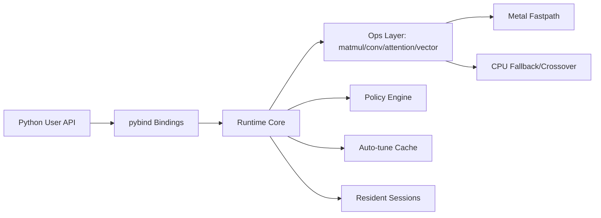
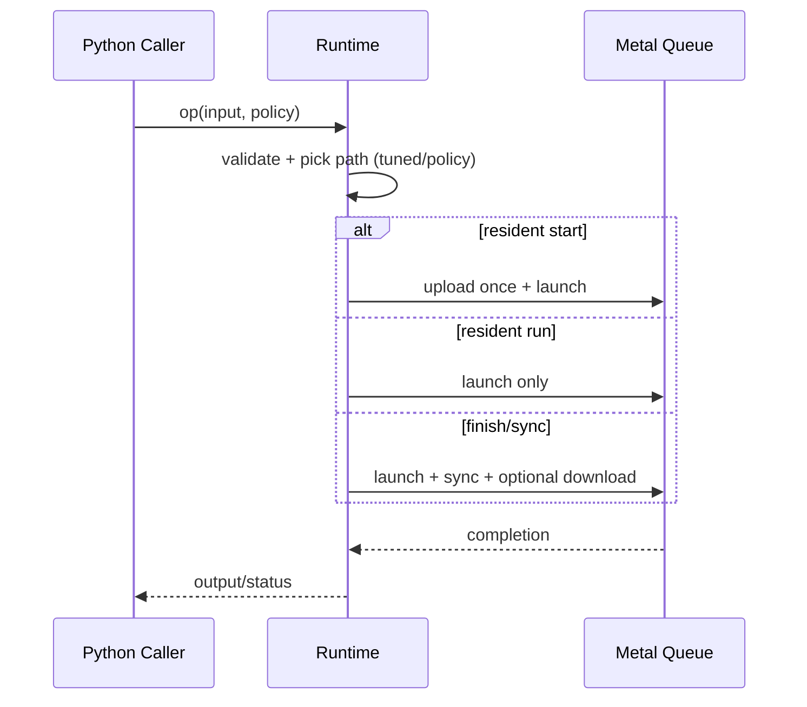
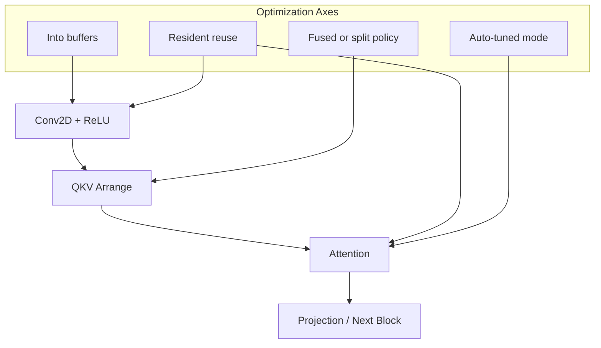

# 1. Title
# Lightning Core: Metal-First Runtime for Attention, MatMul, and Fused Inference Pipelines

# 2. Badges
[](https://pypi.org/project/lightning-core/)
[](https://pypi.org/project/lightning-core/)
[](https://pypi.org/project/lightning-core/)
[](LICENSE)
[](https://github.com/wnsgus00114-droid/lightning-core)
[](https://github.com/wnsgus00114-droid/lightning-core/actions/workflows/python-wheel-publish.yml)
[](https://github.com/wnsgus00114-droid/lightning-core/actions/workflows/docs-pages.yml)

# 3. One-line Summary
Lightning Core is a macOS-first, Metal-backed runtime that provides low-level control (resident IO, policy routing, fused paths) with easy Python APIs.
Current public release: **v0.1.7** (2026-03-31).

# 4. Abstract
Lightning Core targets high-iteration experimentation on Apple Silicon by combining:
- custom C++ kernels and runtime scheduling,
- Metal fastpaths with CPU fallback/crossover,
- pybind-based Python APIs for rapid operator and pipeline testing.

The project is positioned between a research runtime and a production-oriented operator engine. It emphasizes repeatable benchmarking, explicit execution policy control, and practical end-to-end pipeline composition (conv -> attention, FFN, LN -> projection).

# 5. Motivation / Problem Statement
Most deep-learning tooling assumes CUDA-first execution, while many practical local environments are macOS + Apple Silicon. This creates a gap:
- kernel-level optimization ideas are hard to test quickly on macOS,
- launch/memory overhead dominates small and repeated workloads,
- framework-level abstractions can hide runtime policy decisions.

Lightning Core addresses this by exposing runtime scheduling primitives and fastpaths directly.

# 6. Key Idea
Treat execution policy as a first-class runtime object:
- choose upload/download/sync behavior per call,
- persist resident sessions for repeated loops,
- auto-tune per-shape kernel/mode choices,
- fuse where useful, and fallback/crossover when launch overhead dominates.

# 7. Contributions
- Metal-first runtime for selected tensor/ops and attention workloads.
- Resident execution model for amortizing transfer/sync overhead.
- Auto-tuned matmul and attention mode selection with persisted cache.
- High-level integrated APIs for conv/attention pipeline composition.
- Python-friendly convenience APIs (`matmul2d`, `attention2d`, tensor constructors) without changing fast-path kernels.
- Benchmark harnesses and reproducibility artifacts.

# 8. System Architecture


# 9. Execution Model


# 10. Fused Pipeline Design


# 11. Benchmark Setup
Latest README snapshot setup (local run, 2026-03-30):
- Device: Apple Silicon macOS (Metal enabled)
- Runtime: `lightning_core` editable build
- Torch: 2.11.0 (MPS available)
- Bench suites:
  - `ai_model_all_bench.py`
  - `ml_all_bench.py`
  - `dl_all_bench.py`

Verified environments (currently disclosed):

| Scope | Environment |
| --- | --- |
| Local benchmark snapshot | Apple Silicon macOS, Python 3.14, Torch 2.11.0 |
| CI wheel build | GitHub Actions `macos-14`, Python 3.12 |

We are expanding hardware coverage disclosure (M1/M2/M3/M4, Monterey~Sequoia) as additional runs are validated.

# 12. Benchmark Results
Full snapshot with readability-first structure: summary first, then all raw cases in collapsible tables.

Result key: `ours_best_vs_mps > 1.0` means Lightning Core or Integrated API is faster than Torch MPS for that case.

Data scope in this section: `kernel_bench.csv` (10), `pipeline_bench.csv` (8), `ml_all_bench.csv` (10), `large_gemm_auto_sweep.csv` (15), `api_overhead_bench.csv` (6).

**A. Suite Summary (All Rows)**
| Suite | Rows | Win Rate (>1.0) | Median | Avg | Min | Max |
| --- | ---: | ---: | ---: | ---: | ---: | ---: |
| Kernel | 10 | 100.0% | 4.73x | 76.52x | 1.03x | 324.33x |
| Pipeline | 8 | 100.0% | 2.34x | 2.42x | 1.02x | 3.91x |
| ML | 10 | 100.0% | 8.85x | 12.91x | 1.40x | 43.99x |
| DL Large GEMM Sweep | 15 | 100.0% | 2.73x | 3.30x | 2.32x | 4.70x |

**B. Family Summary (to avoid average distortion)**

Kernel families:
| Family | Rows | Median | Avg | Min | Max |
| --- | ---: | ---: | ---: | ---: | ---: |
| attention micro | 3 | 226.43x | 247.31x | 191.17x | 324.33x |
| conv | 4 | 1.08x | 1.14x | 1.03x | 1.39x |
| gemm | 3 | 4.80x | 6.23x | 4.65x | 9.24x |

Pipeline families:
| Family | Rows | Median | Avg | Min | Max |
| --- | ---: | ---: | ---: | ---: | ---: |
| ffn | 2 | 3.85x | 3.85x | 3.79x | 3.90x |
| ln->proj | 2 | 3.75x | 3.75x | 3.60x | 3.91x |
| conv->attn | 4 | 1.04x | 1.05x | 1.02x | 1.09x |

**C. Full Case Tables (All Results, Non-Sampled)**

<details>
<summary>Kernel Bench (10 rows)</summary>

| Case | LC ms | Torch MPS ms | Integrated API ms | Best-vs-MPS | Winner |
| --- | ---: | ---: | ---: | ---: | --- |
| attention micro / seq=8,head_dim=16 | 0.000830 | 0.269087 | 0.001226 | 324.33x | LC |
| attention micro / seq=8,head_dim=32 | 0.000944 | 0.213847 | 0.001882 | 226.43x | LC |
| attention micro / seq=12,head_dim=12 | 0.001070 | 0.204469 | 0.001555 | 191.17x | LC |
| conv / batch=1,in_ch=3,h=16,w=16,out_ch=16,k=3 | 0.185349 | 0.257828 | 0.194724 | 1.39x | LC |
| conv / batch=1,in_ch=3,h=24,w=24,out_ch=16,k=3 | 0.183891 | 0.189333 | 0.210661 | 1.03x | LC |
| conv / batch=2,in_ch=3,h=16,w=16,out_ch=16,k=3 | 0.185802 | 0.199536 | 0.199568 | 1.07x | LC |
| conv / batch=1,in_ch=3,h=28,w=28,out_ch=16,k=3 | 0.189276 | 0.199620 | 0.185099 | 1.08x | Integrated |
| gemm / m=256,k=256,n=256 | 0.025391 | 0.234509 | 0.194258 | 9.24x | LC |
| gemm / m=896,k=896,n=896 | 0.136708 | 0.636312 | 0.722937 | 4.65x | LC |
| gemm / m=1024,k=1024,n=1024 | 0.168671 | 0.810279 | 0.981496 | 4.80x | LC |
</details>

<details>
<summary>Pipeline Bench (8 rows)</summary>

| Case | LC ms | Torch MPS ms | Integrated API ms | Best-vs-MPS | Winner |
| --- | ---: | ---: | ---: | ---: | --- |
| ffn / batch=512,d_model=768,d_ff=3072 | 0.198201 | 0.752038 | n/a | 3.79x | n/a |
| ffn / batch=1024,d_model=768,d_ff=3072 | 0.372339 | 1.452003 | n/a | 3.90x | n/a |
| ln->proj / batch=1024,d_model=1024,out=1024 | 0.172553 | 0.620380 | n/a | 3.60x | n/a |
| ln->proj / batch=2048,d_model=1024,out=1024 | 0.310551 | 1.215415 | n/a | 3.91x | n/a |
| conv->attn / conv(n=1,c=3->16,h=8,w=8,k=3)+attn(seq=48,d=48) | 0.395543 | 0.408251 | 0.404033 | 1.03x | LC |
| conv->attn / conv(n=1,c=3->16,h=8,w=8,k=3)+attn(seq=192,d=48) | 0.431083 | 0.425477 | 0.415871 | 1.02x | Integrated |
| conv->attn / conv(n=1,c=3->16,h=8,w=8,k=3)+attn(seq=192,d=8) | 0.396123 | 0.432692 | 0.407752 | 1.09x | LC |
| conv->attn / conv(n=1,c=3->16,h=8,w=8,k=3)+attn(seq=96,d=48) | 0.394251 | 0.411843 | 0.398017 | 1.04x | LC |
</details>

<details>
<summary>ML Bench (10 rows)</summary>

| Case | LC ms | Torch MPS ms | Integrated API ms | Best-vs-MPS | Winner |
| --- | ---: | ---: | ---: | ---: | --- |
| linear_classifier_inference / batch=1024,in=1024,out=512 | 0.096433 | 0.758746 | 1.214318 | 7.87x | LC |
| linear_classifier_inference / batch=2048,in=1024,out=512 | 0.186845 | 1.847536 | 2.952137 | 9.89x | LC |
| linear_classifier_inference / batch=4096,in=1024,out=1024 | 0.632555 | 3.894910 | 5.193821 | 6.16x | LC |
| matrix_preprocessing_sub / rows=512,cols=512 | 0.015134 | 0.208502 | 0.027561 | 13.78x | LC |
| matrix_preprocessing_sub / rows=1024,cols=1024 | 0.025363 | 0.249293 | 0.108649 | 9.83x | LC |
| matrix_preprocessing_sub / rows=2048,cols=1024 | 0.009389 | 0.413009 | 0.220267 | 43.99x | LC |
| feature_scaling_vector_add / n=65536 | 0.008237 | 0.191661 | 0.007252 | 26.43x | Integrated |
| feature_scaling_vector_add / n=262144 | 0.028608 | 0.205842 | 0.028113 | 7.32x | Integrated |
| feature_scaling_vector_add / n=1048576 | 0.109309 | 0.264072 | 0.109139 | 2.42x | Integrated |
| feature_scaling_vector_add / n=4194304 | 0.469037 | 0.653430 | 0.466921 | 1.40x | Integrated |
</details>

<details>
<summary>DL Large GEMM Sweep (15 rows)</summary>

| Shape + Mode | LC best ms | Torch MPS ms | Integrated API ms | Best-vs-MPS | Winner |
| --- | ---: | ---: | ---: | ---: | --- |
| m=1024,k=1024,n=1024 / runtime_default_promoted | 0.179328 | 0.818152 | 1.011852 | 4.56x | LC |
| m=1024,k=1024,n=1024 / aggressive_mps_no_bucket | 0.176217 | 0.818152 | 1.011852 | 4.64x | LC |
| m=1024,k=1024,n=1024 / kernel_favor_no_bucket | 0.174091 | 0.818152 | 1.011852 | 4.70x | LC |
| m=1536,k=1536,n=1536 / runtime_default_promoted | 0.738707 | 2.801908 | 3.591471 | 3.79x | LC |
| m=1536,k=1536,n=1536 / aggressive_mps_no_bucket | 0.783325 | 2.801908 | 3.591471 | 3.58x | LC |
| m=1536,k=1536,n=1536 / kernel_favor_no_bucket | 0.690338 | 2.801908 | 3.591471 | 4.06x | LC |
| m=2048,k=2048,n=2048 / runtime_default_promoted | 1.808589 | 4.930492 | 5.989359 | 2.73x | LC |
| m=2048,k=2048,n=2048 / aggressive_mps_no_bucket | 1.830923 | 4.930492 | 5.989359 | 2.69x | LC |
| m=2048,k=2048,n=2048 / kernel_favor_no_bucket | 2.034688 | 4.930492 | 5.989359 | 2.42x | LC |
| m=3072,k=3072,n=3072 / runtime_default_promoted | 7.413207 | 17.205290 | 21.317615 | 2.32x | LC |
| m=3072,k=3072,n=3072 / aggressive_mps_no_bucket | 7.110929 | 17.205290 | 21.317615 | 2.42x | LC |
| m=3072,k=3072,n=3072 / kernel_favor_no_bucket | 7.113339 | 17.205290 | 21.317615 | 2.42x | LC |
| m=4096,k=1024,n=4096 / runtime_default_promoted | 2.469568 | 9.743840 | 12.071318 | 3.95x | LC |
| m=4096,k=1024,n=4096 / aggressive_mps_no_bucket | 3.794696 | 9.743840 | 12.071318 | 2.57x | LC |
| m=4096,k=1024,n=4096 / kernel_favor_no_bucket | 3.638081 | 9.743840 | 12.071318 | 2.68x | LC |
</details>

<details>
<summary>API Overhead (LC direct vs Python API, 6 rows)</summary>

| Case | LC direct ms | Python API ms | API/LC |
| --- | ---: | ---: | ---: |
| engine_direct_vs_python_api_attention / seq=256,head_dim=64 | 0.262145 | 0.266253 | 1.02x |
| engine_direct_vs_python_api_attention / seq=512,head_dim=64 | 0.425523 | 0.437983 | 1.03x |
| engine_direct_vs_python_api_conv / batch=1,in_ch=3,h=32,w=32,out_ch=16,k=3 | 0.196769 | 0.195138 | 0.99x |
| engine_direct_vs_python_api_conv / batch=2,in_ch=3,h=32,w=32,out_ch=16,k=3 | 0.211811 | 0.200831 | 0.95x |
| engine_direct_vs_python_api_conv_attn / conv(n=1,c=3->16,h=8,w=8,k=3)+attn(seq=48,d=48) | 0.416029 | 0.396602 | 0.95x |
| engine_direct_vs_python_api_conv_attn / conv(n=1,c=3->16,h=8,w=8,k=3)+attn(seq=96,d=48) | 0.424866 | 0.399091 | 0.94x |
</details>

# 13. Key Findings / Insights
- Why Torch MPS can look slower on some shapes: generic graph/operator dispatch and synchronization overhead become dominant for very small kernels.
- Why Lightning Core can win: tuned mode routing + resident sessions reduce upload/download/sync cost across repeated calls.
- Why integrated path sometimes wins over direct path: fewer intermediate host round-trips and better cache reuse in connected blocks.
- Why Torch can still win in other projects/shapes: some large dense operators benefit from highly optimized generic kernels when fusion/session reuse is not active.
- Fair interpretation rule: compare both one-shot latency and steady-state (resident) throughput, because they measure different bottlenecks.

# 14. Limitations
- Scope is selective operators/pipelines, not a full DL framework.
- Performance can vary by thermals, OS/driver version, and benchmark ordering.
- Some APIs are still low-level by design.
- Multi-head/full-transformer framework parity is not the goal yet.

# 15. Future Work
- Expanded fused kernels (attention and projection blocks).
- Better mixed-precision controls and calibration tooling.
- Broader operator coverage and shape-specialized kernels.
- More stable cross-device benchmark CI baselines.

# 16. Installation
From PyPI:

```bash
python -m pip install -U lightning-core
```

From source:

```bash
git clone https://github.com/wnsgus00114-droid/lightning-core.git
cd lightning-core
python -m pip install .
```

# 17. Quick Start
```python
import numpy as np
import lightning_core as lc

print("backend:", lc.backend_name())

a = np.random.rand(128, 256).astype(np.float32)
b = np.random.rand(256, 64).astype(np.float32)
y = lc.matmul2d(a, b, "metal")
print(y.shape)
```

# 18. Core API Overview
Core categories:
- Runtime: `backend_name`, `metal_available`, `cuda_available`
- Tensor: `Tensor`, `Tensor64`, `TensorView`
- Ops: matmul/conv/vector/matrix (+ resident sessions)
- Attention: forward/train + policy + session
- Integrated: high-level conv/attention pipeline APIs

# 19. Input Rules
- Use `float32` NumPy arrays for fast paths.
- Prefer contiguous arrays (`np.ascontiguousarray`).
- For `*_into` APIs, output buffer shape must exactly match expected shape.
- Device string must be one of: `"metal"`, `"cpu"`, `"cuda"` (if available).

# 20. MatMul Usage
```python
import numpy as np
import lightning_core as lc

a = np.random.rand(512, 1024).astype(np.float32)
b = np.random.rand(1024, 512).astype(np.float32)

# easy API (shape inferred)
out = lc.matmul2d(a, b, "metal")

# into API (avoid re-allocation)
out2 = np.empty((512, 512), dtype=np.float32)
lc.matmul2d_into(a, b, out2, "metal")
```

# 21. Attention Usage
```python
import numpy as np
import lightning_core as lc

q = np.random.rand(8, 16).astype(np.float32)
k = np.random.rand(8, 16).astype(np.float32)
v = np.random.rand(8, 16).astype(np.float32)

out = lc.attention2d(q, k, v, False, "metal")
out_into = np.empty_like(q)
lc.attention2d_into(q, k, v, out_into, False, "metal")
```

# 22. Convolution Usage
```python
import numpy as np
import lightning_core as lc

x = np.random.rand(1, 3, 16, 16).astype(np.float32)
w = np.random.rand(16, 3, 3, 3).astype(np.float32)
b = np.random.rand(16).astype(np.float32)

y = lc.conv2d_nchw(x, w, b, 1, 1, 1, 1, "metal")
```

# 23. Resident Blocks
Resident sessions reduce repeated IO/sync overhead:

```python
import numpy as np
import lightning_core as lc

a = np.random.rand(1024, 1024).astype(np.float32)
b = np.random.rand(1024, 1024).astype(np.float32)
out = np.empty((1024, 1024), dtype=np.float32)

sess = lc.matmul2d_resident_session(a, b)
sess.start_into(a, b, out)
sess.run_batch_sync_no_download_into(a, b, out, 8)
```

# 24. Pipeline Usage
Integrated APIs are exposed in both `lightning_core` (legacy-prefixed names) and `lightning_core.api` (clean names).

```python
import numpy as np
import lightning_core as lc

x = np.random.rand(1, 3, 8, 8).astype(np.float32)
w = np.random.rand(16, 3, 3, 3).astype(np.float32)
b = np.random.rand(16).astype(np.float32)

# High-level conv+relu
y = lc.api.conv_relu_nchw(x, w, b, stride_h=1, stride_w=1, pad_h=1, pad_w=1, device="metal")

# Integrated conv->attention path
seq_len, head_dim = 96, 48
z = lc.api.conv_attention_torchstrong_nchw(
    x, w, b, seq_len=seq_len, head_dim=head_dim, stride_h=1, stride_w=1, pad_h=1, pad_w=1, device="metal"
)

# Graph vs eager A/B toggle for verification
# (current graph mode coverage for this path: conv 3x3, stride=1, pad=1 + attention)
z_graph = lc.api.conv_attention_torchstrong_nchw(
    x,
    w,
    b,
    seq_len=seq_len,
    head_dim=head_dim,
    stride_h=1,
    stride_w=1,
    pad_h=1,
    pad_w=1,
    device="metal",
    execution_mode="graph",
)

# Quick parity + speed report (eager vs graph) for the same shape
report = lc.api.conv_attention_torchstrong_nchw_ab_report(
    x, w, b, seq_len=seq_len, head_dim=head_dim, stride_h=1, stride_w=1, pad_h=1, pad_w=1, device="metal"
)
print(report["winner"], report["graph_over_eager"], report["max_abs_diff"])
print(y.shape, z.shape)
```

Typical optimization pattern:
- use `*_into` to reuse preallocated output buffers,
- keep data contiguous in `float32`,
- avoid host/device round-trips between connected blocks.

# 25. Performance Tips
- Reuse output buffers with `*_into` APIs.
- Use resident sessions for repeated loops.
- Keep inputs contiguous `float32`.
- Separate one-shot latency benchmarks and steady-state throughput benchmarks.
- Warm up before measurement.
- Tiny one-shot conv Metal crossover default is tuned to `260000` MACs; override with `CJ_CONV2D_CPU_CROSSOVER_MACS` (`CJ_CONV2D_CPU_CROSSOVER_DYNAMIC=1` for dynamic refresh).

# 26. API Examples
More examples:
- [docs/quickstart.md](docs/quickstart.md)
- [docs/advanced.md](docs/advanced.md)
- Docs site (GitHub Pages, after repository Pages enablement): <https://wnsgus00114-droid.github.io/lightning-core/>
- `examples/` and benchmark source files under `benchmarks/`

# 27. Benchmark Overview
Lightning Core includes:
- Native C++ benchmark binaries in `benchmarks/`
- Public Python benchmark scripts in `benchmarks/python/`
- CSV/JSON artifacts for reproducibility and comparison
- Full benchmark source is open in this repository (C++ + Python)
- CI quick benchmark artifact workflow on every `main/master` push (`.github/workflows/benchmark-artifacts.yml`)

# 28. Benchmark Directory Structure
```text
benchmarks/
  bench_attention.cpp
  bench_vector_add.cpp
  bench_matmul.cpp
  bench_matrix_ops.cpp
  bench_transformer.cpp
  bench_lstm_rnn.cpp
  bench_cnn_dnn.cpp
  bench_vlm.cpp
  python/
    quick_bench.py
  sweep_matrix_ops.sh
  large_gemm_auto_sweep.py
  generate_cross_suite_summary.py
```

Workspace-level scripts used for the README snapshot (outside repo root in this environment):
- `ai_model_all_bench.py`
- `ml_all_bench.py`
- `dl_all_bench.py`

# 29. How to Run Benchmarks
Native C++ benchmarks:

```bash
cmake -S . -B build -DCJ_ENABLE_METAL=ON -DCJ_BUILD_BENCHMARKS=ON -DCJ_BUILD_PYTHON=ON
cmake --build build -j

./build/benchmarks/bench_vector_add
./build/benchmarks/bench_attention
./build/benchmarks/bench_matmul
./build/benchmarks/bench_matrix_ops
./build/benchmarks/bench_transformer
./build/benchmarks/bench_lstm_rnn
./build/benchmarks/bench_cnn_dnn
./build/benchmarks/bench_vlm
```

Workspace Python benchmark harness (if present):

```bash
python ../ai_model_all_bench.py
python ../ml_all_bench.py
python ../dl_all_bench.py
```

Public quick benchmark (copy-paste runnable, inside this repo):

```bash
python benchmarks/python/quick_bench.py --warmup 40 --iters 200 --out benchmark_results/quick_bench.csv
```

Minimal copy-paste micro benchmark template:

```bash
python - <<'PY'
import time
import numpy as np
import lightning_core as lc

a = np.random.rand(1024, 1024).astype(np.float32)
b = np.random.rand(1024, 1024).astype(np.float32)

for _ in range(20):  # warmup
    lc.matmul2d(a, b, "metal")

t0 = time.perf_counter()
for _ in range(100):
    lc.matmul2d(a, b, "metal")
t1 = time.perf_counter()

print("median-like avg ms:", ((t1 - t0) * 1000.0) / 100.0)
PY
```

# 30. Benchmark Output Files
Typical outputs:
- `benchmark_results/kernel_bench.csv`
- `benchmark_results/pipeline_bench.csv`
- `benchmark_results/ml_all_bench.csv`
- `benchmark_results/large_gemm_auto_sweep.csv`
- corresponding `.json` files for each suite

Native build outputs can also appear under `build/benchmarks/*.csv`.

# 31. How to Read the Results
Common columns:
- `lightning_core_ms`: LC runtime latency
- `torch_mps_ms`: Torch MPS latency
- `integrated_api_ms`: higher-level integrated API latency
- `ours_best_vs_mps`: best(LC, integrated) against Torch MPS
  - `> 1.0`: ours is faster
  - `< 1.0`: Torch MPS is faster

# 32. Reproducing README Numbers
Numbers in this README were refreshed on **2026-03-30** with:

```bash
# from workspace root (recommended in this repo layout)
python ai_model_all_bench.py
python ml_all_bench.py
python dl_all_bench.py
```

Alternative (from `lightning-core/` directory):

```bash
python ../ai_model_all_bench.py
python ../ml_all_bench.py
python ../dl_all_bench.py
```

Then checked by scanning `ours_best_vs_mps` from:
- `benchmark_results/kernel_bench.csv`
- `benchmark_results/pipeline_bench.csv`
- `benchmark_results/ml_all_bench.csv`
- `benchmark_results/large_gemm_auto_sweep.csv`

# 33. Benchmark Methodology Notes
- Warmup iterations are used before timed iterations.
- Some suites use repeated trials and median/robust center.
- Thermal state can affect absolute numbers; compare relative metrics and rerun if needed.
- For fair comparison, synchronize MPS paths and separate one-shot vs resident scenarios.
- For API overhead, compare `lightning_core_ms` vs `integrated_api_ms` directly (they answer different questions than kernel-vs-MPS).

# 34. Repository Structure
```text
include/lightning_core/         # public wrapper headers
include/lightning_core/core/    # canonical core headers
include/lightining_core/        # typo-compat wrapper headers -> lightning_core
src/                            # runtime + op implementations
python/bindings/                # pybind11 bindings
benchmarks/                     # native benchmark sources/scripts
benchmarks/python/              # public runnable python benchmark scripts
tests/                          # C++ unit tests
docs/                           # quickstart/advanced/contributor docs
```

# 35. Roadmap
Roadmap baseline is now aligned to **v0.1.7** and tracked in detail in [ROADMAP.md](ROADMAP.md).

Progress snapshot (2026-03-31):
- Runtime trace/sync policy/capability contracts and tensor semantics checks are implemented.
- Operator registry + Graph IR + validation/planner + graph execution path are implemented and benchmarked.
- Integrated conv->attn graph sessions now use shape-keyed cache to remove per-call graph rebuild overhead.
- Tiny one-shot conv crossover default is re-tuned to `CJ_CONV2D_CPU_CROSSOVER_MACS=260000` (sweep-validated while keeping benchmark win coverage).

Phase A (2026 Q2, `v0.1.7`-`v0.1.9`): Runtime Core Hardening
- Finalize backend contracts (compute/memory/sync/profiler split).
- Lock tensor lifetime and metadata rules across Metal/CPU parity tests.
- Add deterministic trace/profiling hooks and fallback behavior.

Phase B (2026 Q3, `v0.2.x`): Graph + Operator Framework
- Introduce typed operator registry and minimal graph IR.
- Add graph validation and graph/eager A/B execution mode.
- Reduce host round-trips for chained workloads.

Phase C (2026 Q4, `v0.3.x`): Fusion + Cost Model
- Add rule-based fusion (`matmul+bias+act`, `conv+act`, attention subgraphs).
- Add optimization explain reports and fallback diagnostics.
- Expand tuning cache/versioned performance metadata.

Phase D (2027 H1, `v0.4.x`): Model Runner Layer
- Ship tiny transformer runner and reusable block abstraction.
- Add checkpoint/optimizer interfaces and reproducible CLI runner.
- Keep low-level control APIs while improving model-level UX.

Phase E (2027 H2, `v0.5.x`): Ecosystem Interop
- Add CoreML export path for validated subsets.
- Add MLX/PyTorch interop adapters with capability tables.
- Keep pure-LC benchmark numbers separated from interop overhead numbers.

Phase F (2028, `v1.0`): Framework Stabilization
- Semantic versioning + LTS policy + migration guides.
- CI-driven release gates for correctness/perf/reproducibility.
- Versioned docs site with generated C++/Python API references.

Mac-First Guardrails
- Metal fast-path remains first-class while portability grows via backend plugins.
- No abstraction change is accepted if it regresses macOS benchmark gates.
- KWU-1.0 license remains unchanged.

# 36. Citation
If you use Lightning Core in research, please cite it as software:

```bibtex
@software{lightning_core,
  title = {Lightning Core: Metal-First Runtime for Attention and Fused Pipelines},
  author = {Beak, JunHyeon},
  year = {2026},
  url = {https://github.com/wnsgus00114-droid/lightning-core}
}
```

# 37. License
This project is licensed under **Kwangwoon University License 1.0 (KWU-1.0)**.
License policy note: Lightning Core intentionally keeps KWU-1.0 and does not currently plan to switch to MIT/Apache-style terms.
See [LICENSE](LICENSE).

# 38. Contributing
Please read:
- [docs/contributor.md](docs/contributor.md)

General flow:
1. Open an issue/discussion for major changes.
2. Keep PRs focused and benchmark-backed when performance-sensitive.
3. Include reproduction steps for behavior/perf changes.

Community feedback channels we actively monitor:
- X (Twitter)
- Reddit (`r/MachineLearning`, `r/LocalLLaMA`)
- Korean ML communities (Discord/Facebook groups)

# 39. Project Status
**Active development (beta).**

Lightning Core is stable enough for experimentation and benchmarking, while APIs and internals continue to evolve quickly.
Visibility update: repository topics and benchmark discoverability documentation are actively maintained.
Current release train: **v0.1.7**.
