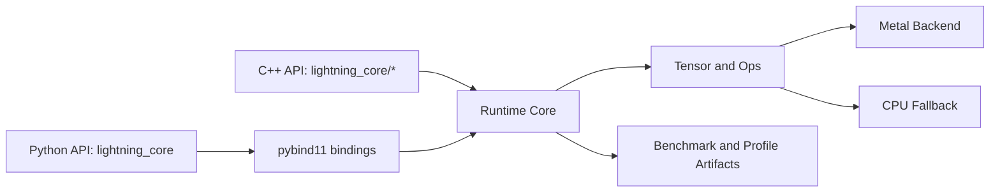

# Lightning Core

[](https://pypi.org/project/lightning-core/)
[](https://pypi.org/project/lightning-core/)

Lightning Core is a macOS-first CUDA-style runtime focused on custom attention training/inference paths.

## Why Lightning Core

| Point | What it gives you |
| --- | --- |
| Metal-first runtime path | Optimized execution flow on Apple Silicon/macOS |
| Attention fastpath focus | Practical tuning path for custom attention workloads |
| Resident session policy | Reduced upload/download/sync overhead in repeated runs |
| C++ + Python workflow | Native core with pybind11 module for quick iteration |

## Core Architecture



## Performance Checkpoints

| Checkpoint | Command | Artifact |
| --- | --- | --- |
| Attention shape sweep | `./build/benchmarks/bench_attention` with sweep env vars | `build/benchmarks/attention_shape_sweep.csv` |
| Vector add crossover | `./build/benchmarks/bench_vector_add` with sweep mode | `build/benchmarks/vector_add_crossover.csv` |
| Matrix ops sweep | `./benchmarks/sweep_matrix_ops.sh` | `build/benchmarks/matrix_ops_sweep.csv` |

See [docs/advanced.md](docs/advanced.md) for full benchmark and tuning flow.

## Install and Use

Install from PyPI:

```bash
python -m pip install -U lightning-core
```

Install from source:

```bash
git clone https://github.com/wnsgus00114-droid/lightning-core.git
cd lightning-core
python -m pip install .
```

Quick Python usage:

```python
import numpy as np
import lightning_core as lc

print(lc.backend_name())
a = np.arange(8, dtype=np.float32)
b = np.arange(8, dtype=np.float32)
out = lc.vector_add(a, b, "metal")
print(out)
```

## Quick Start (Beginner)

Documentation entrypoint:

- docs/index.md

Use this path first:

1. Install and import-check
2. Build and run one C API example
3. Run tests

```bash
python3 -m pip install .
python -c "import lightning_core; print(lightning_core.backend_name())"

cmake -S . -B build -DCJ_ENABLE_METAL=ON -DCJ_BUILD_TESTS=ON -DCJ_BUILD_PYTHON=ON -DCJ_BUILD_EXAMPLES=ON
cmake --build build -j

cmake --build build --target lightning_core_c_api_example -j
./build/lightning_core_c_api_example

ctest --test-dir build --output-on-failure
```

Detailed beginner guide:

- docs/quickstart.md

## Scope (Current)

This project is an optimization-focused runtime prototype, not a full deep learning framework.

- Core focus: runtime, attention path, selected matrix/vector ops
- Model-family wrappers are advanced policy/fastpath helpers, not full model implementations
- API and internals are still actively evolving

## Identity and Naming

- Public package/module: lightning-core / lightning_core
- Public C++ include path/namespace: lightning_core/* and lightning_core::...
- Internal canonical headers: include/lightning_core/core/*
- Legacy include/cudajun/* remains as compatibility shim

## Advanced Topics

For advanced usage and operations, see:

- docs/advanced.md

For contributor workflow and coding conventions, see:

- docs/contributor.md

Includes:

- benchmark sweeps and generated artifacts
- resident session and policy tuning
- model-family wrapper examples and caveats
- runtime profile/env tuning
- release and publishing workflow notes
- repository rename transition operations

## Build Targets

Useful targets:

- library: lightning_core::lightning_core
- python module: lightning_core
- c api example: lightning_core_c_api_example

## Repository

Current GitHub repository URL:

- https://github.com/wnsgus00114-droid/lightning-core

If you still have an older local clone URL, use:

```bash
./scripts/sync_remote_after_repo_rename.sh --dry-run
./scripts/sync_remote_after_repo_rename.sh
```

The script automatically checks target repository availability and skips safely when rename is not ready.

## Project Layout

- include/lightning_core: public wrappers
- include/lightning_core/core: canonical internal headers
- include/cudajun: compatibility shims for legacy integrations
- src: runtime + tensor + ops implementation
- tests: C++ unit tests
- benchmarks: benchmark binaries and sweep scripts
- python: pybind11 bindings
- docs: split docs (index/quickstart/advanced/contributor)

## Author

- Junhyeon Baeg (Kwangwoon University)

## License

This project is licensed under the Kwangwoon University License 1.0 (KWU-1.0).

See [LICENSE](LICENSE).
