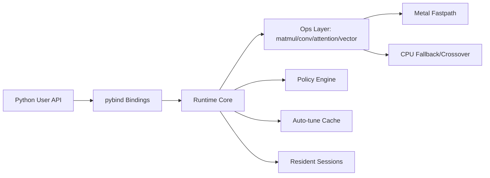
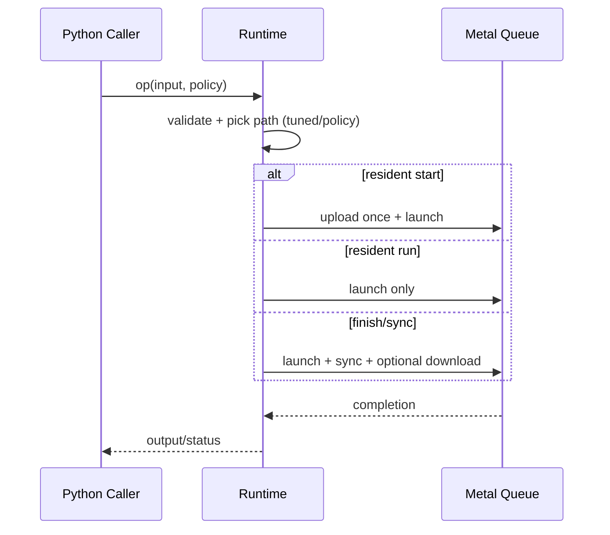
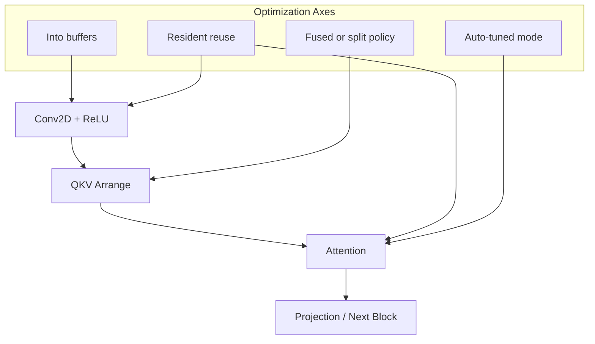
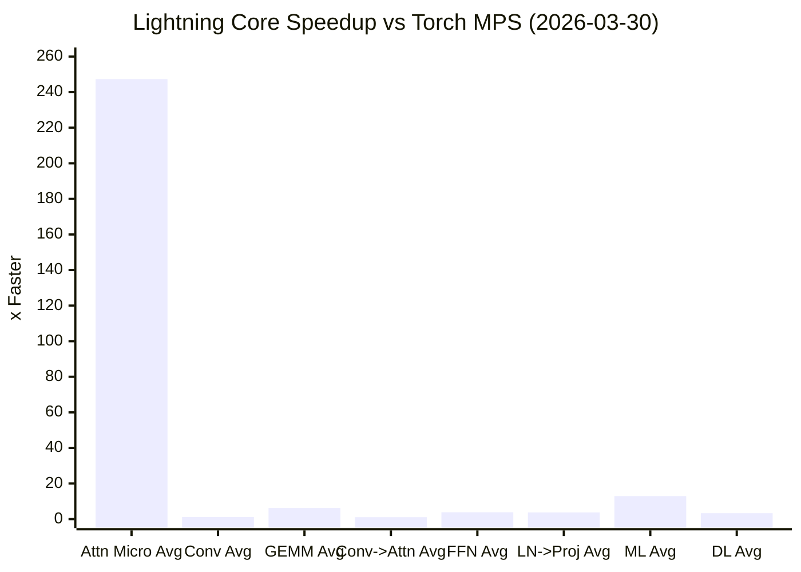

# 1. Title
# Lightning Core: Metal-First Runtime for Attention, MatMul, and Fused Inference Pipelines

# 2. Badges
[](https://pypi.org/project/lightning-core/)
[](https://pypi.org/project/lightning-core/)
[](https://github.com/wnsgus00114-droid/lightning-core/actions/workflows/python-wheel-publish.yml)

# 3. One-line Summary
Lightning Core is a macOS-first, Metal-backed runtime that provides low-level control (resident IO, policy routing, fused paths) with easy Python APIs.

# 4. Abstract
Lightning Core targets high-iteration experimentation on Apple Silicon by combining:
- custom C++ kernels and runtime scheduling,
- Metal fastpaths with CPU fallback/crossover,
- pybind-based Python APIs for rapid operator and pipeline testing.

The project is positioned between a research runtime and a production-oriented operator engine. It emphasizes repeatable benchmarking, explicit execution policy control, and practical end-to-end pipeline composition (conv -> attention, FFN, LN -> projection).

# 5. Motivation / Problem Statement
Most deep-learning tooling assumes CUDA-first execution, while many practical local environments are macOS + Apple Silicon. This creates a gap:
- kernel-level optimization ideas are hard to test quickly on macOS,
- launch/memory overhead dominates small and repeated workloads,
- framework-level abstractions can hide runtime policy decisions.

Lightning Core addresses this by exposing runtime scheduling primitives and fastpaths directly.

# 6. Key Idea
Treat execution policy as a first-class runtime object:
- choose upload/download/sync behavior per call,
- persist resident sessions for repeated loops,
- auto-tune per-shape kernel/mode choices,
- fuse where useful, and fallback/crossover when launch overhead dominates.

# 7. Contributions
- Metal-first runtime for selected tensor/ops and attention workloads.
- Resident execution model for amortizing transfer/sync overhead.
- Auto-tuned matmul and attention mode selection with persisted cache.
- High-level integrated APIs for conv/attention pipeline composition.
- Python-friendly convenience APIs (`matmul2d`, `attention2d`, tensor constructors) without changing fast-path kernels.
- Benchmark harnesses and reproducibility artifacts.

# 8. System Architecture


# 9. Execution Model


# 10. Fused Pipeline Design


# 11. Benchmark Setup
Latest README snapshot setup (local run, 2026-03-30):
- Device: Apple Silicon macOS (Metal enabled)
- Runtime: `lightning_core` editable build
- Torch: 2.11.0 (MPS available)
- Bench suites:
  - `ai_model_all_bench.py`
  - `ml_all_bench.py`
  - `dl_all_bench.py`

# 12. Benchmark Results
Representative rows from the latest local run:

| Suite | Case | Lightning Core ms | Torch MPS ms | Best-vs-MPS |
| --- | --- | ---: | ---: | ---: |
| Kernel | attention `seq=8,dim=16` | 0.00083 | 0.26909 | 324.33x |
| Kernel | conv `1x3x16x16 -> 16, k=3` | 0.18535 | 0.25783 | 1.39x |
| Kernel | gemm `1024^3` | 0.16867 | 0.81028 | 4.80x |
| Pipeline | conv->attn `seq=192,dim=48` | 0.43108 | 0.42548 | 1.02x (best path) |
| Pipeline | FFN `batch=1024` | 0.37234 | 1.45200 | 3.90x |
| Pipeline | LN->Proj `batch=2048` | 0.31055 | 1.21542 | 3.91x |
| ML | Linear `4096x1024 -> 1024` | 0.63256 | 3.89491 | 6.16x |
| DL Sweep | GEMM `4096x1024x4096` | 2.46957 | 9.74384 | 3.95x |

Snapshot speedup visualization (`ours_best_vs_mps`, higher is better):



# 13. Key Findings / Insights
- Tiny attention shapes are launch-bound on GPU; crossover/routing is critical.
- Resident execution strongly improves repeated matmul/pipe throughput.
- For large GEMM, tuned mode selection avoids one-size-fits-all regressions.
- "Best path" metric is useful because integrated and direct paths can win on different shapes.

# 14. Limitations
- Scope is selective operators/pipelines, not a full DL framework.
- Performance can vary by thermals, OS/driver version, and benchmark ordering.
- Some APIs are still low-level by design.
- Multi-head/full-transformer framework parity is not the goal yet.

# 15. Future Work
- Expanded fused kernels (attention and projection blocks).
- Better mixed-precision controls and calibration tooling.
- Broader operator coverage and shape-specialized kernels.
- More stable cross-device benchmark CI baselines.

# 16. Installation
From PyPI:

```bash
python -m pip install -U lightning-core
```

From source:

```bash
git clone https://github.com/wnsgus00114-droid/lightning-core.git
cd lightning-core
python -m pip install .
```

# 17. Quick Start
```python
import numpy as np
import lightning_core as lc

print("backend:", lc.backend_name())

a = np.random.rand(128, 256).astype(np.float32)
b = np.random.rand(256, 64).astype(np.float32)
y = lc.matmul2d(a, b, "metal")
print(y.shape)
```

# 18. Core API Overview
Core categories:
- Runtime: `backend_name`, `metal_available`, `cuda_available`
- Tensor: `Tensor`, `Tensor64`, `TensorView`
- Ops: matmul/conv/vector/matrix (+ resident sessions)
- Attention: forward/train + policy + session
- Integrated: high-level conv/attention pipeline APIs

# 19. Input Rules
- Use `float32` NumPy arrays for fast paths.
- Prefer contiguous arrays (`np.ascontiguousarray`).
- For `*_into` APIs, output buffer shape must exactly match expected shape.
- Device string must be one of: `"metal"`, `"cpu"`, `"cuda"` (if available).

# 20. MatMul Usage
```python
import numpy as np
import lightning_core as lc

a = np.random.rand(512, 1024).astype(np.float32)
b = np.random.rand(1024, 512).astype(np.float32)

# easy API (shape inferred)
out = lc.matmul2d(a, b, "metal")

# into API (avoid re-allocation)
out2 = np.empty((512, 512), dtype=np.float32)
lc.matmul2d_into(a, b, out2, "metal")
```

# 21. Attention Usage
```python
import numpy as np
import lightning_core as lc

q = np.random.rand(8, 16).astype(np.float32)
k = np.random.rand(8, 16).astype(np.float32)
v = np.random.rand(8, 16).astype(np.float32)

out = lc.attention2d(q, k, v, False, "metal")
out_into = np.empty_like(q)
lc.attention2d_into(q, k, v, out_into, False, "metal")
```

# 22. Convolution Usage
```python
import numpy as np
import lightning_core as lc

x = np.random.rand(1, 3, 16, 16).astype(np.float32)
w = np.random.rand(16, 3, 3, 3).astype(np.float32)
b = np.random.rand(16).astype(np.float32)

y = lc.conv2d_nchw(x, w, b, 1, 1, 1, 1, "metal")
```

# 23. Resident Blocks
Resident sessions reduce repeated IO/sync overhead:

```python
import numpy as np
import lightning_core as lc

a = np.random.rand(1024, 1024).astype(np.float32)
b = np.random.rand(1024, 1024).astype(np.float32)
out = np.empty((1024, 1024), dtype=np.float32)

sess = lc.matmul2d_resident_session(a, b)
sess.start_into(a, b, out)
sess.run_batch_sync_no_download_into(a, b, out, 8)
```

# 24. Pipeline Usage
Integrated APIs are exposed in both `lightning_core` (legacy-prefixed names) and `lightning_core.api` (clean names).

```python
import numpy as np
import lightning_core as lc

x = np.random.rand(1, 3, 8, 8).astype(np.float32)
w = np.random.rand(16, 3, 3, 3).astype(np.float32)
b = np.random.rand(16).astype(np.float32)

# High-level conv+relu
y = lc.api.conv_relu_nchw(x, w, b, stride_h=1, stride_w=1, pad_h=1, pad_w=1, device="metal")

# Integrated conv->attention path
seq_len, head_dim = 96, 48
z = lc.api.conv_attention_torchstrong_nchw(
    x, w, b, seq_len=seq_len, head_dim=head_dim, stride_h=1, stride_w=1, pad_h=1, pad_w=1, device="metal"
)
print(y.shape, z.shape)
```

Typical optimization pattern:
- use `*_into` to reuse preallocated output buffers,
- keep data contiguous in `float32`,
- avoid host/device round-trips between connected blocks.

# 25. Performance Tips
- Reuse output buffers with `*_into` APIs.
- Use resident sessions for repeated loops.
- Keep inputs contiguous `float32`.
- Separate one-shot latency benchmarks and steady-state throughput benchmarks.
- Warm up before measurement.

# 26. API Examples
More examples:
- [docs/quickstart.md](docs/quickstart.md)
- [docs/advanced.md](docs/advanced.md)
- `examples/` and benchmark source files under `benchmarks/`

# 27. Benchmark Overview
Lightning Core includes:
- Native C++ benchmark binaries in `benchmarks/`
- Python benchmark scripts in benchmark workspace (when available)
- CSV/JSON artifacts for reproducibility and comparison

# 28. Benchmark Directory Structure
```text
benchmarks/
  bench_attention.cpp
  bench_vector_add.cpp
  bench_matmul.cpp
  bench_matrix_ops.cpp
  bench_transformer.cpp
  bench_lstm_rnn.cpp
  bench_cnn_dnn.cpp
  bench_vlm.cpp
  sweep_matrix_ops.sh
  large_gemm_auto_sweep.py
  generate_cross_suite_summary.py
```

Workspace-level scripts used for README snapshot (outside repo root in this environment):
- `ai_model_all_bench.py`
- `ml_all_bench.py`
- `dl_all_bench.py`

# 29. How to Run Benchmarks
Native C++ benchmarks:

```bash
cmake -S . -B build -DCJ_ENABLE_METAL=ON -DCJ_BUILD_BENCHMARKS=ON -DCJ_BUILD_PYTHON=ON
cmake --build build -j

./build/benchmarks/bench_vector_add
./build/benchmarks/bench_attention
./build/benchmarks/bench_matmul
./build/benchmarks/bench_matrix_ops
./build/benchmarks/bench_transformer
./build/benchmarks/bench_lstm_rnn
./build/benchmarks/bench_cnn_dnn
./build/benchmarks/bench_vlm
```

Workspace Python benchmark harness (if present):

```bash
python ../ai_model_all_bench.py
python ../ml_all_bench.py
python ../dl_all_bench.py
```

# 30. Benchmark Output Files
Typical outputs:
- `benchmark_results/kernel_bench.csv`
- `benchmark_results/pipeline_bench.csv`
- `benchmark_results/ml_all_bench.csv`
- `benchmark_results/large_gemm_auto_sweep.csv`
- corresponding `.json` files for each suite

Native build outputs can also appear under `build/benchmarks/*.csv`.

# 31. How to Read the Results
Common columns:
- `lightning_core_ms`: LC runtime latency
- `torch_mps_ms`: Torch MPS latency
- `integrated_api_ms`: higher-level integrated API latency
- `ours_best_vs_mps`: best(LC, integrated) against Torch MPS
  - `> 1.0`: ours is faster
  - `< 1.0`: Torch MPS is faster

# 32. Reproducing README Numbers
Numbers in this README were refreshed on **2026-03-30** with:

```bash
# from workspace root (recommended in this repo layout)
python ai_model_all_bench.py
python ml_all_bench.py
python dl_all_bench.py
```

Alternative (from `lightning-core/` directory):

```bash
python ../ai_model_all_bench.py
python ../ml_all_bench.py
python ../dl_all_bench.py
```

Then checked by scanning `ours_best_vs_mps` from:
- `benchmark_results/kernel_bench.csv`
- `benchmark_results/pipeline_bench.csv`
- `benchmark_results/ml_all_bench.csv`
- `benchmark_results/large_gemm_auto_sweep.csv`

# 33. Benchmark Methodology Notes
- Warmup iterations are used before timed iterations.
- Some suites use repeated trials and median/robust center.
- Thermal state can affect absolute numbers; compare relative metrics and rerun if needed.
- For fair comparison, synchronize MPS paths and separate one-shot vs resident scenarios.

# 34. Repository Structure
```text
include/lightning_core/         # public wrapper headers
include/lightning_core/core/    # canonical core headers
include/cudajun/                # compatibility forwarding headers
src/                            # runtime + op implementations
python/bindings/                # pybind11 bindings
benchmarks/                     # native benchmark sources/scripts
tests/                          # C++ unit tests
docs/                           # quickstart/advanced/contributor docs
```

# 35. Roadmap
- Expand fused operator coverage for end-to-end pipelines.
- Improve precision/performance control surfaces.
- Harden reproducibility tooling and CI benchmarking.
- Continue Python ergonomics while preserving low-level controls.

# 36. Citation
If you use Lightning Core in research, please cite it as software:

```bibtex
@software{lightning_core,
  title = {Lightning Core: Metal-First Runtime for Attention and Fused Pipelines},
  author = {Beak, JunHyeon},
  year = {2026},
  url = {https://github.com/wnsgus00114-droid/lightning-core}
}
```

# 37. License
This project is licensed under **Kwangwoon University License 1.0 (KWU-1.0)**.
See [LICENSE](LICENSE).

# 38. Contributing
Please read:
- [docs/contributor.md](docs/contributor.md)

General flow:
1. Open an issue/discussion for major changes.
2. Keep PRs focused and benchmark-backed when performance-sensitive.
3. Include reproduction steps for behavior/perf changes.

# 39. Project Status
**Active development (beta).**

Lightning Core is stable enough for experimentation and benchmarking, while APIs and internals continue to evolve quickly.
